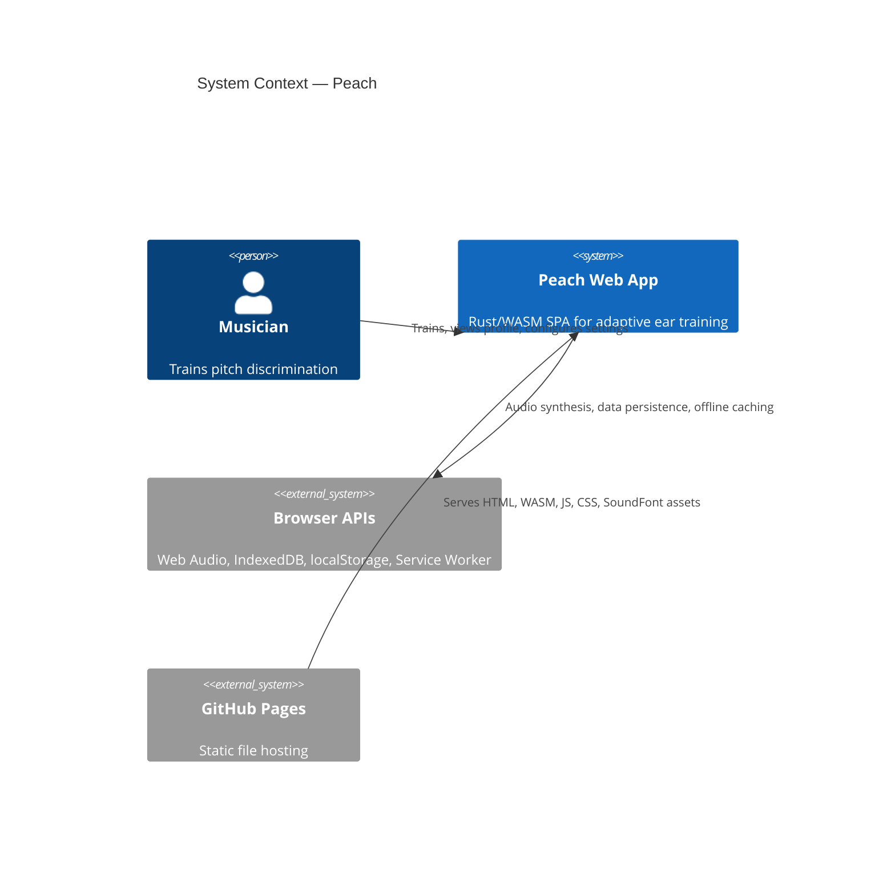
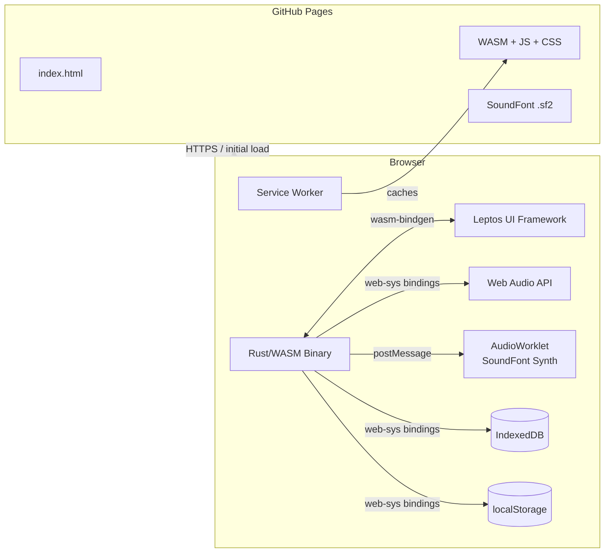
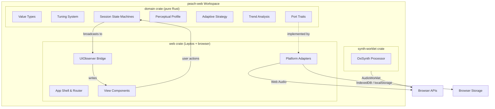
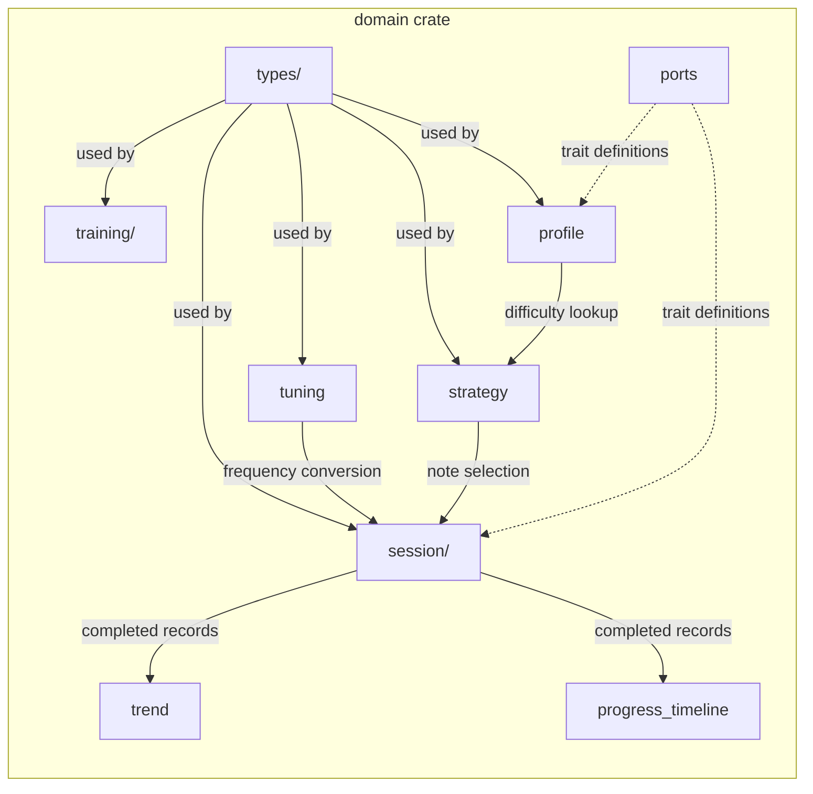
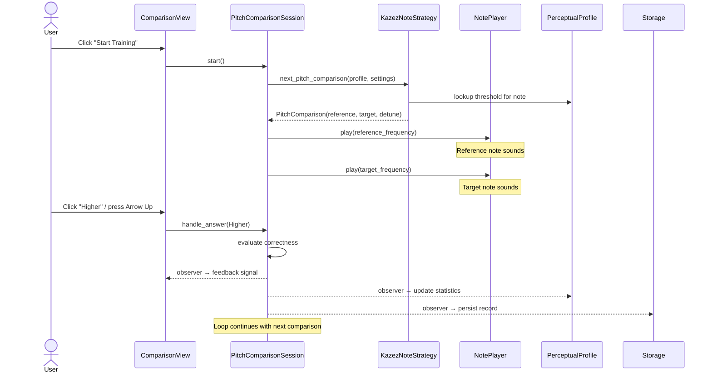
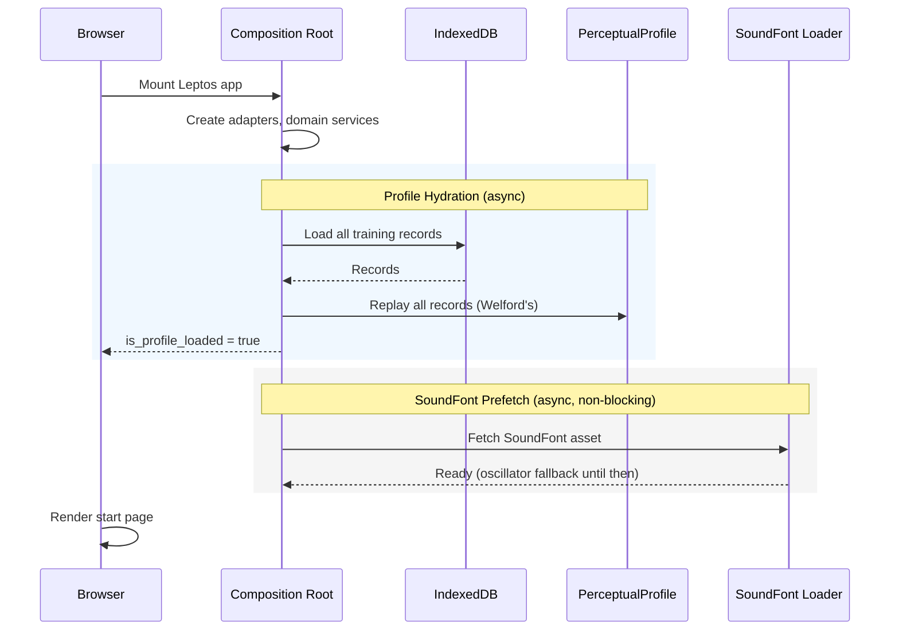
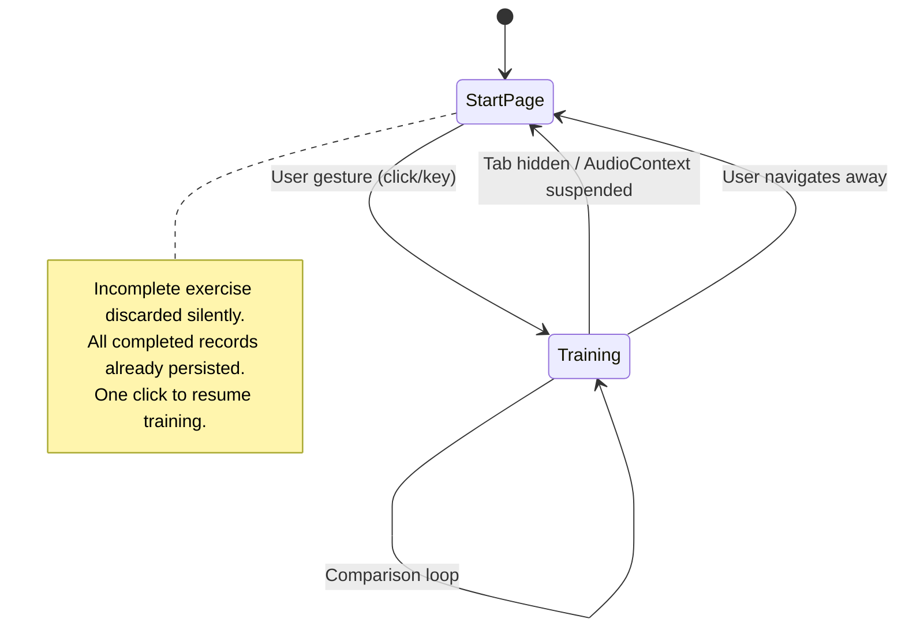
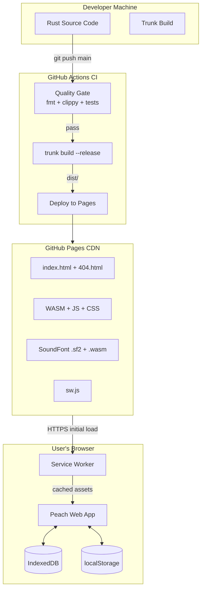

# arc42 Architecture Documentation — peach-web

**Version:** 1.0
**Date:** 2026-03-17
**Status:** Initial

Based on [arc42](https://arc42.org) template v9.0 by Dr. Peter Hruschka and Dr. Gernot Starke.

---

# 1. Introduction and Goals

Peach is a browser-based ear training application that builds a statistical model of the user's pitch discrimination ability through adaptive training. It reimplements the existing Peach iOS app for the web platform using Rust compiled to WebAssembly.

The application operates entirely client-side. There is no backend, no user accounts, no network dependency after initial page load. A static file server delivers the app; the browser does everything else.

## 1.1 Requirements Overview

| Requirement Area | Summary |
|---|---|
| Comparison Training | Two notes play sequentially; user judges higher or lower. Adaptive algorithm narrows/widens difficulty based on answers. |
| Pitch Matching Training | Reference note plays, user tunes a second note by ear using a slider. |
| Perceptual Profile | Statistical model of pitch discrimination ability across the MIDI range, built from all training history using Welford's online algorithm. |
| Settings | Configurable note range, duration, reference pitch, sound source, tuning system, interval selection. |
| Audio Engine | Web Audio API synthesis with oscillator fallback and SoundFont playback via AudioWorklet. |
| Data Persistence | Training records in IndexedDB, settings in localStorage. Export/import via CSV. |
| Offline Support | Service Worker caches all assets for full offline functionality after initial load. |

49 functional requirements and 15 non-functional requirements are specified in the [PRD](planning-artifacts/prd.md).

## 1.2 Quality Goals

| Priority | Quality Goal | Scenario |
|---|---|---|
| 1 | **Audio responsiveness** | Note playback begins within 50ms of trigger. Real-time pitch adjustment has no perceptible lag. |
| 2 | **Data integrity** | Training records survive page refresh, browser crash, and device restart. No silent data loss — storage failures are reported to the user. |
| 3 | **Algorithmic correctness** | All domain algorithms (Kazez adaptive, Welford statistics, tuning conversions) produce identical results to the iOS implementation given the same inputs. |
| 4 | **Offline capability** | After initial page load, the app functions with zero network requests. |
| 5 | **Cross-browser compatibility** | Full functionality in current Chrome, Firefox, Safari, and Edge. Graceful handling of AudioContext autoplay policies. |

## 1.3 Stakeholders

| Role | Person | Expectations |
|---|---|---|
| Developer / Owner | Michael | Learning Rust, WASM, and browser APIs through a real project. A working application he actually uses. |
| End User | Musicians (singers, string/wind/brass players) | Accessible, no-install ear training that fits into the cracks of a day. Persistent progress without accounts. |

---

# 2. Architecture Constraints

## Technical Constraints

| Constraint | Rationale |
|---|---|
| Rust compiled to WebAssembly | Primary learning goal; enables shared domain logic and high performance |
| No backend / no server logic | Simplicity, privacy, offline-first; all data stays in the browser |
| Web Audio API for synthesis | Only browser-native option for low-latency audio with sub-semitone precision |
| Static deployment (GitHub Pages) | Zero infrastructure cost, automatic deployment via CI |
| Leptos 0.8 CSR | Fine-grained reactivity maps to the domain's observer pattern; web-focused Rust framework |

## Organizational Constraints

| Constraint | Rationale |
|---|---|
| Solo developer | Architecture must be simple enough for one person to maintain |
| Learning-first | Idiomatic Rust patterns preferred over convenience shortcuts |
| Domain blueprint fidelity | Domain type names, algorithms, and port interfaces match the [iOS domain blueprint](ios-reference/domain-blueprint.md) exactly |

---

# 3. Context and Scope

## 3.1 Business Context



| Communication Partner | Input | Output |
|---|---|---|
| Musician (User) | Training answers (higher/lower, pitch slider), settings changes | Audio playback, visual feedback, profile visualization |
| Browser Web Audio API | — | Note synthesis commands (play, stop, adjust frequency) |
| Browser IndexedDB | Stored training records (on startup) | New training records (after each exercise) |
| Browser localStorage | Stored settings (on startup) | Updated settings (on change) |
| GitHub Pages | — | Static assets (HTML, WASM, JS, CSS, SoundFont) |

## 3.2 Technical Context



All communication is local within the browser. The only network interaction is the initial asset download from GitHub Pages, after which the Service Worker enables full offline use.

---

# 4. Solution Strategy

| Decision | Choice | Rationale |
|---|---|---|
| **Language & compilation** | Rust → WebAssembly | Learning goal; type safety; domain logic testable natively with `cargo test` |
| **UI framework** | Leptos 0.8 (CSR) | Fine-grained signals map directly to the domain's observer pattern — no virtual DOM overhead |
| **Build toolchain** | Trunk | Standard Rust/WASM bundler; handles WASM compilation, asset pipeline, and dev server |
| **Styling** | Tailwind CSS | Utility-first; covers the minimal UX spec without custom CSS ceremony |
| **Domain separation** | Two-crate Cargo workspace | Compiler-enforced boundary: `domain` crate has zero browser dependencies |
| **Audio synthesis** | Hybrid oscillator + SoundFont (AudioWorklet) | Oscillators provide instant fallback; SoundFont via OxiSynth in AudioWorklet delivers realistic timbres |
| **Storage split** | IndexedDB (records) + localStorage (settings) | Matches the two distinct access patterns: async bulk data vs. sync key-value |
| **Reactivity bridge** | UIObserver pattern | Domain observer traits → Leptos signal updates; single integration point between domain and UI |
| **Deployment** | GitHub Pages + CI (GitHub Actions) | Zero cost; automatic quality gate (fmt, clippy, tests) and deploy on push to main |
| **Offline** | Service Worker with hash-based cache versioning | Full offline after initial load; cache busted automatically on each deploy |

---

# 5. Building Block View

## 5.1 Level 1 — Whitebox Overall System



| Building Block | Responsibility |
|---|---|
| **domain crate** | All musical domain logic: value types, tuning, training sessions, adaptive algorithm, perceptual profile, trend analysis. Pure Rust — no browser dependencies. Testable with native `cargo test`. |
| **web crate** | Browser integration: Leptos UI components, platform adapters (audio, storage), UIObserver bridge, routing, composition root. |
| **synth-worklet crate** | WASM AudioWorklet processor for real-time SoundFont synthesis via OxiSynth. Compiled separately as `cdylib`. |

## 5.2 Level 2 — Domain Crate



| Module | Responsibility |
|---|---|
| `types/` | Domain value types: `MIDINote`, `Cents`, `Frequency`, `Interval`, `DetunedMIDINote`, `NoteDuration`, `AmplitudeDB`, `SoundSourceID`, `NoteRange` |
| `tuning` | `TuningSystem` — the bridge between the logical MIDI world and the physical frequency world |
| `training/` | Training entities: `PitchComparison`, `CompletedPitchComparison`, `PitchMatchingChallenge`, `CompletedPitchMatching` |
| `session/` | State machines: `PitchComparisonSession`, `PitchMatchingSession` — orchestrate the training loop, broadcast to observers |
| `profile` | `PerceptualProfile` — per-note Welford online statistics tracking pitch discrimination thresholds |
| `strategy` | `KazezNoteStrategy` — adaptive algorithm that narrows difficulty after correct answers, widens after incorrect |
| `trend` | `TrendAnalyzer` — EWMA-based trend detection for threshold improvement over time |
| `progress_timeline` | `ProgressTimeline` — adaptive bucketed timeline of training progress |
| `ports` | Port trait definitions: `NotePlayer`, `PlaybackHandle`, `TrainingDataStore`, `UserSettings`, `SoundSourceProvider`, observer traits |
| `records` | Serializable training record types for persistence |

## 5.3 Level 2 — Web Crate

| Module | Responsibility |
|---|---|
| `app` | Top-level Leptos component, router setup with `leptos_router`, base path handling for subpath deployment |
| `main` | Composition root: creates adapters, wires domain services, provides Leptos contexts |
| `bridge` | `UIObserver` — implements domain observer traits, translates events into Leptos signal writes |
| `adapters/audio_context` | AudioContext lifecycle: creation on user gesture, suspension detection, tab visibility handling |
| `adapters/audio_oscillator` | `OscillatorNotePlayer` — Web Audio OscillatorNode + GainNode synthesis |
| `adapters/audio_soundfont` | `SoundFontNotePlayer` — AudioWorklet bridge for OxiSynth-based SoundFont playback |
| `adapters/note_player` | Unified note player that delegates to oscillator or SoundFont based on availability |
| `adapters/indexeddb_store` | `TrainingDataStore` implementation using IndexedDB |
| `adapters/localstorage_settings` | `UserSettings` implementation using localStorage |
| `adapters/csv_export_import` | Training data export/import in CSV format |
| `components/` | Leptos view components: `StartPage`, `PitchComparisonView`, `PitchMatchingView`, `ProfileView`, `SettingsView`, `InfoView`, plus shared components (`NavBar`, `AudioGateOverlay`, `ProgressChart`, etc.) |

---

# 6. Runtime View

## 6.1 Comparison Training Loop



## 6.2 App Startup and Profile Hydration



## 6.3 Audio Interruption Recovery



---

# 7. Deployment View



| Element | Details |
|---|---|
| **Build** | `trunk build --release --public-url /peach-web/` produces `dist/` with hashed assets |
| **Quality Gate** | `cargo fmt --check`, `cargo clippy --workspace`, `cargo test -p domain` |
| **Cache Versioning** | CI injects WASM hash into `sw.js` cache name (`peach-<hash>`) for automatic cache busting |
| **SPA Routing** | `index.html` copied to `404.html` so GitHub Pages serves the SPA for all routes |
| **Deployment URL** | `https://mschuerig.github.io/peach-web/` |

---

# 8. Cross-cutting Concepts

## 8.1 Domain Purity and Port/Adapter Pattern

The `domain` crate contains zero platform dependencies — enforced at compile time via `Cargo.toml`. All external capabilities (audio, storage, settings) are defined as Rust traits (ports) in the domain and implemented as adapters in the `web` crate. This enables:

- Native `cargo test` for all domain logic (no browser required)
- Platform portability (the same domain crate could power a CLI or desktop app)
- Guaranteed separation of concerns

## 8.2 Reactive Bridge (Observer → Signal)

Domain sessions broadcast events via injected observer trait objects. The `UIObserver` in the `web` crate implements these traits and writes to Leptos `RwSignal`s. View components read signals but never mutate domain state. This creates a clean, unidirectional data flow:

```
User Action → Domain Method → Observer Notification → Signal Write → DOM Update
```

## 8.3 AudioContext Lifecycle

The Web Audio API requires a user gesture to create or resume an `AudioContext`. Peach handles this with an `AudioGateOverlay` pattern: if a user lands on a training view via direct URL (no prior gesture), an overlay prompts them to tap/click before audio begins. Tab visibility changes and AudioContext suspension trigger a clean stop of the active session and return to the start page.

## 8.4 Internationalization

Localization uses `leptos-fluent` with Fluent (`.ftl`) resource files. The reactive `move_tr!()` macro ensures UI text updates on language switch without page reload.

## 8.5 Offline-First

A Service Worker caches all static assets with hash-based versioning. After initial load, the app requires zero network requests. Training data lives in browser-local storage, never leaving the device.

---

# 9. Architecture Decisions

| ID | Decision | Alternatives Considered | Rationale |
|---|---|---|---|
| AD-1 | **Leptos 0.8 CSR** over Dioxus | Dioxus 0.7 (virtual DOM, cross-platform) | Fine-grained signals match domain observer pattern; web-only focus avoids abstraction layers over browser APIs |
| AD-2 | **Two-crate workspace** (domain + web) | Single crate with feature flags | Compiler-enforced separation; domain tests run natively without WASM |
| AD-3 | **IndexedDB for records, localStorage for settings** | IndexedDB for everything; localStorage for everything | Two distinct access patterns: async bulk data vs. sync key-value reads |
| AD-4 | **Hybrid audio** (oscillator fallback + SoundFont via AudioWorklet) | Oscillator only; SoundFont only | Instant availability + realistic timbres; graceful degradation if SoundFont fails to load |
| AD-5 | **Trunk** as build tool | wasm-pack + custom bundler | Standard Rust/WASM bundler; handles WASM compilation, CSS processing, asset hashing, dev server |
| AD-6 | **GitHub Pages** deployment | Self-hosted Apache; Cloudflare Pages | Zero cost; native GitHub Actions integration; sufficient for a static SPA |
| AD-7 | **Service Worker with CI-injected hash** | Manual version bumps; no SW | Automatic cache invalidation per deploy; reliable offline support |
| AD-8 | **CSV export/import** | JSON export | Human-readable, spreadsheet-compatible; simple enough for the data model |

Full architectural decisions with rationale and implementation patterns are documented in [architecture.md](planning-artifacts/architecture.md).

---

# 10. Quality Requirements

## 10.1 Quality Scenarios

| ID | Quality | Scenario | Metric |
|---|---|---|---|
| QS-1 | Performance | User clicks "Higher" during comparison training | Audio onset < 50ms; state transition + observer notification + profile update < 16ms |
| QS-2 | Performance | User drags pitch slider during pitch matching | Frequency adjustment lag imperceptible (< 10ms from input to audible change) |
| QS-3 | Performance | App starts with 10,000 stored training records | Profile hydration completes in < 1 second |
| QS-4 | Data Integrity | Browser crashes mid-training session | All previously completed records intact; only the in-progress exercise is lost |
| QS-5 | Data Integrity | Storage write fails (e.g., quota exceeded) | User is notified; training continues; no silent data loss |
| QS-6 | Correctness | Kazez adaptive algorithm given the same inputs as iOS app | Produces bit-identical f64 results |
| QS-7 | Compatibility | User opens app in Safari with strict autoplay policy | AudioGateOverlay prompts for gesture; training proceeds after tap |
| QS-8 | Offline | User opens app with no network connection after first visit | Full functionality; all assets served from Service Worker cache |
| QS-9 | Accessibility | User navigates with keyboard only | All interactive elements reachable via Tab; training answerable via Arrow/H/L keys |

---

# 11. Risks and Technical Debt

| Risk / Debt | Impact | Status | Mitigation |
|---|---|---|---|
| **Web Audio latency variance across browsers** | Audio onset may exceed 50ms on some platforms | Mitigated | Oscillator path is minimal-latency; AudioWorklet avoids main-thread scheduling |
| **SoundFont file size (~31 MB)** | Slow first load on poor connections | Mitigated | Oscillator fallback plays immediately; SoundFont loads in background; browser caches for subsequent visits |
| **Leptos 0.8 pre-1.0 stability** | Breaking changes in future updates | Accepted | 0.8 described as "final form"; migration effort expected to be manageable |
| **Single-threaded WASM** | Profile hydration of very large datasets (>50k records) may block UI | Low risk | Current performance is well within budget at 10k records; sharding could be added if needed |
| **No automated browser tests** | UI regressions caught only by manual testing | Known debt | Domain logic has comprehensive native tests; browser test infrastructure deferred as learning opportunity |
| **`SendWrapper` for Leptos context** | Relies on WASM being single-threaded | Accepted | Safe in single-threaded WASM; would need revisiting if multi-threading ever introduced |

---

# 12. Glossary

| Term | Definition |
|---|---|
| **Cents** | Unit of pitch: 1/100 of a semitone, 1/1200 of an octave. Used to express microtonal offsets. |
| **Comparison Training** | Training mode where two notes play sequentially and the user judges which is higher. |
| **DetunedMIDINote** | A MIDI note with an additional microtonal cent offset, representing sub-semitone pitch variation. |
| **EWMA** | Exponentially Weighted Moving Average — used in trend analysis to detect improvement or regression. |
| **Kazez adaptive algorithm** | Algorithm that narrows difficulty after correct answers and widens after incorrect, converging on the user's detection threshold. Based on Daniel Kazez's "Ear Training" methodology. |
| **MIDI note** | Integer 0-127 representing discrete pitches on the standard MIDI scale. Middle C = 60, A4 = 69. |
| **Perceptual Profile** | Per-note statistical model of the user's pitch discrimination ability, using Welford's online algorithm for mean and variance. |
| **Pitch Matching** | Training mode where the user tunes a note to match a reference by ear using a slider. |
| **Port** | A trait defining an external capability (audio, storage, settings) that the domain depends on but does not implement. |
| **SoundFont** | Sampled instrument format (.sf2) used for realistic note playback via OxiSynth. |
| **Trunk** | Rust/WASM build tool that compiles Rust to WebAssembly, processes assets, and serves the dev build. |
| **UIObserver** | Bridge component that implements domain observer traits and translates domain events into Leptos signal updates. |
| **Welford's algorithm** | Online algorithm for computing running mean and variance in a single pass, without storing all data points. |
