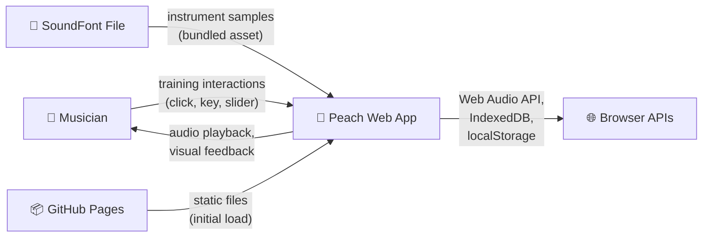
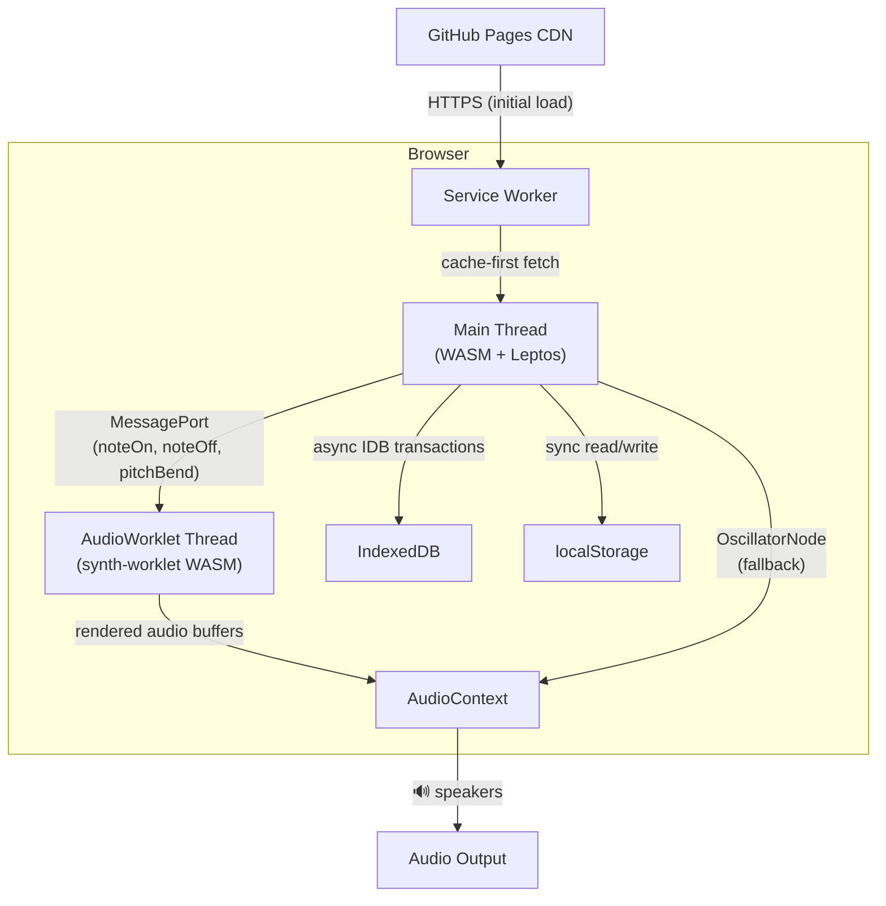
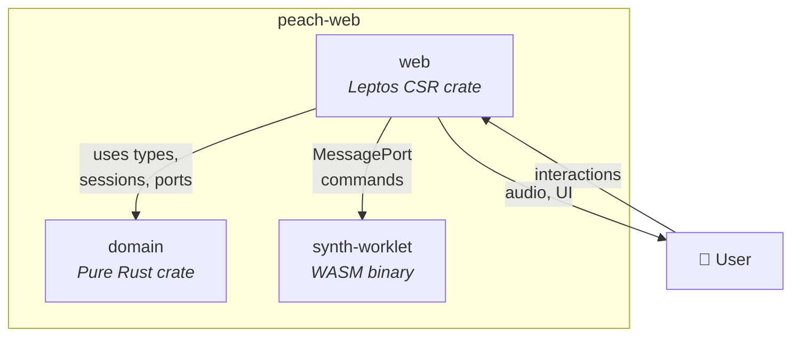
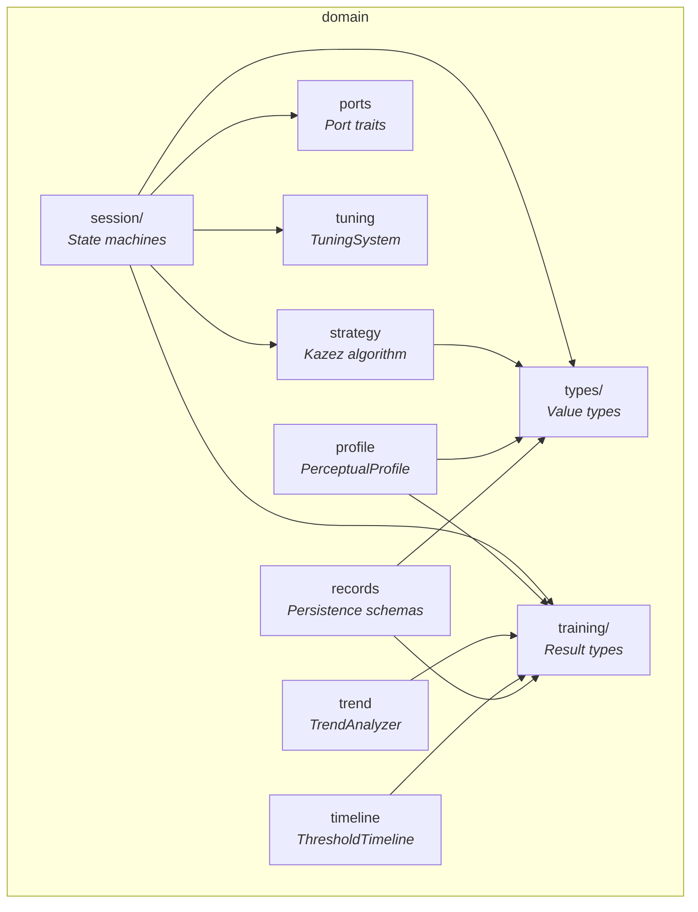
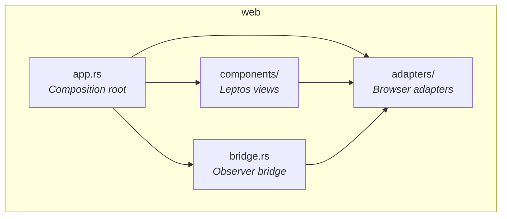
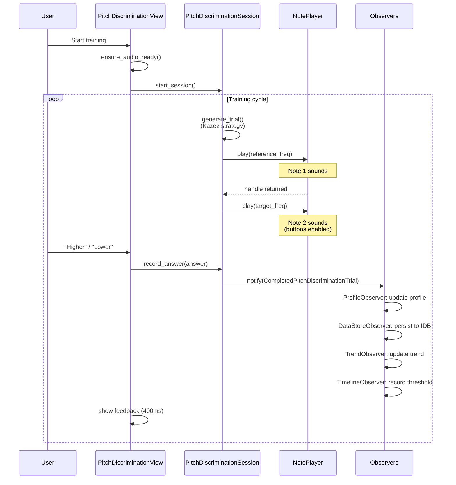
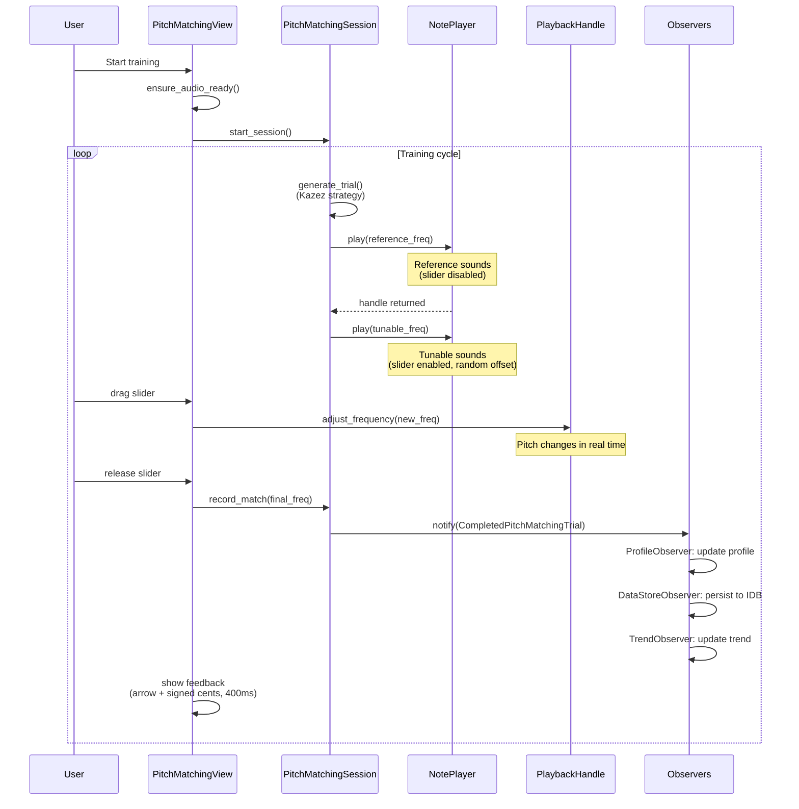
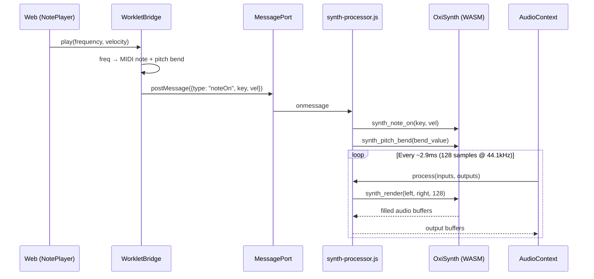
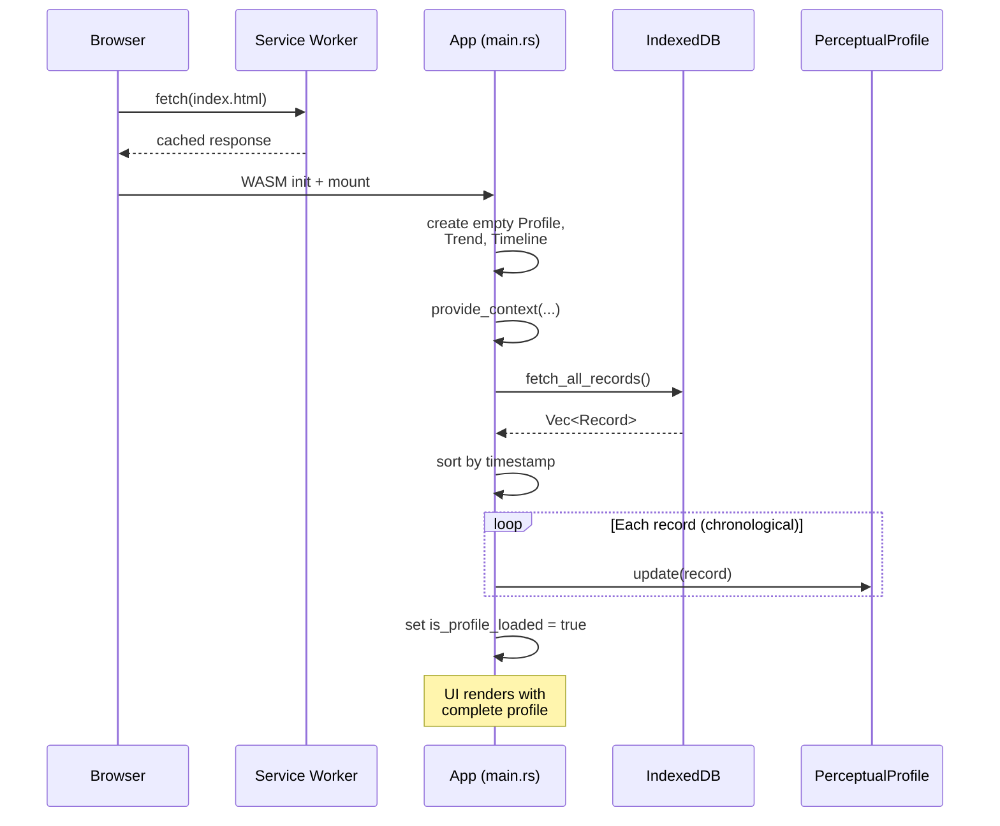
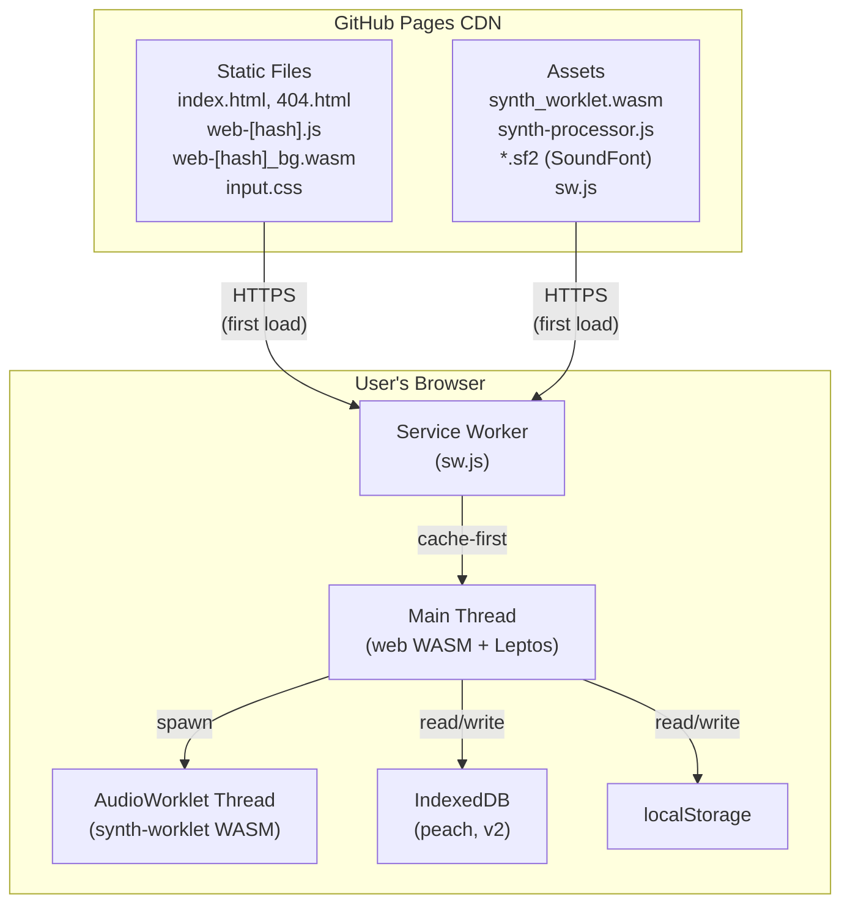

# Peach — arc42 Architecture Documentation

> Based on arc42 template version 9.0-EN. See <https://arc42.org>.

## 1. Introduction and Goals

Peach is a browser-based ear training application that builds a perceptual profile of the user's pitch discrimination ability through adaptive comparison training. It is a Rust/WebAssembly reimplementation of an existing iOS app, making the same training approach accessible via any modern browser.

### 1.1 Requirements Overview

Peach trains pitch discrimination — not through gamified testing, but through meditative, reflexive practice. The core interactions are:

- **Pitch Discrimination:** Hear two notes, indicate which is higher.
- **Pitch Matching:** Hear a reference, adjust a tunable note via slider to match it.
- **Interval Training:** Same interactions applied to musical intervals rather than single pitches.

Key functional requirements:

| ID | Requirement | Description |
|----|-------------|-------------|
| FR1 | Adaptive difficulty | Kazez convergence algorithm narrows/widens cent offsets based on correctness |
| FR2 | Perceptual profile | Per-note discrimination thresholds tracked via Welford's online statistics |
| FR3 | SoundFont playback | OxiSynth renders SF2 instrument presets via AudioWorklet |
| FR4 | Offline operation | Service Worker caches all assets; zero network requests after initial load |
| FR5 | Data portability | CSV export/import of training records |
| FR6 | Customizable settings | Note range, duration, reference pitch, tuning system, loudness variation |
| FR7 | Trend analysis | Detects improving/stable/declining performance over time |
| FR8 | Profile visualization | Piano keyboard with confidence band overlay |

Full requirements: `docs/planning-artifacts/prd.md`

### 1.2 Quality Goals

| Priority | Quality Goal | Scenario |
|----------|-------------|----------|
| 1 | **Audio latency** | Playback onset < 50 ms after state transition; frequency accuracy < 0.1 cents |
| 2 | **Data integrity** | Training records survive page refresh, crashes, and reboots; profile rebuilt from records produces identical results |
| 3 | **Offline capability** | After initial load, all training modes function without any network connectivity |
| 4 | **Responsiveness** | State transitions < 16 ms; profile hydration < 1 s for 10,000 records |
| 5 | **Accessibility** | WCAG 2.1 AA: keyboard navigation, screen reader support, 4.5:1 contrast, respects `prefers-reduced-motion` |

### 1.3 Stakeholders

| Role | Person | Expectations |
|------|--------|-------------|
| Developer & User | Michael | Maintainable codebase with clean separation; reliable training tool for personal use |
| End Users | Musicians (singers, string/wind/brass players) | Fast, distraction-free pitch training that works on any device |
| AI Agents | BMAD framework agents | Well-documented architecture enabling autonomous implementation assistance |

## 2. Architecture Constraints

| Constraint | Consequence |
|-----------|-------------|
| **Client-only (no backend)** | All computation runs in the browser; no server, no user accounts, no cloud storage |
| **WASM target** | Rust compiled to `wasm32-unknown-unknown`; no std threading, no filesystem |
| **Browser audio policies** | AudioContext creation requires user gesture; audio gate overlay needed |
| **Single-threaded** | WASM main thread is single-threaded; AudioWorklet runs on separate thread |
| **Rust edition 2024** | Requires Rust 1.85+; enables latest language features |
| **Leptos 0.8 CSR** | Client-side rendering only; `provide_context` requires `Send + Sync` (use `SendWrapper`) |
| **Static hosting** | Deployed to GitHub Pages; SPA routing requires 404.html fallback |
| **Offline-first** | Service Worker must cache all assets; no lazy-loading from CDN |

## 3. Context and Scope

### 3.1 Business Context



| Neighbor | Input | Output |
|----------|-------|--------|
| Musician | Training answers (higher/lower, slider position), settings changes | Audio playback, visual feedback, profile visualization |
| Browser APIs | Stored records (IndexedDB), settings (localStorage), audio output (Web Audio) | Write requests, audio commands |
| SoundFont file | SF2 instrument preset data (bundled) | — |
| GitHub Pages | HTML, JS, WASM, CSS, assets (initial load only) | — |

### 3.2 Technical Context



| Channel | Protocol | Purpose |
|---------|----------|---------|
| Main Thread ↔ AudioWorklet | `MessagePort.postMessage` | MIDI-like commands (noteOn/Off, pitchBend, loadSoundFont) |
| Main Thread ↔ IndexedDB | IDB async API (`IdbTransaction`) | Training record persistence |
| Main Thread ↔ localStorage | Sync `Storage` API | User settings persistence |
| Service Worker ↔ Network | HTTPS (cache-first) | Asset delivery and offline caching |
| AudioWorklet ↔ AudioContext | `process()` callback (128-sample chunks) | Real-time audio rendering |

## 4. Solution Strategy

| Quality Goal | Solution Approach | Details |
|-------------|-------------------|---------|
| Audio latency | AudioWorklet + OxiSynth rendering | Dedicated audio thread avoids main-thread jank; SoundFont synthesis at sample level (Section 5: synth-worklet) |
| Data integrity | Append-only records + profile hydration from records | Profile never persisted directly; rebuilt from records on every launch, guaranteeing consistency (Section 8: Profile Hydration) |
| Offline capability | Service Worker + bundled assets | All assets cached after first load; zero runtime network dependency (Section 7) |
| Responsiveness | Fine-grained Leptos signals + pure domain logic | No virtual DOM diffing; domain computations are synchronous Rust (Section 5: domain crate) |
| Accessibility | Semantic HTML + ARIA + keyboard shortcuts | Power-path keyboard control; screen reader announcements for feedback (Section 8: Accessibility) |
| Maintainability | Ports & Adapters architecture | Domain crate has zero browser dependencies; testable with `cargo test` (Section 5, Section 9: ADR-1) |
| Extensibility | Observer pattern for training events | New consumers (analytics, haptics) added without modifying session logic (Section 8: Observer Pattern) |

## 5. Building Block View

### 5.1 Level 1 — Whitebox Overall System



**Motivation:** Three-crate workspace separates concerns by runtime environment: pure logic (domain), browser integration (web), and audio thread (synth-worklet).

| Building Block | Responsibility |
|---------------|----------------|
| **domain** | All ear-training logic: types, algorithms, state machines, profile computation. Zero browser dependencies. |
| **web** | Leptos UI components, browser API adapters (audio, storage, settings), routing, i18n. |
| **synth-worklet** | OxiSynth SoundFont synthesizer compiled to WASM; runs on AudioWorklet thread. |

**Important Interfaces:**

| Interface | From → To | Purpose |
|-----------|-----------|---------|
| Port traits (`ports.rs`) | domain → web (implemented by adapters) | `NotePlayer`, `UserSettings`, `TrainingDataStore`, Observers |
| `MessagePort` messages | web → synth-worklet | `noteOn`, `noteOff`, `pitchBend`, `selectProgram`, `loadSoundFont` |
| Leptos contexts | web (app.rs) → web (components) | Shared reactive state (`RwSignal`, `SendWrapper<Rc<RefCell<T>>>`) |

### 5.2 Level 2 — Domain Crate



| Building Block | Responsibility |
|---------------|----------------|
| **types/** | Value types with validation: `MIDINote`, `Frequency`, `Cents`, `DetunedMIDINote`, `Interval`, `DirectedInterval`, `NoteDuration`, `MIDIVelocity`, `AmplitudeDB`, `UnitInterval`, `NoteRange`, `SoundSourceID` |
| **session/** | `PitchDiscriminationSession` and `PitchMatchingSession` state machines driving the training loop |
| **training/** | Result types: `PitchDiscriminationTrial`, `CompletedPitchDiscriminationTrial`, `PitchMatchingTrial`, `CompletedPitchMatchingTrial` |
| **strategy** | `KazezNoteStrategy` — adaptive difficulty algorithm (narrow 5%, widen 9%, square-root scaling) |
| **profile** | `PerceptualProfile` — 128-element array (one per MIDI note) with Welford's online statistics |
| **trend** | `TrendAnalyzer` — EWMA-based improving/stable/declining classification |
| **timeline** | `ThresholdTimeline` — historical performance aggregation with rolling statistics |
| **tuning** | `TuningSystem` — Equal Temperament / Just Intonation frequency conversion |
| **ports** | Port trait definitions: `NotePlayer`, `PlaybackHandle`, `UserSettings`, `TrainingDataStore`, `PitchDiscriminationObserver`, `PitchMatchingObserver`, `Resettable` |
| **records** | `PitchDiscriminationRecord`, `PitchMatchingRecord` — flat serializable persistence schemas |

### 5.3 Level 2 — Web Crate



| Building Block | Responsibility |
|---------------|----------------|
| **app.rs** | Composition root: creates all shared state, provides Leptos contexts, sets up router |
| **components/** | UI views: `StartPage`, `PitchDiscriminationView`, `PitchMatchingView`, `PitchSlider`, `ProfileView`, `SettingsView`, `ProgressCard`, `ProgressChart`, `NavBar`, `AudioGateOverlay`, `InfoView` |
| **adapters/** | Browser API implementations: `AudioContextManager`, `OscillatorNotePlayer`, `WorkletBridge` (SoundFont), `IndexedDbStore`, `LocalStorageSettings`, `CsvExportImport` |
| **bridge.rs** | Observer implementations connecting domain events to UI state: `ProfileObserver`, `DataStoreObserver`, `TrendObserver`, `TimelineObserver`, `ProgressTimelineObserver` |

### 5.4 Level 2 — Synth Worklet

| Building Block | Responsibility |
|---------------|----------------|
| **lib.rs** | C-style FFI boundary: `synth_new`, `synth_note_on/off`, `synth_pitch_bend`, `synth_render`, `synth_load_soundfont`, memory `alloc`/`dealloc` |
| **synth-processor.js** | `AudioWorkletProcessor` subclass: instantiates WASM, handles MessagePort commands, renders audio in `process()`, parses SF2 preset headers |

## 6. Runtime View

### 6.1 Pitch Discrimination Training Loop



### 6.2 Pitch Matching Training Loop



### 6.3 Audio Playback (SoundFont Path)



### 6.4 Application Startup & Profile Hydration



## 7. Deployment View



**Motivation:** Fully static deployment with no server component. All computation happens client-side. Service Worker enables offline operation after initial load.

**Software-to-Infrastructure Mapping:**

| Software Artifact | Infrastructure Element |
|------------------|----------------------|
| `web` crate (compiled) | `web-[hash]_bg.wasm` + `web-[hash].js` on GitHub Pages |
| `synth-worklet` crate (compiled) | `synth_worklet.wasm` in assets directory |
| `synth-processor.js` | AudioWorklet processor script in assets |
| SoundFont file (`.sf2`) | Bundled asset, cached by Service Worker |
| `sw.js` | Service Worker registered by `index.html` |
| Training records | IndexedDB `peach` database, object stores `comparison_records` (legacy name) and `pitch_matching_records` |
| User settings | `localStorage` key-value pairs |

**Build Pipeline:**

```
cargo build (synth-worklet → wasm32-unknown-unknown)
    ↓ copy to web/assets/soundfont/
trunk build --release --public-url /peach-web/
    ↓ compiles web crate, processes Tailwind, bundles assets
dist/
    ↓ GitHub Actions deploys to GitHub Pages
```

**CI/CD (GitHub Actions):**

1. **Quality gate:** `cargo fmt --check` → `cargo clippy --workspace` → `cargo test -p domain`
2. **Build & deploy:** `trunk build --release` → deploy `dist/` to GitHub Pages

## 8. Cross-cutting Concepts

### 8.1 Ports & Adapters (Hexagonal Architecture)

The domain crate defines port traits; the web crate provides browser-specific adapter implementations.

```
Domain Port                  → Web Adapter
─────────────────────────────────────────────────
NotePlayer                   → OscillatorNotePlayer / SoundFontNotePlayer
PlaybackHandle               → OscillatorHandle / WorkletHandle
UserSettings                 → LocalStorageSettings
TrainingDataStore            → IndexedDbStore
PitchDiscriminationObserver   → ProfileObserver, DataStoreObserver, TrendObserver, ...
Resettable                   → Profile, Timeline, TrendAnalyzer (cleared on data reset)
```

This enables `cargo test -p domain` without any browser runtime — the domain crate has zero WASM or browser dependencies.

### 8.2 Profile Hydration Invariant

The `PerceptualProfile` is **never persisted directly**. On every application launch:

1. Fetch all `PitchDiscriminationRecord` and `PitchMatchingRecord` from IndexedDB
2. Sort chronologically by timestamp
3. Replay each record through profile update methods

This guarantees that profile state is always derivable from the append-only record log. No cache invalidation, no schema migration for profile data, no inconsistency risk.

### 8.3 Observer Pattern

Training sessions broadcast results via observer traits (fire-and-forget). Multiple independent consumers react without coupling:

- **ProfileObserver** — updates `PerceptualProfile` statistics
- **DataStoreObserver** — persists record to IndexedDB (async via `spawn_local`)
- **TrendObserver** — feeds metric into `TrendAnalyzer`
- **TimelineObserver** — records to `ThresholdTimeline`
- **ProgressTimelineObserver** — aggregates to daily buckets

New consumers (e.g., analytics, haptics) can be added without modifying session logic.

### 8.4 Leptos Reactive State Management

- **Context-based DI:** `provide_context` / `use_context` in composition root (`app.rs`)
- **Newtype wrappers:** `IsProfileLoaded`, `WorkletConnecting`, `AudioNeedsGesture` prevent type-based context shadowing (multiple `RwSignal<bool>` would shadow each other)
- **`SendWrapper`:** Wraps `Rc<RefCell<T>>` for Leptos 0.8's `Send + Sync` context requirement (safe in single-threaded WASM)
- **Scoped tasks:** `spawn_local_scoped_with_cancellation` instead of `Timeout::forget()` to prevent disposed-signal panics on navigation

### 8.5 Accessibility

- Semantic HTML with ARIA attributes for all interactive elements
- Keyboard power path: `↑`/`H` (higher), `↓`/`L` (lower), `Escape` (stop)
- Screen reader announcements for training feedback events
- 4.5:1 minimum color contrast ratio
- Visible focus indicators
- Respects `prefers-reduced-motion` and `prefers-color-scheme`

### 8.6 Internationalization

- `leptos-fluent` with Fluent translation bundles (English, German)
- `move_tr!()` macro for reactive translated strings
- Runtime language switching without page reload

## 9. Architecture Decisions

### ADR-1: Two-Crate Workspace (Domain / Web)

- **Context:** Ear-training logic (algorithms, state machines, profiles) must be testable without a browser and reusable across platforms.
- **Decision:** Separate `domain` crate (pure Rust, no browser deps) from `web` crate (Leptos + browser APIs). Connect via port traits.
- **Status:** Accepted
- **Consequences:** Domain logic tested with `cargo test` natively. Adapter implementations require manual browser testing. Port trait surface area must be kept minimal.

### ADR-2: Leptos CSR (No SSR)

- **Context:** The app has no server; all state is local. SSR would add complexity with no benefit.
- **Decision:** Use Leptos in CSR-only mode with `leptos_router` for client-side navigation.
- **Status:** Accepted
- **Consequences:** Simpler build pipeline (Trunk only). No SEO benefit (acceptable for a training tool). All rendering happens in WASM on the client.

### ADR-3: AudioWorklet for SoundFont Synthesis

- **Context:** SoundFont rendering (OxiSynth) is CPU-intensive and must not block the UI thread. `ScriptProcessorNode` is deprecated.
- **Decision:** Compile OxiSynth to a separate WASM binary, run it in an `AudioWorkletProcessor` on its own thread, communicate via `MessagePort`.
- **Status:** Accepted
- **Consequences:** Glitch-free audio rendering. Requires two separate WASM builds. MessagePort communication adds serialization overhead (negligible for MIDI-rate messages). Oscillator fallback needed while SoundFont loads.

### ADR-4: IndexedDB for Training Records

- **Context:** `localStorage` has a ~5 MB limit and is synchronous. Training records grow unbounded.
- **Decision:** Use IndexedDB for all training records (comparison + pitch matching). Use `localStorage` only for small settings values.
- **Status:** Accepted
- **Consequences:** Async API adds complexity (wrapped with `JsFuture`). Records survive browser restart. Profile hydration replays all records on launch.

### ADR-5: Profile Hydration from Records (No Direct Persistence)

- **Context:** Persisting the profile directly would require cache invalidation and schema migration strategies.
- **Decision:** Never persist `PerceptualProfile` directly. Rebuild from the append-only record log on every launch.
- **Status:** Accepted
- **Consequences:** Guaranteed consistency. Performance bounded by record count (< 1 s for 10,000 records). Profile computation logic can change without data migration. Slight startup cost.

### ADR-6: Static Deployment on GitHub Pages

- **Context:** No server logic needed. Minimizing operational complexity for a solo developer.
- **Decision:** Deploy as static files to GitHub Pages with CI/CD via GitHub Actions.
- **Status:** Accepted
- **Consequences:** Free hosting with HTTPS. SPA routing requires `404.html` copy trick. Asset paths must use `--public-url /peach-web/` for subpath deployment.

## 10. Quality Requirements

### 10.1 Quality Tree

```
Quality
├── Performance Efficiency
│   ├── Audio latency (< 50ms onset)
│   ├── Frequency accuracy (< 0.1 cents)
│   ├── State transitions (< 16ms)
│   └── Profile hydration (< 1s / 10k records)
├── Reliability
│   ├── Data integrity (records survive crashes)
│   ├── Profile consistency (deterministic rebuild)
│   └── Offline operation (zero network dependency)
├── Usability
│   ├── Accessibility (WCAG 2.1 AA)
│   ├── Responsiveness (mobile + desktop)
│   └── Instant start/stop (no session overhead)
├── Maintainability
│   ├── Domain isolation (testable without browser)
│   ├── Type safety (validated newtypes)
│   └── Clean separation (ports & adapters)
└── Portability
    ├── Browser compatibility (Chrome, Firefox, Safari, Edge)
    └── Functional at 200% zoom
```

### 10.2 Quality Scenarios

| ID | Category | Scenario | Metric |
|----|----------|----------|--------|
| QS-1 | Performance | User clicks training button | Audio onset < 50 ms |
| QS-2 | Performance | App launches with 10,000 stored records | Profile fully hydrated < 1 s |
| QS-3 | Reliability | User closes browser mid-training, reopens | All previously completed records present in IndexedDB |
| QS-4 | Reliability | Profile hydrated from same records on two browsers | Identical per-note thresholds (deterministic Welford) |
| QS-5 | Usability | Screen reader user performs comparison training | All state changes announced; answer buttons labeled |
| QS-6 | Usability | User on mobile device in portrait mode | All controls reachable; tap targets ≥ 44px |
| QS-7 | Maintainability | New training mode added | Domain crate extended; existing sessions and adapters unchanged |
| QS-8 | Portability | App deployed to different subpath | Only `--public-url` flag changes; no code modifications |

## 11. Risks and Technical Debt

| # | Risk / Debt | Severity | Mitigation |
|---|------------|----------|-----------|
| 1 | **AudioWorklet browser support** — older browsers or restrictive environments may not support AudioWorklet | Medium | Oscillator fallback provides basic sine-wave playback when WorkletBridge unavailable |
| 2 | **Leptos 0.8 breaking changes** — framework is pre-1.0 and API may change | Medium | Domain crate is Leptos-independent; web crate isolates framework usage |
| 3 | **No automated browser tests** — web crate tested manually only | Medium | Domain crate has comprehensive unit tests; web adapter testing deferred to future |
| 4 | **IndexedDB storage limits** — browser may impose quotas for large record volumes | Low | Records are small (~200 bytes each); 100,000 records ≈ 20 MB, well within typical quotas |
| 5 | **Service Worker cache invalidation** — stale assets after deployment | Low | Content-hashed filenames (Trunk default) ensure cache busting on new deployments |
| 6 | **`SendWrapper` safety assumption** — relies on single-threaded WASM runtime | Low | Valid assumption for current `wasm32-unknown-unknown` target; would need revisiting for multi-threaded WASM |
| 7 | **Disposed signal panics on navigation** — async tasks may outlive component scope | Resolved | Mitigated by `spawn_local_scoped_with_cancellation` and `terminated` guard pattern |

## 12. Glossary

| Term | Definition |
|------|-----------|
| **Cents** | Logarithmic unit of pitch interval; 100 cents = 1 semitone in equal temperament |
| **Pitch discrimination trial** | A training interaction where two pitches are played and the user identifies which is higher |
| **DetunedMIDINote** | A MIDI note plus a cent offset, representing a pitch that may fall between piano keys |
| **Equal Temperament** | Tuning system dividing the octave into 12 equal semitones (100 cents each) |
| **Just Intonation** | Tuning system based on pure frequency ratios (e.g., 3:2 for a perfect fifth) |
| **Kazez convergence** | Adaptive algorithm: correct answer narrows difficulty by ~5%, incorrect widens by ~9% |
| **MIDI note** | Integer 0–127 representing a pitch in the MIDI standard (60 = middle C, 69 = A4) |
| **OxiSynth** | Rust SoundFont synthesizer (port of FluidSynth) used for instrument-quality audio |
| **Perceptual profile** | Per-note pitch discrimination thresholds derived from training history via Welford's algorithm |
| **Pitch matching** | Training discipline where user adjusts a slider to match a reference pitch |
| **Profile hydration** | Rebuilding the perceptual profile from stored training records on application startup |
| **SoundFont (SF2)** | File format containing sampled instrument sounds, rendered by a synthesizer |
| **Welford's algorithm** | Online algorithm for computing running mean and variance in a single pass |
| **WorkletBridge** | Adapter connecting the main thread to the AudioWorklet-hosted OxiSynth synthesizer |
