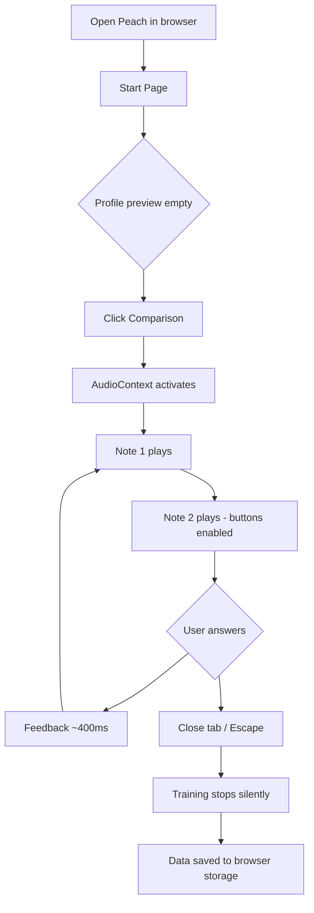
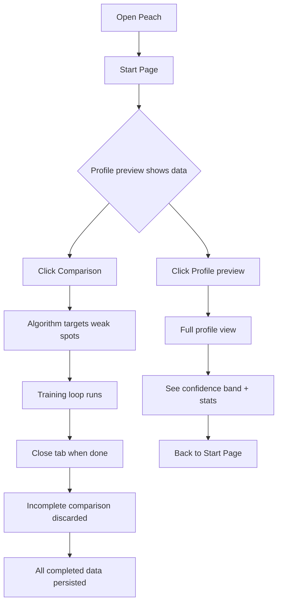
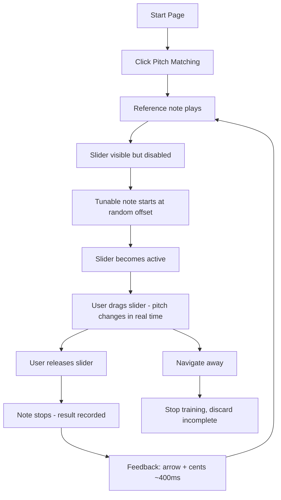
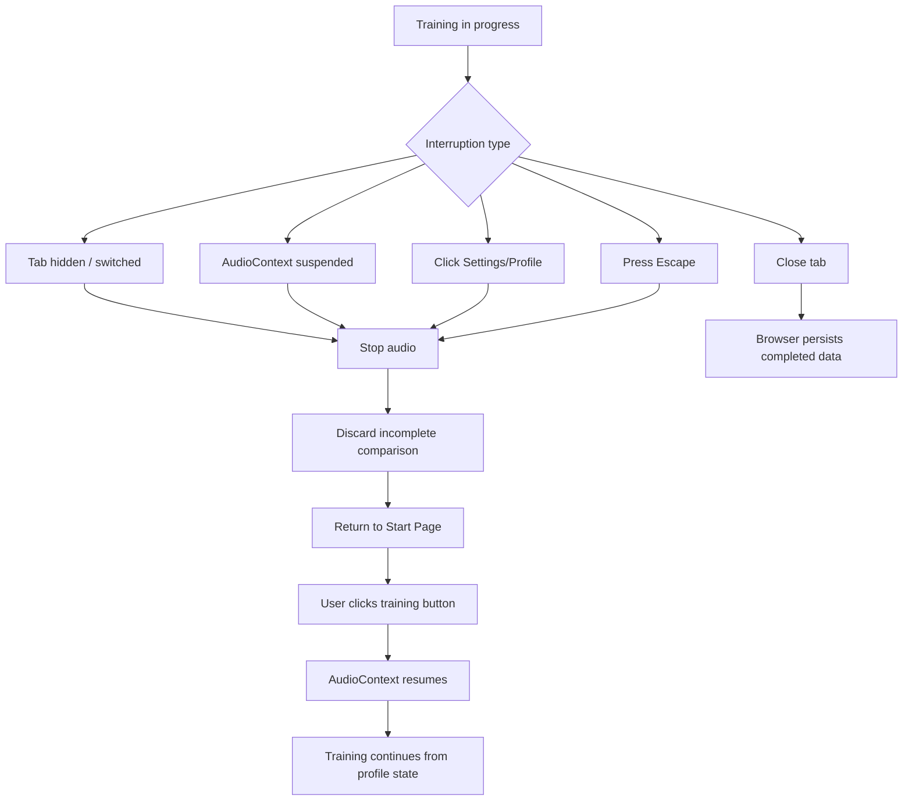
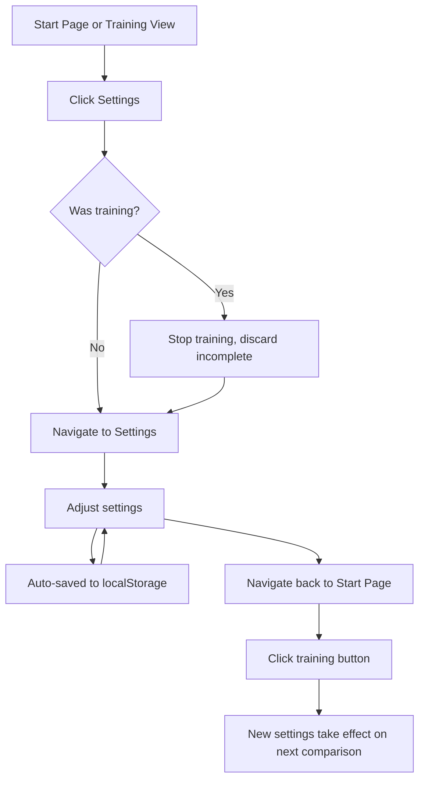

[← Previous (520b8a98d8)](520b8a98d8.md) | [Index](index.md) | [Next (5b4ddbbe57) →](5b4ddbbe57.md)

# Commit 6e95d8b14c

**Date:** 2026-03-03T00:35  
**Author:** Michael Schürig <michael@schuerig.de>

## Commit message

Add UX design specification

Comprehensive UX spec for the web reimplementation, covering core
experience, emotional design, interaction patterns, screen specs,
custom components, user journeys, and accessibility strategy.

Co-Authored-By: Claude Opus 4.6 <noreply@anthropic.com>

## Changed files

```
docs/planning-artifacts/ux-design-specification.md | 885 +++++++++++++++++++++
 1 file changed, 885 insertions(+)
```

## Session 1 (`0b98a211…`)

*2026-03-02T23:36 → 2026-03-02T23:36*

### 🧑 Human (2026-03-02T23:36)

<command-message>bmad-bmm-generate-project-context</command-message>
<command-name>/bmad-bmm-generate-project-context</command-name>


## Session 2 (`b2938a48…`)

*2026-03-02T22:58 → 2026-03-02T23:36*

### 🧑 Human (2026-03-02T22:58)

<command-message>bmad-bmm-create-ux-design</command-message>
<command-name>/bmad-bmm-create-ux-design</command-name>
<command-args>Be aware that this project is a web re-implementation of an existing iOS app. A "distilled" version (without iOS-specifics) of the UX spec for the iOS app you can find at docs/ios-reference/peach-web-ux-spec.md.</command-args>


### 🤖 Assistant (2026-03-02T22:59)

<details>
<summary>💭 Thinking</summary>

The user wants me to execute the BMAD UX design workflow. Let me start by reading the workflow file and the referenced iOS UX spec document.

</details>


### 🤖 Assistant (2026-03-02T22:59)

<details>
<summary>🔧 <code>Read</code></summary>

```
file_path: /Users/michael/Projekte/peach-web/_bmad/bmm/workflows/2-plan-workflows/create-ux-design/workflow.md
```

</details>


<details>
<summary>📎 Result</summary>

```
1→---
     2→name: create-ux-design
     3→description: 'Plan UX patterns and design specifications. Use when the user says "lets create UX design" or "create UX specifications" or "help me plan the UX"'
     4→---
     5→
     6→# Create UX Design Workflow
     7→
     8→**Goal:** Create comprehensive UX design specifications through collaborative visual exploration and informed decision-making where you act as a UX facilitator working with a product stakeholder.
… (35 more lines)
```

</details>

### 🤖 Assistant (2026-03-02T22:59)

<details>
<summary>🔧 <code>Read</code></summary>

```
file_path: /Users/michael/Projekte/peach-web/docs/ios-reference/peach-web-ux-spec.md
```

</details>


<details>
<summary>📎 Result</summary>

```
1→# Peach Web — UX Design Specification
     2→
     3→**Distilled from** the iOS UX Design Specification for browser implementation.
     4→**Date:** 2026-03-02
     5→
     6→**Companion documents:** `docs/domain-blueprint.md` (domain logic), `docs/peach-web-prd.md` (web PRD), `docs/planning-artifacts/glossary.md` (domain terminology).
     7→
     8→---
… (569 more lines)
```

</details>

### 🤖 Assistant (2026-03-02T22:59)

<details>
<summary>💭 Thinking</summary>

Now I need to read the workflow step 1 and the BMM config file. Let me also load the template.

</details>


### 🤖 Assistant (2026-03-02T22:59)

Now let me load the config and the first step of the workflow.


### 🤖 Assistant (2026-03-02T22:59)

<details>
<summary>🔧 <code>Read</code></summary>

```
file_path: /Users/michael/Projekte/peach-web/_bmad/bmm/config.yaml
```

</details>


<details>
<summary>📎 Result</summary>

```
1→# BMM Module Configuration
     2→# Generated by BMAD installer
     3→# Version: 6.0.4
     4→# Date: 2026-03-02T20:20:38.421Z
     5→
     6→project_name: peach-web
     7→user_skill_level: intermediate
     8→planning_artifacts: "{project-root}/docs/planning-artifacts"
… (9 more lines)
```

</details>

### 🤖 Assistant (2026-03-02T22:59)

<details>
<summary>🔧 <code>Read</code></summary>

```
file_path: /Users/michael/Projekte/peach-web/_bmad/bmm/workflows/2-plan-workflows/create-ux-design/steps/step-01-init.md
```

</details>


<details>
<summary>📎 Result</summary>

```
1→# Step 1: UX Design Workflow Initialization
     2→
     3→## MANDATORY EXECUTION RULES (READ FIRST):
     4→
     5→- 🛑 NEVER generate content without user input
     6→
     7→- 📖 CRITICAL: ALWAYS read the complete step file before taking any action - partial understanding leads to incomplete decisions
     8→- 🔄 CRITICAL: When loading next step with 'C', ensure the entire file is read and understood before proceeding
… (128 more lines)
```

</details>

### 🤖 Assistant (2026-03-02T22:59)

<details>
<summary>🔧 <code>Read</code></summary>

```
file_path: /Users/michael/Projekte/peach-web/_bmad/bmm/workflows/2-plan-workflows/create-ux-design/ux-design-template.md
```

</details>


<details>
<summary>📎 Result</summary>

```
1→---
     2→stepsCompleted: []
     3→inputDocuments: []
     4→---
     5→
     6→# UX Design Specification {{project_name}}
     7→
     8→**Author:** {{user_name}}
… (6 more lines)
```

</details>

### 🤖 Assistant (2026-03-02T22:59)

<details>
<summary>💭 Thinking</summary>

Now I need to:
1. Check if the output document already exists
2. If not, discover input documents
3. Set up the workflow

Let me check for existing output and discover input documents.

</details>


### 🤖 Assistant (2026-03-02T22:59)

Good, I've loaded everything. Let me now check for an existing output document and discover input documents.


### 🤖 Assistant (2026-03-02T22:59)

<details>
<summary>🔧 <code>Glob</code></summary>

```
pattern: docs/planning-artifacts/*ux-design-specification*.md
```

</details>


<details>
<summary>📎 Result</summary>

```
No files found
```

</details>

### 🤖 Assistant (2026-03-02T22:59)

<details>
<summary>🔧 <code>Glob</code></summary>

```
pattern: docs/**/*brief*.md
```

</details>


### 🤖 Assistant (2026-03-02T22:59)

<details>
<summary>🔧 <code>Glob</code></summary>

```
pattern: docs/**/*prd*.md
```

</details>


<details>
<summary>📎 Result</summary>

```
No files found
```

</details>

### 🤖 Assistant (2026-03-02T22:59)

<details>
<summary>🔧 <code>Glob</code></summary>

```
pattern: docs/**/project-context.md
```

</details>


<details>
<summary>📎 Result</summary>

```
/Users/michael/Projekte/peach-web/docs/ios-reference/peach-web-prd.md
/Users/michael/Projekte/peach-web/docs/planning-artifacts/prd.md
```

</details>

<details>
<summary>📎 Result</summary>

```
No files found
```

</details>

### 🤖 Assistant (2026-03-02T22:59)

<details>
<summary>🔧 <code>Glob</code></summary>

```
pattern: docs/**/*.md
```

</details>


<details>
<summary>📎 Result</summary>

```
/Users/michael/Projekte/peach-web/docs/ios-reference/domain-blueprint.md
/Users/michael/Projekte/peach-web/docs/ios-reference/peach-web-prd.md
/Users/michael/Projekte/peach-web/docs/ios-reference/peach-web-ux-spec.md
/Users/michael/Projekte/peach-web/docs/planning-artifacts/prd.md
/Users/michael/Projekte/peach-web/docs/planning-artifacts/architecture.md
```

</details>

### 🤖 Assistant (2026-03-02T22:59)

<details>
<summary>💭 Thinking</summary>

No existing UX design specification found — this is a fresh workflow. Let me discover and report the input documents found:

**PRD documents:**
- `docs/planning-artifacts/prd.md`
- `docs/ios-reference/peach-web-prd.md`

**Other context documents:**
- `docs/ios-reference/domain-blueprint.md`
- `docs/ios-reference/peach-web-ux-spec.md` (already loaded above)
- `docs/planning-artifacts/architecture.md`

No product brief found. No project-context.md found.

Let me also check for sharded folders (index.md files).

</details>


### 🤖 Assistant (2026-03-02T22:59)

No existing UX design specification found — this is a fresh workflow. Let me also check for sharded folders.


### 🤖 Assistant (2026-03-02T22:59)

<details>
<summary>🔧 <code>Glob</code></summary>

```
pattern: docs/**/index.md
```

</details>


<details>
<summary>📎 Result</summary>

```
No files found
```

</details>

### 🤖 Assistant (2026-03-02T22:59)

No sharded folders. Here's what I've found:

---

Welcome Michael! I've set up your UX design workspace for **peach-web**.

**Documents Found:**

- **PRD:** 2 files found
  - `docs/planning-artifacts/prd.md` (web PRD)
  - `docs/ios-reference/peach-web-prd.md` (iOS-reference PRD)
- **Product brief:** None found
- **Other context:** 3 files found
  - `docs/ios-reference/domain-blueprint.md` (domain logic reference)
  - `docs/ios-reference/peach-web-ux-spec.md` (iOS UX spec — distilled for web, already loaded)
  - `docs/planning-artifacts/architecture.md` (technical architecture)

**Note:** The iOS UX spec (`peach-web-ux-spec.md`) you mentioned is already loaded and will serve as a key reference throughout this workflow.

Do you have any other documents you'd like me to include, or shall we continue to the next step?

**[C]** Continue to UX discovery


### 🧑 Human (2026-03-02T23:01)

c


### 🤖 Assistant (2026-03-02T23:01)

<details>
<summary>🔧 <code>Read</code></summary>

```
file_path: /Users/michael/Projekte/peach-web/docs/planning-artifacts/prd.md
```

</details>


<details>
<summary>📎 Result</summary>

```
1→---
     2→stepsCompleted:
     3→  - step-01-init
     4→  - step-02-discovery
     5→  - step-02b-vision
     6→  - step-02c-executive-summary
     7→  - step-03-success
     8→  - step-04-journeys
… (303 more lines)
```

</details>

### 🤖 Assistant (2026-03-02T23:01)

<details>
<summary>🔧 <code>Read</code></summary>

```
file_path: /Users/michael/Projekte/peach-web/docs/ios-reference/peach-web-prd.md
```

</details>


<details>
<summary>📎 Result</summary>

```
1→# Peach Web — Product Requirements Document
     2→
     3→**Project:** Peach Web (public name: "Peach")
     4→**Type:** Browser-based ear training application
     5→**Status:** Draft
     6→**Date:** 2026-03-02
     7→
     8→---
… (242 more lines)
```

</details>

### 🤖 Assistant (2026-03-02T23:01)

<details>
<summary>🔧 <code>Read</code></summary>

```
file_path: /Users/michael/Projekte/peach-web/docs/ios-reference/domain-blueprint.md
```

</details>


<details>
<summary>📎 Result</summary>

```
1→# Peach — Platform-Agnostic Domain Blueprint
     2→
     3→**Purpose:** This document specifies the complete domain logic of the Peach ear-training application in a language-agnostic way. An implementing agent should be able to build a functionally equivalent application on any platform (web, desktop, CLI) using only this document as the domain reference — without reading the iOS source code.
     4→
     5→**Scope:** Domain model, algorithms, state machines, port interfaces, persistence schemas, and composition rules. Excludes: UI layout, platform-specific APIs, visual design.
     6→
     …(truncated)
```

</details>

### 🤖 Assistant (2026-03-02T23:01)

<details>
<summary>🔧 <code>Read</code></summary>

```
file_path: /Users/michael/Projekte/peach-web/docs/planning-artifacts/architecture.md
```

</details>


<details>
<summary>📎 Result</summary>

```
1→---
     2→stepsCompleted: [1, 2, 3, 4, 5, 6, 7, 8]
     3→lastStep: 8
     4→status: 'complete'
     5→completedAt: '2026-03-02'
     6→inputDocuments:
     7→  - docs/planning-artifacts/prd.md
     8→  - docs/ios-reference/domain-blueprint.md
… (741 more lines)
```

</details>

### 🤖 Assistant (2026-03-02T23:01)

<details>
<summary>💭 Thinking</summary>

Excellent. I've loaded all the input documents. Now I need to:

1. Create the initial UX design specification document from the template
2. Update the frontmatter with the input documents
3. Report what was loaded
4. Then load step-02-discovery.md

Let me first create the output document, then load step 2.

</details>


### 🤖 Assistant (2026-03-02T23:01)

All documents loaded. Let me create the initial UX design specification and proceed to step 2.


### 🤖 Assistant (2026-03-02T23:01)

<details>
<summary>🔧 <code>Write</code></summary>

```
file_path: /Users/michael/Projekte/peach-web/docs/planning-artifacts/ux-design-specification.md
content: ---
stepsCompleted: [1]
inputDocuments:
  - docs/planning-artifacts/prd.md
  - docs/ios-reference/peach-web-prd.md
  …
```

</details>


### 🤖 Assistant (2026-03-02T23:01)

<details>
<summary>🔧 <code>Read</code></summary>

```
file_path: /Users/michael/Projekte/peach-web/_bmad/bmm/workflows/2-plan-workflows/create-ux-design/steps/step-02-discovery.md
```

</details>


<details>
<summary>📎 Result</summary>

```
File created successfully at: /Users/michael/Projekte/peach-web/docs/planning-artifacts/ux-design-specification.md
```

</details>

<details>
<summary>📎 Result</summary>

```
1→# Step 2: Project Understanding
     2→
     3→## MANDATORY EXECUTION RULES (READ FIRST):
     4→
     5→- 🛑 NEVER generate content without user input
     6→
     7→- 📖 CRITICAL: ALWAYS read the complete step file before taking any action - partial understanding leads to incomplete decisions
     8→- 🔄 CRITICAL: When loading next step with 'C', ensure the entire file is read and understood before proceeding
… (183 more lines)
```

</details>

### 🤖 Assistant (2026-03-02T23:01)

<details>
<summary>💭 Thinking</summary>

Now I need to execute step 2 — Project Understanding. I need to analyze the loaded documents and present a summary of what I understand about the project from a UX perspective.

This is a unique project — a web reimplementation of an existing iOS app. We already have a comprehensive UX spec for the iOS version (distilled for web). This means a lot of the UX decisions are already made. Let me synthesize the key UX insights from all the documents.

Key points:
- Ear training app with "training not testing" philosophy
- Radically simple interaction: hear two notes, judge higher/lower
- Adaptive algorithm is the intelligence


- No scores, no gamification, or sessions to distract from learning
- Designed for musicians across different instruments
- Hub-and-spoke navigation structure with emotional design emphasizing calm focus and freedom from judgment
- Building for web with keyboard, mouse, and touch inputs using Rust/WASM and Leptos with Tailwind styling

</details>


### 🤖 Assistant (2026-03-02T23:02)

Now let me work through the project understanding discovery.

---

Based on the project documentation we've loaded, let me confirm what I understand about **peach-web** from a UX perspective.

**From the documents:**

This is a browser-based reimplementation of the Peach iOS ear training app. The core philosophy is **"training, not testing"** — where conventional ear training apps escalate difficulty until failure to produce a score, Peach builds a perceptual profile of the user's pitch discrimination and targets weak spots. The interaction is radically simple: two notes play, the user judges higher or lower. The intelligence lives entirely in the adaptive algorithm, not the UI.

The existing iOS UX spec has been distilled for web and provides comprehensive guidance — screen specs, interaction loops, emotional design, visual foundation, and accessibility. The architecture decision document confirms Leptos + Tailwind + Rust/WASM with a hub-and-spoke navigation model.

**Target Users:**

Musicians (singers, string, woodwind, brass players) for whom intonation is a practical daily challenge. Musically sophisticated but not necessarily tech-savvy. They want a tool that fits into the cracks of their day — 30 seconds of training is as valid as 30 minutes. No emotional investment required.

**Key Features/Goals:**

- **Comparison training** — hear two notes, judge higher/lower, adaptive difficulty
- **Pitch matching** — tune a note to match a reference using a vertical slider
- Both modes in unison and interval variants
- **Perceptual profile** — piano keyboard with confidence band, stats, trend
- Settings, data persistence (browser-local), full offline after initial load
- Developer's primary motivation is learning Rust/WASM

**UX Design Challenges:**

1. **Invisible intelligence** — The adaptive algorithm is the core value, but users can't see it working. The UX must make adaptive behavior feel purposeful, not random.
2. **Sparse-data visualization** — On first use, the perceptual profile has almost no data. It must look meaningful and inviting even when mostly empty.
3. **No-session training model** — Start and stop must feel natural without conventional session framing. No guilt, no summaries, no "are you sure?"
4. **Multi-input for web** — Mouse, keyboard, and touch must all work equally well for the core training loop. Keyboard shortcuts are the power-user path.
5. **Web audio constraints** — AudioContext requires user gesture, tab suspension kills audio. The UX must handle these gracefully without breaking the flow.

**Design Opportunities:**

1. **Disappearing UI** — The sparse, meditative design philosophy is a genuine differentiator. Most training apps are visually noisy; Peach can own the calm, tool-like space.
2. **Instant start, instant stop** — Respecting incidental time is rare in apps. One click to first sound is a powerful UX statement.
3. **Existing iOS UX spec as a strong foundation** — We have a thoroughly considered, distilled UX spec. The web version can build on proven design decisions rather than starting from scratch, adapting where the platform differs (no haptics, keyboard shortcuts, browser audio policies).

Does this match your understanding, Michael? Are there any corrections or additions you'd like to make?

---

**Here's what I'll add to the document:**

```markdown
## Executive Summary

### Project Vision

Peach is a browser-based ear training application that builds a perceptual profile of the user's pitch discrimination ability through adaptive comparison training. Built as a web reimplementation of the existing Peach iOS app, it brings the same "training, not testing" philosophy to any modern browser — desktop or mobile, any operating system.

The interaction is radically simple: two notes play in sequence, the user indicates higher or lower. The intelligence lives entirely in the adaptive algorithm, invisible to the user. No scores, no gamification, no session framing. Every answer is data that improves the model. Wrong answers are information, not failure.

The web version's primary differentiator is accessibility — same philosophy, same algorithms, new platform. Remove the iOS gate.

### Target Users

Musicians (singers, string, woodwind, brass players) for whom intonation is a practical challenge. Musically sophisticated but not necessarily tech-savvy. They want a tool that fits into the cracks of their day and makes them measurably better without demanding attention or emotional investment. 30 seconds of training is as valid as 30 minutes.

### Key Design Challenges

1. **Invisible intelligence** — The adaptive algorithm is the core value, but users cannot see it working. The UX must make adaptive behavior feel purposeful, not random.
2. **Sparse-data visualization** — On first use, the perceptual profile has almost no data. The profile must look meaningful and inviting even when mostly empty.
3. **No-session training model** — Start and stop must feel natural without conventional session framing. No guilt mechanics, no summaries, no confirmation dialogs.
4. **Multi-input interaction** — The browser must support mouse, keyboard, and touch equally for the core training loop. Keyboard shortcuts are the power-user path.
5. **Web audio constraints** — AudioContext activation requires a user gesture; tab suspension kills audio. The UX must handle these transitions gracefully without breaking the training flow.

### Design Opportunities

1. **Disappearing UI** — The sparse, meditative design philosophy is a genuine differentiator in a space dominated by visually noisy, gamified apps. Peach can own the calm, tool-like experience.
2. **Instant start, instant stop** — Respecting incidental time is rare. One click from the start page to hearing the first note is a powerful UX statement.
3. **Proven iOS foundation** — A comprehensive, distilled UX specification from the iOS app provides a strong starting point. The web version adapts where the platform differs (no haptic feedback, keyboard shortcuts, browser audio policies) rather than redesigning from scratch.
```

**What would you like to do?**

**[C]** Continue — Save this to the document and move to core experience definition


### 🧑 Human (2026-03-02T23:03)

c


### 🤖 Assistant (2026-03-02T23:03)

<details>
<summary>🔧 <code>Read</code></summary>

```
file_path: /Users/michael/Projekte/peach-web/docs/planning-artifacts/ux-design-specification.md
```

</details>


<details>
<summary>📎 Result</summary>

```
1→---
     2→stepsCompleted: [1]
     3→inputDocuments:
     4→  - docs/planning-artifacts/prd.md
     5→  - docs/ios-reference/peach-web-prd.md
     6→  - docs/ios-reference/domain-blueprint.md
     7→  - docs/ios-reference/peach-web-ux-spec.md
     8→  - docs/planning-artifacts/architecture.md
… (11 more lines)
```

</details>

### 🤖 Assistant (2026-03-02T23:03)

<details>
<summary>🔧 <code>Edit</code></summary>

```
replace_all: false
file_path: /Users/michael/Projekte/peach-web/docs/planning-artifacts/ux-design-specification.md
old_string: stepsCompleted: [1]
new_string: stepsCompleted: [1, 2]
```

</details>


<details>
<summary>📎 Result</summary>

```
The file /Users/michael/Projekte/peach-web/docs/planning-artifacts/ux-design-specification.md has been updated successfully.
```

</details>

### 🤖 Assistant (2026-03-02T23:03)

<details>
<summary>🔧 <code>Edit</code></summary>

```
replace_all: false
file_path: /Users/michael/Projekte/peach-web/docs/planning-artifacts/ux-design-specification.md
old_string: <!-- UX design content will be appended sequentially through collaborative workflow steps -->
new_string: ## Executive Summary

### Project Vision

Peach is a browser-based ear training application that builds a perceptual …
```

</details>


<details>
<summary>📎 Result</summary>

```
The file /Users/michael/Projekte/peach-web/docs/planning-artifacts/ux-design-specification.md has been updated successfully.
```

</details>

### 🤖 Assistant (2026-03-02T23:03)

Content saved. Now loading step 3.


### 🤖 Assistant (2026-03-02T23:03)

<details>
<summary>🔧 <code>Read</code></summary>

```
file_path: /Users/michael/Projekte/peach-web/_bmad/bmm/workflows/2-plan-workflows/create-ux-design/steps/step-03-core-experience.md
```

</details>


<details>
<summary>📎 Result</summary>

```
1→# Step 3: Core Experience Definition
     2→
     3→## MANDATORY EXECUTION RULES (READ FIRST):
     4→
     5→- 🛑 NEVER generate content without user input
     6→
     7→- 📖 CRITICAL: ALWAYS read the complete step file before taking any action - partial understanding leads to incomplete decisions
     8→- 🔄 CRITICAL: When loading next step with 'C', ensure the entire file is read and understood before proceeding
… (209 more lines)
```

</details>

### 🤖 Assistant (2026-03-02T23:03)

<details>
<summary>💭 Thinking</summary>

Now I need to work through the core experience definition for peach-web. Given that the iOS UX spec is loaded and has a lot of this already defined, I should synthesize it from the existing documents and present it for review, rather than asking all the discovery questions from scratch.

The iOS UX spec already covers:
- Core experience (comparison loop)
- Effortless interactions (5 defined)
- Experience principles (5 defined)
- Platform details are covered in the PRD and architecture docs

Let me synthesize this and present it.

</details>


### 🤖 Assistant (2026-03-02T23:04)

Now let's define the core experience. Given our comprehensive reference documents, let me synthesize what I understand and confirm with you.

---

The iOS UX spec and PRD have already deeply explored the core experience. Let me confirm my understanding and surface anything web-specific we should consider.

**Core User Action:**

The defining experience is the **comparison loop**: two notes play in sequence, the user indicates higher or lower, feedback flashes, the next pair begins. This loop *is* the entire product. Everything else exists to support or reflect it. The loop must feel **reflexive, not deliberative** — the user should be reacting to sounds, not thinking about an app.

**Platform Strategy:**

- **Web SPA** (Rust/WASM + Leptos), static deployment, no backend
- **Multi-input:** Mouse click, keyboard shortcuts (Arrow Up/H, Arrow Down/L), and touch — all equally supported
- **Desktop primary**, mobile supported — keyboard shortcuts are the power-user path
- **Fully offline** after initial page load (Service Worker in Phase 4)
- **Sensory hierarchy adapted for web:** Ears > eyes (feedback) > keyboard/mouse — haptic feedback is unavailable, so visual feedback carries more weight than on iOS, but must remain emotionally neutral

**Effortless Interactions:**

1. **Start training** — One click/keypress from the start page to hearing the first note. No onboarding, no account, no "welcome back."
2. **Stop training** — One click/keypress or simply close the tab. No confirmation, no session summary. Incomplete comparison silently discarded.
3. **Answer a comparison** — Click a button or press a key. Buttons enabled the moment the second note begins playing (early answer allowed).
4. **Resume where you left off** — There is no resume. There are no sessions. The algorithm already knows the user's profile.
5. **See progress** — Profile preview on the start page. Click to open the full profile.

**Critical Success Moments:**

1. **First comparison** — User clicks "Comparison," hears two notes, taps "Higher," sees a quick thumbs-up, next pair begins. Within seconds they're in the loop. If this takes more than one click or feels clunky, the product fails.
2. **First wrong answer** — Nothing happens. A brief thumbs-down, same weight as thumbs-up, next pair. No shame, no "try again." This is where trust is built.
3. **Profile discovery** — After a few sessions, the confidence band starts filling in. The user sees their hearing visualized for the first time. Quiet curiosity, not celebration.
4. **AudioContext activation** — The training start button doubles as the Web Audio user gesture. If the browser blocks audio or the tab is suspended, training stops cleanly and the user returns to the start page. No error dialogs.

**Experience Principles:**

1. **Disappearing UI** — Every design decision reduces the distance between the user and the sounds. Controls, transitions, and feedback should be felt, not studied.
2. **Every answer improves you** — No answer is wasted, no answer is punished. Wrong answers are information, not failure. No scores, no streaks, no "try again" language.
3. **Respect incidental time** — Instant start, instant stop. 30 seconds of training is as valid as 30 minutes.
4. **Show, don't score** — Progress is a perceptual profile that evolves, not a number going up.
5. **Sound first, pixels second** — Audio quality, timing, and accuracy take absolute priority over visual polish.

---

**Here's what I'll add to the document:**

```markdown
## Core User Experience

### Defining Experience

The core experience is the **comparison loop**: two notes play in sequence, the user indicates higher or lower, feedback flashes, the next pair begins. This loop is the entire product. Everything else exists to support or reflect it.

The loop must feel **reflexive, not deliberative**. The user should be reacting to sounds, not thinking about an app. If the user is ever thinking about the UI during training, the design has failed.

The secondary mode — **pitch matching** — follows the same philosophy but with a slower, more deliberate rhythm: hear a reference, tune a note by ear using a vertical slider, release to commit. No visual proximity feedback — the ear is the only guide.

### Platform Strategy

- **Web SPA** (Rust/WASM + Leptos), statically deployed, no backend, fully offline after initial load
- **Multi-input:** Mouse click, keyboard shortcuts (Arrow Up/H for higher, Arrow Down/L for lower, Escape to stop), and touch — all equally supported for the core training loop
- **Desktop primary, mobile supported** — keyboard shortcuts are the power-user path; touch targets meet 44x44px minimum
- **Sensory hierarchy (web-adapted):** Ears > eyes (feedback) > keyboard/mouse. Haptic feedback is unavailable on web. Visual feedback compensates by being clear but emotionally neutral — same visual weight for correct and incorrect

### Effortless Interactions

1. **Start training** — One click/keypress from the start page to hearing the first note. No onboarding, no account, no "welcome back." The training button doubles as the Web Audio API activation gesture.
2. **Stop training** — One click/keypress, close the tab, or switch tabs. No confirmation dialog, no session summary. Incomplete comparison silently discarded.
3. **Answer a comparison** — Click a button or press a key. Buttons are enabled the moment the second note begins playing, allowing early answers.
4. **Resume where you left off** — There is no resume. There are no sessions. The user opens the page and starts training; the algorithm already knows their profile.
5. **See progress** — The profile preview on the start page provides a glanceable snapshot. Clicking it opens the full profile.

### Critical Success Moments

1. **First comparison** — User clicks "Comparison," hears two notes, indicates higher or lower, sees brief feedback, next pair begins. Within seconds they are in the loop. One click to first sound is non-negotiable.
2. **First wrong answer** — Brief thumbs-down, same visual weight as thumbs-up, next pair begins. No shame, no special treatment. This is where trust in the "training, not testing" philosophy is built.
3. **Profile discovery** — After training, the confidence band starts filling in. The user sees their pitch perception visualized. Quiet curiosity, not celebration.
4. **Audio interruption** — Tab hidden or AudioContext suspended: training stops cleanly. User returns to start page, one click to resume. No error dialogs, no lost data.

### Experience Principles

1. **Disappearing UI** — Every design decision should reduce the distance between the user and the sounds. Controls, transitions, and feedback should be felt, not studied.
2. **Every answer improves you** — No answer is wasted, no answer is punished. Wrong answers are information, not failure. No scores, no streaks, no "try again" language.
3. **Respect incidental time** — Instant start, instant stop. 30 seconds of training is as valid as 30 minutes.
4. **Show, don't score** — Progress is a perceptual profile that evolves, not a number going up.
5. **Sound first, pixels second** — Audio quality, timing, and accuracy take absolute priority over visual polish.
```

**What would you like to do?**

- **[A]** Advanced Elicitation — Refine the core experience definition
- **[P]** Party Mode — Bring different perspectives on the user experience
- **[C]** Continue — Save this to the document and move to emotional response definition


### 🧑 Human (2026-03-02T23:04)

c


### 🤖 Assistant (2026-03-02T23:04)

<details>
<summary>🔧 <code>Read</code></summary>

```
file_path: /Users/michael/Projekte/peach-web/docs/planning-artifacts/ux-design-specification.md
```

</details>


<details>
<summary>📎 Result</summary>

```
1→---
     2→stepsCompleted: [1, 2]
     3→inputDocuments:
     4→  - docs/planning-artifacts/prd.md
     5→  - docs/ios-reference/peach-web-prd.md
     6→  - docs/ios-reference/domain-blueprint.md
     7→  - docs/ios-reference/peach-web-ux-spec.md
     8→  - docs/planning-artifacts/architecture.md
… (37 more lines)
```

</details>

### 🤖 Assistant (2026-03-02T23:04)

<details>
<summary>🔧 <code>Edit</code></summary>

```
replace_all: false
file_path: /Users/michael/Projekte/peach-web/docs/planning-artifacts/ux-design-specification.md
old_string: stepsCompleted: [1, 2]
new_string: stepsCompleted: [1, 2, 3]
```

</details>


<details>
<summary>📎 Result</summary>

```
The file /Users/michael/Projekte/peach-web/docs/planning-artifacts/ux-design-specification.md has been updated successfully.
```

</details>

### 🤖 Assistant (2026-03-02T23:05)

<details>
<summary>🔧 <code>Edit</code></summary>

```
replace_all: false
file_path: /Users/michael/Projekte/peach-web/docs/planning-artifacts/ux-design-specification.md
old_string: 3. **Proven iOS foundation** — A comprehensive, distilled UX specification from the iOS app provides a strong startin…
new_string: 3. **Proven iOS foundation** — A comprehensive, distilled UX specification from the iOS app provides a strong startin…
```

</details>


<details>
<summary>📎 Result</summary>

```
The file /Users/michael/Projekte/peach-web/docs/planning-artifacts/ux-design-specification.md has been updated successfully.
```

</details>

### 🤖 Assistant (2026-03-02T23:05)

Content saved. Loading step 4.


### 🤖 Assistant (2026-03-02T23:05)

<details>
<summary>🔧 <code>Read</code></summary>

```
file_path: /Users/michael/Projekte/peach-web/_bmad/bmm/workflows/2-plan-workflows/create-ux-design/steps/step-04-emotional-respo…
```

</details>


<details>
<summary>📎 Result</summary>

```
1→# Step 4: Desired Emotional Response
     2→
     3→## MANDATORY EXECUTION RULES (READ FIRST):
     4→
     5→- 🛑 NEVER generate content without user input
     6→
     7→- 📖 CRITICAL: ALWAYS read the complete step file before taking any action - partial understanding leads to incomplete decisions
     8→- 🔄 CRITICAL: When loading next step with 'C', ensure the entire file is read and understood before proceeding
… (212 more lines)
```

</details>

### 🤖 Assistant (2026-03-02T23:05)

<details>
<summary>💭 Thinking</summary>

The iOS UX spec has a detailed emotional design section (Section 3) that I should reference. Let me synthesize this for the web version.

</details>


### 🤖 Assistant (2026-03-02T23:05)

The iOS UX spec has a particularly well-developed emotional design section. Let me synthesize this for the web context and present it for your review.

---

The emotional design of Peach is one of its strongest differentiators. The iOS spec nails this — let me confirm the web adaptation resonates.

**Primary Emotional Goals:**

1. **Calm focus** — Training should feel meditative, not competitive. The rhythmic cadence of the comparison loop creates a flow state.
2. **Quiet confidence** — Over time, a growing inner certainty that hearing is sharpening, confirmed by the data.
3. **Freedom from judgment** — No answer carries weight. The app never evaluates the user — it trains them.

**Emotional Journey:**

| Moment | Desired Feeling | Anti-Pattern to Avoid |
|---|---|---|
| **First launch** | Curiosity, ease — "that's it?" | Overwhelm, setup fatigue |
| **First comparisons** | Playful alertness — like a reflex game | Scoring overhead, distraction |
| **First wrong answer** | Nothing — indicator and the next pair | Shame, "try again" pressure |
| **Stopping mid-training** | Neutral — like closing a book | Guilt, loss aversion, "are you sure?" |
| **Checking the profile** | Honest curiosity — "what does my hearing look like?" | Score-driven framing |
| **Seeing improvement** | Quiet satisfaction — the data speaks for itself | Artificial celebration, badges |
| **Returning after a break** | Seamless continuity | Guilt trips, streak resets |

The "anti-patterns to avoid" column is as important as the desired feelings. Most ear training apps fail precisely at these moments — turning wrong answers into punishment, stopping into guilt, and returning into pressure.

**Design Implications:**

| Emotional Goal | UX Approach |
|---|---|
| Calm focus | Minimal training view — no stats, counters, or progress bars during training |
| Freedom from judgment | Feedback indicator is brief and non-emphatic. Same visual weight for correct and incorrect |
| Quiet confidence | Profile visualization uses calm, factual presentation. No celebratory animations |
| Seamless continuity | No session boundaries, no timers, no "session complete" screens |

Does this capture the emotional experience you want, Michael? Anything you'd adjust or add for the web version specifically?

---

**Here's what I'll add to the document:**

```markdown
## Emotional Design

### Primary Emotional Goals

1. **Calm focus** — Training should feel meditative, not competitive. The rhythmic cadence of the comparison loop creates a flow state.
2. **Quiet confidence** — Over time, a growing inner certainty that hearing is sharpening, confirmed by the data.
3. **Freedom from judgment** — No answer carries weight. The app never evaluates the user — it trains them.

### Emotional Journey

| Moment | Desired Feeling | Anti-Pattern to Avoid |
|---|---|---|
| **First launch** | Curiosity, ease — "that's it?" | Overwhelm, setup fatigue |
| **First comparisons** | Playful alertness — like a reflex game | Scoring overhead, distraction |
| **First wrong answer** | Nothing — indicator and the next pair | Shame, "try again" pressure |
| **Stopping mid-training** | Neutral — like closing a book | Guilt, loss aversion, "are you sure?" |
| **Checking the profile** | Honest curiosity — "what does my hearing look like?" | Score-driven framing |
| **Seeing improvement** | Quiet satisfaction — the data speaks for itself | Artificial celebration, badges |
| **Returning after a break** | Seamless continuity | Guilt trips, streak resets |

### Design Implications

| Emotional Goal | UX Approach |
|---|---|
| Calm focus | Minimal training view — no stats, counters, or progress bars during training |
| Freedom from judgment | Feedback indicator is brief (~400ms) and non-emphatic. Same visual weight for correct and incorrect |
| Quiet confidence | Profile visualization uses calm, factual presentation. No celebratory animations |
| Seamless continuity | No session boundaries, no timers, no "session complete" screens |

### Sensory Hierarchy (Web Adaptation)

The iOS app uses: ears > fingers (haptic) > eyes. On the web, haptic feedback is unavailable. The adapted hierarchy is:

**Ears > eyes (feedback) > keyboard/mouse**

- Audio provides the training content (primary)
- Visual feedback provides the result (secondary) — must be brief and non-emphatic
- Input provides the response (tertiary)

The absence of haptic feedback means the web version relies more on visual feedback than iOS. The feedback indicator compensates by being visually clear but emotionally neutral.
```

**What would you like to do?**

- **[A]** Advanced Elicitation — Refine the emotional response definition
- **[P]** Party Mode — Bring different perspectives on user emotional needs
- **[C]** Continue — Save this to the document and move to inspiration analysis


### 🧑 Human (2026-03-02T23:05)

c


### 🤖 Assistant (2026-03-02T23:05)

<details>
<summary>🔧 <code>Read</code></summary>

```
file_path: /Users/michael/Projekte/peach-web/docs/planning-artifacts/ux-design-specification.md
```

</details>


<details>
<summary>📎 Result</summary>

```
1→---
     2→stepsCompleted: [1, 2, 3]
     3→inputDocuments:
     4→  - docs/planning-artifacts/prd.md
     5→  - docs/ios-reference/peach-web-prd.md
     6→  - docs/ios-reference/domain-blueprint.md
     7→  - docs/ios-reference/peach-web-ux-spec.md
     8→  - docs/planning-artifacts/architecture.md
… (77 more lines)
```

</details>

### 🤖 Assistant (2026-03-02T23:05)

<details>
<summary>🔧 <code>Edit</code></summary>

```
replace_all: false
file_path: /Users/michael/Projekte/peach-web/docs/planning-artifacts/ux-design-specification.md
old_string: stepsCompleted: [1, 2, 3]
new_string: stepsCompleted: [1, 2, 3, 4]
```

</details>


<details>
<summary>📎 Result</summary>

```
The file /Users/michael/Projekte/peach-web/docs/planning-artifacts/ux-design-specification.md has been updated successfully.
```

</details>

### 🤖 Assistant (2026-03-02T23:06)

<details>
<summary>🔧 <code>Edit</code></summary>

```
replace_all: false
file_path: /Users/michael/Projekte/peach-web/docs/planning-artifacts/ux-design-specification.md
old_string: 5. **Sound first, pixels second** — Audio quality, timing, and accuracy take absolute priority over visual polish.
new_string: 5. **Sound first, pixels second** — Audio quality, timing, and accuracy take absolute priority over visual polish.

#…
```

</details>


<details>
<summary>📎 Result</summary>

```
The file /Users/michael/Projekte/peach-web/docs/planning-artifacts/ux-design-specification.md has been updated successfully.
```

</details>

### 🤖 Assistant (2026-03-02T23:06)

Content saved. Loading step 5.


### 🤖 Assistant (2026-03-02T23:06)

<details>
<summary>🔧 <code>Read</code></summary>

```
file_path: /Users/michael/Projekte/peach-web/_bmad/bmm/workflows/2-plan-workflows/create-ux-design/steps/step-05-inspiration.md
```

</details>


<details>
<summary>📎 Result</summary>

```
1→# Step 5: UX Pattern Analysis & Inspiration
     2→
     3→## MANDATORY EXECUTION RULES (READ FIRST):
     4→
     5→- 🛑 NEVER generate content without user input
     6→
     7→- 📖 CRITICAL: ALWAYS read the complete step file before taking any action - partial understanding leads to incomplete decisions
     8→- 🔄 CRITICAL: When loading next step with 'C', ensure the entire file is read and understood before proceeding
… (227 more lines)
```

</details>

### 🤖 Assistant (2026-03-02T23:06)

<details>
<summary>💭 Thinking</summary>

This step is about UX pattern analysis and inspiration. For Peach, this is interesting because:

1. The iOS UX spec already has a strong anti-patterns section
2. The design philosophy is very specific — "training not testing"
3. Comparable products exist (ear training apps) but Peach deliberately departs from them

Let me ask Michael about inspiring apps and UX patterns rather than just synthesizing from existing docs, since this step specifically calls for collaborative discovery about what apps inspire the UX direction.

</details>


### 🤖 Assistant (2026-03-02T23:06)

Now let's explore UX inspiration. This is an area where your personal perspective matters — the reference docs define what Peach should be, but inspiration from other products can sharpen the design direction.

**Inspiration Questions:**

- Are there 2-3 apps (in music, training, or completely unrelated) whose UX you admire or that feel like the kind of experience Peach should evoke?
- Any apps where the interaction feels particularly "reflexive" or tool-like in the way you envision Peach?
- Any ear training or music apps you've used where you thought "they got the UX wrong" — things you specifically want to avoid?

If you'd prefer, I can also draft this section based on what I can infer from the design philosophy in your existing docs and common UX patterns in the space, and you can adjust from there. What would you prefer?


### 🧑 Human (2026-03-02T23:08)

Take what you can from docs/ios-reference/peach-web-ux-spec.md and only ask me for things that are not treated there.


### 🤖 Assistant (2026-03-02T23:08)

<details>
<summary>💭 Thinking</summary>

The user wants me to pull from the iOS UX spec first and only ask about gaps. Let me review what the iOS UX spec covers regarding inspiration/patterns/anti-patterns.

Looking back at the iOS UX spec I already loaded:

**Section 11 — Anti-Patterns to Avoid** is very comprehensive:
1. Score-driven design
2. Transition theater
3. Engagement guilt mechanics
4. Complexity creep
5. Onboarding tutorials
6. Session framing
7. Gamification

The spec also has strong implicit inspiration patterns throughout:
- The "disappearing UI" philosophy
- The reflexive loop design


- The meditative/flow-state design
- The "like closing a book" metaphor for stopping
- The profile-as-visualization-not-score approach

However, the iOS UX spec doesn't explicitly reference inspiring products or apps. It focuses on what Peach should be, not what inspired it. The step asks for inspiring products analysis, transferable UX patterns, anti-patterns, and design inspiration strategy — and while anti-patterns are well covered and some patterns are implicit throughout the spec, there's a clear gap around which actual products or apps informed this vision. I'll need to synthesize what I can infer from the design philosophy and identify what's missing.

</details>


### 🤖 Assistant (2026-03-02T23:09)

Good call. The iOS UX spec has a strong anti-patterns section and the interaction patterns are thoroughly defined throughout. Let me synthesize what's there and identify the gap.

**From the iOS UX spec — covered:**

- Anti-patterns (Section 11): seven explicitly rejected patterns
- Navigation patterns: hub-and-spoke, max depth 1, no tabs
- Interaction patterns: reflexive loop, early answer, instant start/stop, no session framing
- Visual patterns: minimal, system defaults, no brand colors, no custom fonts
- Feedback patterns: brief, non-emphatic, equal weight correct/incorrect

**Gap — not covered in the spec:**

The spec defines what Peach *is* and what it *isn't*, but doesn't reference any inspiring products. Are there any apps (music or otherwise) whose UX feel you'd point to as "that's the vibe"? For example:

- A metronome or tuner app that feels like a clean tool?
- A meditation app whose calm, minimal approach resonates?
- Any web app where the keyboard-driven workflow felt right?

If nothing comes to mind, I'm happy to draft this section purely from the patterns already in the spec — it's rich enough to stand on its own.


### 🧑 Human (2026-03-02T23:16)

go ahead


### 🤖 Assistant (2026-03-02T23:16)

<details>
<summary>💭 Thinking</summary>

The user wants me to draft the inspiration section from the existing spec content. Let me synthesize the UX patterns and anti-patterns from the iOS UX spec into the format this step requires.

</details>


### 🤖 Assistant (2026-03-02T23:16)

**Here's what I'll add to the document:**

```markdown
## Anti-Patterns and UX Pattern Strategy

### Transferable UX Patterns

**Navigation: Hub-and-Spoke**

- Start page is always the hub. All secondary views return to it. Maximum navigation depth is 1 level. No tabs, no nested views.
- Why it works: Eliminates navigation confusion. The user always knows where they are and how to get back. Matches the "respect incidental time" principle — no navigation overhead.

**Interaction: Reflexive Loop**

- The comparison loop runs continuously with no pause between iterations. Feedback is brief (~400ms) and automatic. Next pair begins without user action.
- Why it works: Creates a rhythmic cadence that induces flow state. The user stops thinking about the app and starts reacting to sounds.

**Interaction: Early Answer**

- Answer buttons are enabled the moment the second note begins playing, not after it finishes. The user can respond as soon as they've heard enough.
- Why it works: Respects expert users who can judge pitch quickly. Prevents the UI from feeling sluggish or patronizing.

**Visual: System Defaults as Design System**

- System font stack, system color scheme (light/dark via `prefers-color-scheme`), no brand colors, no custom fonts, minimal custom styling.
- Why it works: The app's identity comes from its behavior, not its visual branding. Platform-native feel reduces cognitive load and respects the "disappearing UI" principle.

**Feedback: Equal Weight**

- Correct and incorrect feedback use the same duration, position, and visual weight. Only color and icon differ (green thumbs-up / red thumbs-down).
- Why it works: Reinforces "every answer improves you." Neither outcome is emphasized over the other. No celebration, no punishment.

### Anti-Patterns to Avoid

These patterns are explicitly rejected:

1. **Score-driven design** — Any element that frames outcomes as a score, percentage, or pass/fail.
2. **Transition theater** — Animated transitions, "preparing next challenge" delays between comparisons. Every second of non-training time is a design failure.
3. **Engagement guilt mechanics** — Streaks, daily goals, "you haven't trained in X days," declining statistics presented as warnings.
4. **Complexity creep** — Visible algorithm parameters, per-comparison statistics, or "advanced mode" during training.
5. **Onboarding tutorials** — The interaction is self-explanatory. A tutorial implies complexity that doesn't exist.
6. **Session framing** — No session summaries, no "X comparisons today" counters, no session-complete screens.
7. **Gamification** — No badges, no levels, no achievements, no leaderboards, no confetti.

### Design Strategy

**Adopt:**

- Hub-and-spoke navigation — proven simplicity for single-purpose tools
- Reflexive loop with early answer — the defining interaction that creates flow state
- System defaults for visual foundation — maximum "disappearing UI," minimum maintenance
- Equal-weight feedback — core to the "training, not testing" philosophy

**Adapt for web:**

- Keyboard shortcuts as the power-user fast path (no equivalent in the iOS touch model)
- Visual feedback carries more weight than on iOS due to absent haptics — must remain emotionally neutral despite increased visual reliance
- AudioContext lifecycle management replaces iOS AVAudioSession — same UX intent (graceful interruption), different mechanism

**Avoid:**

- Everything in the anti-patterns list above. These are not negotiable — they represent the philosophical core of what makes Peach different from every other ear training app.
```

**What would you like to do?**

- **[A]** Advanced Elicitation — Deepen the UX pattern analysis
- **[P]** Party Mode — Bring different perspectives on inspiration sources
- **[C]** Continue — Save this to the document and move to design system choice


### 🧑 Human (2026-03-02T23:18)

c


### 🤖 Assistant (2026-03-02T23:18)

<details>
<summary>🔧 <code>Read</code></summary>

```
file_path: /Users/michael/Projekte/peach-web/docs/planning-artifacts/ux-design-specification.md
offset: 80
limit: 50
```

</details>


<details>
<summary>📎 Result</summary>

```
80→1. **Disappearing UI** — Every design decision should reduce the distance between the user and the sounds. Controls, transitions, and feedback should be felt, not studied.
    81→2. **Every answer improves you** — No answer is wasted, no answer is punished. Wrong answers are information, not failure. No scores, no streaks, no "try again" language.
    82→3. **Respect incidental time** — Instant start, instant stop. 30 seconds of training is as valid as 30 minutes.
    83→4. **Show, don't score** — Progress is a perceptual profile that evolves, not a number going up.
    84→5. **Sound first, …(truncated)
```

</details>

### 🤖 Assistant (2026-03-02T23:18)

<details>
<summary>🔧 <code>Edit</code></summary>

```
replace_all: false
file_path: /Users/michael/Projekte/peach-web/docs/planning-artifacts/ux-design-specification.md
old_string: stepsCompleted: [1, 2, 3, 4]
new_string: stepsCompleted: [1, 2, 3, 4, 5]
```

</details>


<details>
<summary>📎 Result</summary>

```
The file /Users/michael/Projekte/peach-web/docs/planning-artifacts/ux-design-specification.md has been updated successfully.
```

</details>

### 🤖 Assistant (2026-03-02T23:18)

<details>
<summary>🔧 <code>Edit</code></summary>

```
replace_all: false
file_path: /Users/michael/Projekte/peach-web/docs/planning-artifacts/ux-design-specification.md
old_string: The absence of haptic feedback means the web version relies more on visual feedback than iOS. The feedback indicator …
new_string: The absence of haptic feedback means the web version relies more on visual feedback than iOS. The feedback indicator …
```

</details>


<details>
<summary>📎 Result</summary>

```
The file /Users/michael/Projekte/peach-web/docs/planning-artifacts/ux-design-specification.md has been updated successfully.
```

</details>

### 🤖 Assistant (2026-03-02T23:19)

Content saved. Loading step 6.


### 🤖 Assistant (2026-03-02T23:19)

<details>
<summary>🔧 <code>Read</code></summary>

```
file_path: /Users/michael/Projekte/peach-web/_bmad/bmm/workflows/2-plan-workflows/create-ux-design/steps/step-06-design-system.md
```

</details>


<details>
<summary>📎 Result</summary>

```
1→# Step 6: Design System Choice
     2→
     3→## MANDATORY EXECUTION RULES (READ FIRST):
     4→
     5→- 🛑 NEVER generate content without user input
     6→
     7→- 📖 CRITICAL: ALWAYS read the complete step file before taking any action - partial understanding leads to incomplete decisions
     8→- 🔄 CRITICAL: When loading next step with 'C', ensure the entire file is read and understood before proceeding
… (245 more lines)
```

</details>

### 🤖 Assistant (2026-03-02T23:19)

<details>
<summary>💭 Thinking</summary>

The design system choice is already well-defined in both the iOS UX spec (Section 7) and the architecture document:

From iOS UX spec Section 7:
- System font stack
- System color scheme (prefers-color-scheme)
- Minimal custom styling
- No CSS framework required
- No brand colors
- Consistent spacing scale (4/8/16/24/32/48px)

From architecture document:
- Tailwind CSS integrated with Trunk
- System font stack
- prefers-color-scheme dark mode via Tailwind utilities

So the decision is already made: Tailwind CSS as a utility-first approach with system defaults. This is essentially approach #3 (Themeable System) but used in its most minimal form — utilities only, no pre-built component library. Let me synthesize this.

</details>


### 🤖 Assistant (2026-03-02T23:19)

This decision is already well-established across your existing documents. Let me synthesize it.

The iOS UX spec (Section 7) defines a "system defaults" visual foundation, and the architecture document has already committed to **Tailwind CSS** integrated with Trunk. This is a clear, consistent choice. Let me confirm the synthesis.

---

**Here's what I'll add to the document:**

```markdown
## Visual Design Foundation

### Design System Approach

Tailwind CSS utility classes on top of browser defaults. No component library, no pre-built design system. The app's visual identity comes from its behavior, not from branded styling.

This is deliberately minimal: Tailwind provides the spacing scale, responsive utilities, dark mode support, and color utilities. Everything else is system defaults.

### Rationale

- **Solo developer** — no team to coordinate design tokens with. Utility classes are self-documenting.
- **"Disappearing UI" philosophy** — the less custom design, the more the interaction speaks for itself.
- **Rust/WASM + Leptos** — Tailwind integrates with Trunk's build pipeline. No JavaScript component library dependencies.
- **System defaults are the design** — system fonts, system colors, `prefers-color-scheme` dark mode. The app should feel like a well-built web tool, not an iOS port.

### Color System

- **Feedback green:** Standard green for correct/close match
- **Feedback yellow:** Standard yellow/amber for moderate match (pitch matching only)
- **Feedback red:** Standard red for incorrect/far match
- **Text:** System foreground colors with semantic hierarchy (primary, secondary, muted)
- **Background:** System background, respecting dark mode
- **No brand colors.** The app's identity comes from its behavior.

### Typography

- System font stack: `-apple-system, BlinkMacSystemFont, "Segoe UI", Roboto, sans-serif`
- Standard size scale for hierarchy (headings, body, captions)
- No custom fonts

### Spacing and Layout

- Tailwind's default spacing scale (based on 4px increments: 1/2/4/6/8/12/16/24/32/48)
- Single-column layout for training views
- Responsive: works on desktop and mobile browsers
- Training view buttons should be large and easy to click/tap (minimum 44x44px touch targets)
- Content centered at a comfortable maximum width on desktop
```

**What would you like to do?**

- **[A]** Advanced Elicitation — Refine the design system decision
- **[P]** Party Mode — Bring technical perspectives on design systems
- **[C]** Continue — Save this to the document and move to defining experience


### 🧑 Human (2026-03-02T23:19)

c


### 🤖 Assistant (2026-03-02T23:19)

<details>
<summary>🔧 <code>Read</code></summary>

```
file_path: /Users/michael/Projekte/peach-web/docs/planning-artifacts/ux-design-specification.md
offset: 155
limit: 10
```

</details>


<details>
<summary>📎 Result</summary>

```
155→
   156→### Anti-Patterns to Avoid
   157→
   158→These patterns are explicitly rejected:
   159→
   160→1. **Score-driven design** — Any element that frames outcomes as a score, percentage, or pass/fail.
   161→2. **Transition theater** — Animated transitions, "preparing next challenge" delays between comparisons. Every second of non-training time is a design failure.
   162→3. **Engagement guilt mechanics** — Streaks, daily goals, "you haven't trained in X days," declining statistics presented as warnings.
… (2 more lines)
```

</details>

### 🤖 Assistant (2026-03-02T23:19)

<details>
<summary>🔧 <code>Read</code></summary>

```
file_path: /Users/michael/Projekte/peach-web/docs/planning-artifacts/ux-design-specification.md
offset: 175
limit: 15
```

</details>


<details>
<summary>📎 Result</summary>

```
175→- Equal-weight feedback — core to the "training, not testing" philosophy
   176→
   177→**Adapt for web:**
   178→
   179→- Keyboard shortcuts as the power-user fast path (no equivalent in the iOS touch model)
   180→- Visual feedback carries more weight than on iOS due to absent haptics — must remain emotionally neutral despite increased visual reliance
   181→- AudioContext lifecycle management replaces iOS AVAudioSession — same UX intent (graceful interruption), different mechanism
   182→
… (4 more lines)
```

</details>

### 🤖 Assistant (2026-03-02T23:19)

Good, I can see the end of the file. Let me update the frontmatter and append.


### 🤖 Assistant (2026-03-02T23:19)

<details>
<summary>🔧 <code>Edit</code></summary>

```
replace_all: false
file_path: /Users/michael/Projekte/peach-web/docs/planning-artifacts/ux-design-specification.md
old_string: stepsCompleted: [1, 2, 3, 4, 5]
new_string: stepsCompleted: [1, 2, 3, 4, 5, 6]
```

</details>


<details>
<summary>📎 Result</summary>

```
The file /Users/michael/Projekte/peach-web/docs/planning-artifacts/ux-design-specification.md has been updated successfully.
```

</details>

### 🤖 Assistant (2026-03-02T23:20)

<details>
<summary>🔧 <code>Edit</code></summary>

```
replace_all: false
file_path: /Users/michael/Projekte/peach-web/docs/planning-artifacts/ux-design-specification.md
old_string: - Everything in the anti-patterns list above. These are not negotiable — they represent the philosophical core of wha…
new_string: - Everything in the anti-patterns list above. These are not negotiable — they represent the philosophical core of wha…
```

</details>


<details>
<summary>📎 Result</summary>

```
The file /Users/michael/Projekte/peach-web/docs/planning-artifacts/ux-design-specification.md has been updated successfully.
```

</details>

### 🤖 Assistant (2026-03-02T23:20)

Content saved. Loading step 7.


### 🤖 Assistant (2026-03-02T23:20)

<details>
<summary>🔧 <code>Read</code></summary>

```
file_path: /Users/michael/Projekte/peach-web/_bmad/bmm/workflows/2-plan-workflows/create-ux-design/steps/step-07-defining-experi…
```

</details>


<details>
<summary>📎 Result</summary>

```
1→# Step 7: Defining Core Experience
     2→
     3→## MANDATORY EXECUTION RULES (READ FIRST):
     4→
     5→- 🛑 NEVER generate content without user input
     6→
     7→- 📖 CRITICAL: ALWAYS read the complete step file before taking any action - partial understanding leads to incomplete decisions
     8→- 🔄 CRITICAL: When loading next step with 'C', ensure the entire file is read and understood before proceeding
… (247 more lines)
```

</details>

### 🤖 Assistant (2026-03-02T23:20)

<details>
<summary>💭 Thinking</summary>

This step wants me to define the core interaction mechanics in detail. The iOS UX spec sections 5 and 6 have very detailed specifications for:
- Comparison training view (states, timing, keyboard shortcuts)
- Pitch matching training view (states, slider, feedback)
- Comparison loop mechanics
- Pitch matching loop mechanics
- Interruption handling
- Web Audio Context activation

This is the heart of the UX spec. Let me synthesize the detailed interaction mechanics from the iOS UX spec, adapted for web. This is the most important section of the document.

</details>


### 🤖 Assistant (2026-03-02T23:20)

This step is about the detailed interaction mechanics — the heart of the spec. The iOS UX spec (Sections 5.2, 5.3, and 6) covers this extensively. Let me synthesize the web adaptation.

---

**Here's what I'll add to the document:**

```markdown
## Interaction Patterns

### Comparison Loop Mechanics

The defining interaction: "Hear two notes, indicate higher or lower."

1. **Initiation:** User clicks a training button on the start page. Training view appears. First comparison begins immediately — no countdown, no "get ready." The click also activates the Web Audio API AudioContext.
2. **Note 1 plays:** Answer buttons disabled.
3. **Note 2 plays:** Answer buttons enabled the moment the second note begins. User can answer during or after the note.
4. **Answer:** User clicks a button or presses a key (Arrow Up/H for higher, Arrow Down/L for lower). Both buttons disable immediately.
5. **Feedback:** Indicator appears instantly (thumbs up/down). Persists ~400ms. No other information shown.
6. **Loop:** Indicator clears, next comparison begins. Loop continues indefinitely until the user navigates away.
7. **Leaving:** User clicks Settings/Profile link, presses Escape, or closes/hides the tab. Incomplete comparison silently discarded. No session summary, no confirmation.

**Timing diagram:**

```
[Note 1 ~~~] [Note 2 ~~~] [Answer] [Feedback ··] [Note 1 ~~~] [Note 2 ~~~] ...
 buttons off   buttons on   click/   brief show    buttons off   buttons on
                             key!     400ms
```

### Pitch Matching Loop Mechanics

The secondary interaction: "Tune a note to match a reference by ear."

1. **Initiation:** User clicks Pitch Matching on start page. Training view appears. First reference note plays immediately.
2. **Reference plays:** Configured duration. Slider visible but disabled (dimmed).
3. **Reference stops, tunable auto-starts:** Tunable note begins at random offset. Slider becomes active.
4. **User tunes:** Dragging the slider changes pitch in real time. No visual proximity feedback — the ear is the only guide.
5. **User releases:** Note stops immediately. Result recorded. Feedback appears (directional arrow + signed cent offset, ~400ms).
6. **Loop:** Feedback clears, next reference note plays. Loop continues until user navigates away.

**Timing diagram:**

```
[Reference ~~~] [Tunable ~~~~~~~~~~~~~~~~~~~~...release] [Feedback ··] [Reference ~~~] ...
 slider visible   auto-starts, slider active              arrow+cents   slider visible
 but disabled     user tunes by ear, no visual aid        ~400ms        but disabled
```

### Keyboard Shortcuts

| Action | Keys | Context |
|---|---|---|
| Answer "Higher" | Arrow Up or H | Comparison training |
| Answer "Lower" | Arrow Down or L | Comparison training |
| Fine pitch adjust | Arrow Up / Arrow Down | Pitch matching (slider focused) |
| Commit pitch | Enter or Space | Pitch matching |
| Stop / leave training | Escape | Any training view |

### Interruption Handling

| Interruption | Behavior |
|---|---|
| Navigate to Settings/Profile | Stop training, discard incomplete |
| Press Escape | Stop training, return to start page |
| Close or hide tab | Stop training, discard incomplete |
| AudioContext suspended by browser | Stop training, require user gesture to resume |
| Return after interruption | Start page — user starts fresh |

All interruptions follow the same rule: stop audio, discard incomplete exercise, return to start page. No error dialogs, no "resume" prompts.

### Web Audio Context Activation

The Web Audio API requires a user gesture to create or resume an AudioContext. The training start button serves as this gesture — clicking "Comparison" or "Pitch Matching" both activates the AudioContext and begins training in one action.

If the AudioContext becomes suspended (e.g. tab hidden, browser policy), training stops. The user must return to the start page and click a training button again to resume.
```

This is the mechanical heart of Peach — everything else serves these loops. Anything you'd adjust, Michael?

**What would you like to do?**

- **[A]** Advanced Elicitation — Refine the interaction mechanics
- **[P]** Party Mode — Bring different perspectives on the core interaction
- **[C]** Continue — Save this to the document and move to visual foundation


### 🧑 Human (2026-03-02T23:21)

c


### 🤖 Assistant (2026-03-02T23:21)

<details>
<summary>🔧 <code>Read</code></summary>

```
file_path: /Users/michael/Projekte/peach-web/docs/planning-artifacts/ux-design-specification.md
offset: 210
limit: 10
```

</details>


<details>
<summary>📎 Result</summary>

```
210→
   211→### Typography
   212→
   213→- System font stack: `-apple-system, BlinkMacSystemFont, "Segoe UI", Roboto, sans-serif`
   214→- Standard size scale for hierarchy (headings, body, captions)
   215→- No custom fonts
   216→
   217→### Spacing and Layout
… (2 more lines)
```

</details>

### 🤖 Assistant (2026-03-02T23:21)

<details>
<summary>🔧 <code>Read</code></summary>

```
file_path: /Users/michael/Projekte/peach-web/docs/planning-artifacts/ux-design-specification.md
offset: 218
limit: 10
```

</details>


<details>
<summary>📎 Result</summary>

```
218→
   219→- Tailwind's default spacing scale (based on 4px increments: 1/2/4/6/8/12/16/24/32/48)
   220→- Single-column layout for training views
   221→- Responsive: works on desktop and mobile browsers
   222→- Training view buttons should be large and easy to click/tap (minimum 44x44px touch targets)
   223→- Content centered at a comfortable maximum width on desktop
   224→
```

</details>

### 🤖 Assistant (2026-03-02T23:21)

<details>
<summary>🔧 <code>Edit</code></summary>

```
replace_all: false
file_path: /Users/michael/Projekte/peach-web/docs/planning-artifacts/ux-design-specification.md
old_string: stepsCompleted: [1, 2, 3, 4, 5, 6]
new_string: stepsCompleted: [1, 2, 3, 4, 5, 6, 7]
```

</details>


<details>
<summary>📎 Result</summary>

```
The file /Users/michael/Projekte/peach-web/docs/planning-artifacts/ux-design-specification.md has been updated successfully.
```

</details>

### 🤖 Assistant (2026-03-02T23:21)

<details>
<summary>🔧 <code>Edit</code></summary>

```
replace_all: false
file_path: /Users/michael/Projekte/peach-web/docs/planning-artifacts/ux-design-specification.md
old_string: - Content centered at a comfortable maximum width on desktop
new_string: - Content centered at a comfortable maximum width on desktop

## Interaction Patterns

### Comparison Loop Mechanics
…
```

</details>


<details>
<summary>📎 Result</summary>

```
The file /Users/michael/Projekte/peach-web/docs/planning-artifacts/ux-design-specification.md has been updated successfully.
```

</details>

### 🤖 Assistant (2026-03-02T23:21)

Content saved. Loading step 8.


### 🤖 Assistant (2026-03-02T23:21)

<details>
<summary>🔧 <code>Read</code></summary>

```
file_path: /Users/michael/Projekte/peach-web/_bmad/bmm/workflows/2-plan-workflows/create-ux-design/steps/step-08-visual-foundati…
```

</details>


<details>
<summary>📎 Result</summary>

```
1→# Step 8: Visual Foundation
     2→
     3→## MANDATORY EXECUTION RULES (READ FIRST):
     4→
     5→- 🛑 NEVER generate content without user input
     6→
     7→- 📖 CRITICAL: ALWAYS read the complete step file before taking any action - partial understanding leads to incomplete decisions
     8→- 🔄 CRITICAL: When loading next step with 'C', ensure the entire file is read and understood before proceeding
… (217 more lines)
```

</details>

### 🤖 Assistant (2026-03-02T23:21)

<details>
<summary>💭 Thinking</summary>

This step covers visual foundation — color, typography, spacing, accessibility. We already covered much of this in step 6 (Design System Foundation). The iOS UX spec Sections 7 and 9-10 cover this too. The architecture document confirms Tailwind CSS.

Since we already wrote a "Visual Design Foundation" section in step 6, this step would overlap significantly. Let me synthesize the remaining visual details that weren't already covered — specifically the navigation structure, screen layouts, and responsive design — which are more detailed visual specifications.

Actually, looking more carefully, step 6 covered the design system choice, color system, typography, and spacing. Step 8 wants more detail on the same topics. 

Rather than duplicating what's already there, I should focus on the gaps: responsive design specifics from the iOS UX spec, accessibility requirements, navigation structure visuals, and screen-level layout specs. The core visual foundation is done, so I'll concentrate on those meaningful additions.

</details>


### 🤖 Assistant (2026-03-02T23:22)

We already covered the core visual foundation (colors, typography, spacing) in step 6. This step allows us to add the remaining visual specifications — responsive design and accessibility — which are thoroughly covered in the iOS UX spec (Sections 9-10).

---

**Here's what I'll add to the document:**

```markdown
## Responsive Design

### Strategy

The app works on both desktop and mobile browsers. No breakpoints for training functionality — the core interaction works at any reasonable viewport size.

### Desktop (Primary)

- Training buttons are large, centered
- Keyboard shortcuts are the primary input method for power users
- Profile visualization uses full available width
- Content centered at a comfortable maximum width

### Mobile (Supported)

- Touch-friendly button sizes (minimum 44x44px tap targets)
- Vertical slider works with touch drag
- Single-column layout, no horizontal scrolling
- Viewport meta tag for proper mobile rendering

### Orientation

- **Portrait (phone):** Natural layout, vertical slider fills height
- **Landscape (phone):** Reduced slider height, still functional
- **Desktop:** Width varies; training views center content at a comfortable maximum width

## Accessibility

### Strategy

Follow WCAG 2.1 AA guidelines. Use semantic HTML, ARIA attributes where needed, and keyboard navigation throughout.

### Requirements

| Area | Approach |
|---|---|
| Keyboard navigation | All interactive elements reachable and operable via keyboard |
| Screen reader | Semantic HTML + ARIA labels for custom components |
| Color contrast | Minimum 4.5:1 for text, 3:1 for large text and UI components |
| Focus indicators | Visible focus rings on all interactive elements |
| Motion | Respect `prefers-reduced-motion` — minimize or eliminate animations |
| Dark mode | Respect `prefers-color-scheme` — all colors work in both modes |
| Text scaling | Layout doesn't break at 200% browser zoom |

### Screen Reader Announcements

| Event | Announcement |
|---|---|
| Comparison feedback | "Correct" or "Incorrect" |
| Pitch matching feedback | "4 cents sharp" / "27 cents flat" / "Dead center" |
| Training started | "Training started" |
| Training stopped | "Training stopped" |
| Interval change | "Target interval: Perfect Fifth Up" |

### Audio Dependency

Peach requires audio output to function. This is a fundamental constraint of the domain. Users who cannot hear audio cannot use the core training functionality. This is acknowledged as a limitation, not a design oversight.
```

**What would you like to do?**

- **[A]** Advanced Elicitation — Refine the visual foundation
- **[P]** Party Mode — Bring design perspectives on visual choices
- **[C]** Continue — Save this to the document and move to design directions


### 🧑 Human (2026-03-02T23:22)

c


### 🤖 Assistant (2026-03-02T23:22)

<details>
<summary>🔧 <code>Read</code></summary>

```
file_path: /Users/michael/Projekte/peach-web/docs/planning-artifacts/ux-design-specification.md
offset: 270
limit: 10
```

</details>


<details>
<summary>📎 Result</summary>

```
270→| Answer "Higher" | Arrow Up or H | Comparison training |
   271→| Answer "Lower" | Arrow Down or L | Comparison training |
   272→| Fine pitch adjust | Arrow Up / Arrow Down | Pitch matching (slider focused) |
   273→| Commit pitch | Enter or Space | Pitch matching |
   274→| Stop / leave training | Escape | Any training view |
   275→
   276→### Interruption Handling
   277→
… (2 more lines)
```

</details>

### 🤖 Assistant (2026-03-02T23:22)

<details>
<summary>🔧 <code>Read</code></summary>

```
file_path: /Users/michael/Projekte/peach-web/docs/planning-artifacts/ux-design-specification.md
offset: 288
limit: 10
```

</details>


<details>
<summary>📎 Result</summary>

```
288→### Web Audio Context Activation
   289→
   290→The Web Audio API requires a user gesture to create or resume an AudioContext. The training start button serves as this gesture — clicking "Comparison" or "Pitch Matching" both activates the AudioContext and begins training in one action.
   291→
   292→If the AudioContext becomes suspended (e.g. tab hidden, browser policy), training stops. The user must return to the start page and click a training button again to resume.
   293→
```

</details>

### 🤖 Assistant (2026-03-02T23:22)

Good — line 293 is the end of the file.


### 🤖 Assistant (2026-03-02T23:22)

<details>
<summary>🔧 <code>Edit</code></summary>

```
replace_all: false
file_path: /Users/michael/Projekte/peach-web/docs/planning-artifacts/ux-design-specification.md
old_string: stepsCompleted: [1, 2, 3, 4, 5, 6, 7]
new_string: stepsCompleted: [1, 2, 3, 4, 5, 6, 7, 8]
```

</details>


<details>
<summary>📎 Result</summary>

```
The file /Users/michael/Projekte/peach-web/docs/planning-artifacts/ux-design-specification.md has been updated successfully.
```

</details>

### 🤖 Assistant (2026-03-02T23:22)

<details>
<summary>🔧 <code>Edit</code></summary>

```
replace_all: false
file_path: /Users/michael/Projekte/peach-web/docs/planning-artifacts/ux-design-specification.md
old_string: If the AudioContext becomes suspended (e.g. tab hidden, browser policy), training stops. The user must return to the …
new_string: If the AudioContext becomes suspended (e.g. tab hidden, browser policy), training stops. The user must return to the …
```

</details>


<details>
<summary>📎 Result</summary>

```
The file /Users/michael/Projekte/peach-web/docs/planning-artifacts/ux-design-specification.md has been updated successfully.
```

</details>

### 🤖 Assistant (2026-03-02T23:22)

Content saved. Loading step 9.


### 🤖 Assistant (2026-03-02T23:22)

<details>
<summary>🔧 <code>Read</code></summary>

```
file_path: /Users/michael/Projekte/peach-web/_bmad/bmm/workflows/2-plan-workflows/create-ux-design/steps/step-09-design-directio…
```

</details>


<details>
<summary>📎 Result</summary>

```
1→# Step 9: Design Direction Mockups
     2→
     3→## MANDATORY EXECUTION RULES (READ FIRST):
     4→
     5→- 🛑 NEVER generate content without user input
     6→
     7→- 📖 CRITICAL: ALWAYS read the complete step file before taking any action - partial understanding leads to incomplete decisions
     8→- 🔄 CRITICAL: When loading next step with 'C', ensure the entire file is read and understood before proceeding
… (217 more lines)
```

</details>

### 🤖 Assistant (2026-03-02T23:22)

<details>
<summary>💭 Thinking</summary>

This step wants design direction mockups — typically HTML visualizers showing different visual approaches. However, Peach has a very specific design philosophy: system defaults, no branding, minimal custom styling. The "design direction" is already clearly established:- Tailwind CSS utilities on system defaults- No brand colors, system font stack
- Minimal, disappearing UI- The behavior IS the design

Generating 6-8 different visual mockups seems counterproductive for this project — the whole point is that there's deliberately NO visual design to speak of. The app should look like a well-built web tool using system defaults.

However, what WOULD be useful is documenting the navigation structure and screen layouts — which the iOS UX spec covers in Sections 4 and 5. Let me propose this as the meaningful content for this step: the navigation structure, screen specifications (start page, comparison view, pitch matching view, profile view, settings view, info view), and the custom components (profile visualization, profile preview, feedback indicators, vertical slider).


The iOS UX spec still has substantial content in those sections that I haven't incorporated yet — the detailed screen layouts and component specifications would be the most valuable thing to extract here.

</details>


### 🤖 Assistant (2026-03-02T23:22)

This step typically generates HTML mockups showing different visual directions. For Peach, this doesn't quite fit — the design philosophy is deliberately "no design direction." System defaults *are* the direction. There's no brand to express visually.

What would be genuinely useful here is documenting the **navigation structure and screen specifications** — the concrete layouts that implement everything we've defined. The iOS UX spec (Sections 4-5) has detailed specifications for each screen. Want me to synthesize that instead of generating mockup HTML?


### 🧑 Human (2026-03-02T23:23)

yes, go ahead with navigation structure and screen specifications


### 🤖 Assistant (2026-03-02T23:24)

**Here's what I'll add to the document:**

```markdown
## Navigation and Screen Structure

### Hub-and-Spoke Model

```
                    ┌──────────────────────────┐
                    │      Start Page          │
                    │                          │
                    │ [Comparison]             │
                    │ [Pitch Matching]         │
                    │ ── ── ── ── ── ── ──    │
                    │ [Interval Comparison]    │
                    │ [Interval Pitch Matching]│
                    │                          │
                    │ [Settings] [Profile]     │
                    │ [Info]                   │
                    └┬──┬──┬──┬──┬──┬──┬──┬──┘
                     │  │  │  │  │  │  │  │
        Comparison───┘  │  │  │  │  │  │  └───Interval PM
        Pitch Match─────┘  │  │  │  │  └──────Interval Comp
                           │  │  │  │
                    Settings  Profile  Info
```

### Navigation Rules

| Rule | Implementation |
|---|---|
| Start page is always the hub | Client-side routing root (`/`) |
| All secondary views return to start page | Back navigation or explicit link |
| Training views are entered only from start page | Direct links from start page buttons |
| Training views are exited by navigating away | Settings/Profile links, Escape key, or closing the tab |
| Maximum navigation depth is always 1 level | No nested views |
| No tabs | Single navigation flow |

### Route Paths

| Route | View |
|---|---|
| `/` | Start Page |
| `/training/comparison` | Comparison Training (unison) |
| `/training/comparison?interval=true` | Comparison Training (interval) |
| `/training/pitch-matching` | Pitch Matching Training (unison) |
| `/training/pitch-matching?interval=true` | Pitch Matching Training (interval) |
| `/profile` | Profile View |
| `/settings` | Settings View |
| `/info` | Info View |

## Screen Specifications

### Start Page

**Purpose:** Hub for all app actions. Profile preview, training mode selection, navigation.

**Elements:**

- **Profile Preview** — compact visualization of the perceptual profile. Clickable, navigates to full profile view. Shows cold-start empty state when no data exists.
- **Comparison button** — primary action, most prominent. Begins comparison training.
- **Pitch Matching button** — secondary action, less prominent. Begins pitch matching training.
- **Visual separator** — subtle divider between unison and interval modes.
- **Interval Comparison button** — secondary action. Begins interval comparison training.
- **Interval Pitch Matching button** — secondary action. Begins interval pitch matching training.
- **Settings link** — navigates to settings view.
- **Profile link** — navigates to full profile view.
- **Info link** — navigates to info view.

**Button hierarchy:**

| Button | Prominence | Description |
|---|---|---|
| Comparison | Primary (most prominent) | Hero action for new and returning users |
| Pitch Matching | Secondary | Below comparison |
| Interval Comparison | Secondary | Below separator |
| Interval Pitch Matching | Secondary | Below separator |
| Settings, Profile, Info | Tertiary (icon or text link) | Utility navigation |

**Behavior:**

- No onboarding, tutorial, or welcome message.
- Identical on every visit regardless of time elapsed since last use.
- No "welcome back," streak, or activity summary.

### Comparison Training View

**Purpose:** The core comparison training loop.

**Elements:**

- **Target interval label** — shown only in interval mode. Displays the current interval name (e.g. "Perfect Fifth Up"). Hidden in unison mode.
- **Higher button** — user's judgment that the second note was higher.
- **Lower button** — user's judgment that the second note was lower.
- **Feedback indicator** — thumbs up (correct) or thumbs down (incorrect), shown briefly after each answer.
- **Settings link** — navigates to settings (stops training).
- **Profile link** — navigates to profile (stops training).

**States:**

| State | Higher/Lower Buttons | Feedback | Description |
|---|---|---|---|
| `playingNote1` | Disabled | Hidden | Reference note playing |
| `playingNote2` | **Enabled** | Hidden | Target note playing — early answer allowed |
| `awaitingAnswer` | Enabled | Hidden | Both notes finished, waiting for input |
| `showingFeedback` | Disabled | Visible (400ms) | Brief result display |

**Feedback indicator:**

- Correct: thumbs-up icon, green color
- Incorrect: thumbs-down icon, red color
- Same visual weight, same duration, same position for both
- No haptic equivalent on web — the visual indicator is the sole feedback channel

### Pitch Matching Training View

**Purpose:** Pitch matching training — tune a note to match a reference.

**Elements:**

- **Target interval label** — shown only in interval mode. Hidden in unison mode.
- **Vertical pitch slider** — the primary interaction control. Up = sharper, down = flatter. Custom component.
- **Feedback indicator** — directional arrow + signed cent offset, shown after each attempt.
- **Settings link** — navigates to settings (stops training).
- **Profile link** — navigates to profile (stops training).

**States:**

| State | Slider | Feedback | Description |
|---|---|---|---|
| `playingReference` | Visible, disabled (dimmed) | Hidden | Reference note playing |
| `awaitingSliderTouch` | Enabled, waiting | Hidden | Reference ended, tunable note playing, waiting for first interaction |
| `playingTunable` | Active, user dragging | Hidden | Pitch changes in real time as user drags |
| `showingFeedback` | Disabled | Visible (400ms) | Result display: arrow + cent offset |

**Pitch matching feedback:**

| User's Error | Symbol | Color | Example |
|---|---|---|---|
| Dead center (~0 cents) | Dot | Green | "0 cents" |
| Slightly off (<10 cents) | Short arrow up/down | Green | "+4 cents" |
| Moderately off (10-30 cents) | Medium arrow up/down | Yellow | "-22 cents" |
| Far off (>30 cents) | Long arrow up/down | Red | "+55 cents" |

Arrow direction indicates sharp (up) or flat (down). Arrow length is categorical (short/medium/long), not proportional. The signed cent offset provides exact detail.

### Profile View

**Purpose:** Full perceptual profile visualization and statistics.

**Elements:**

- **Perceptual profile visualization** — piano keyboard with confidence band overlay (Canvas or SVG).
- **Summary statistics** — overall mean detection threshold, standard deviation, trend indicator (improving/stable/declining).
- **Pitch matching statistics** — mean absolute error, standard deviation, sample count. Shown when matching data exists.
- **Back navigation** — returns to start page.

**Empty states:**

- **Cold start (no data):** Keyboard renders fully. Band absent or shown as a faint uniform placeholder at 100 cents. Text: "Start training to build your profile." No call-to-action button.
- **Statistics cold start:** Show dashes ("—") instead of numbers. Trend indicator hidden.
- **Partial data:** Band renders where data exists and fades where it doesn't. No interpolation across large gaps.

### Settings View

**Purpose:** Configuration of all training parameters.

| Setting | Control Type | Notes |
|---|---|---|
| Note range (lower bound) | Dropdown or stepper | MIDI note range |
| Note range (upper bound) | Dropdown or stepper | MIDI note range |
| Note duration | Slider or stepper | 0.3 to 3.0 seconds |
| Reference pitch | Dropdown or stepper | 440Hz, 442Hz, 432Hz, 415Hz, or custom |
| Sound source | Dropdown | Available instrument sounds |
| Vary loudness | Slider | 0% to 100% |
| Interval selection | Multi-select | Which directed intervals to train |
| Tuning system | Dropdown | Equal Temperament / Just Intonation |
| Reset all training data | Button with confirmation | Destructive action — requires confirmation dialog |

**Behavior:**

- All changes auto-save to browser storage — no save/cancel buttons.
- No form validation needed — all controls are bounded.
- Changes take effect on the next comparison after returning to training.
- Settings persist across page refreshes and browser restarts via localStorage.

### Info View

**Purpose:** Basic app information.

**Contents:** App name (Peach), developer name, copyright notice, version number.

Minimal content. Can be a modal/overlay or a separate page.

## Custom Components

### Perceptual Profile Visualization

**Purpose:** Display pitch discrimination ability across the training range.

**Implementation:** HTML Canvas or SVG.

- Piano keyboard strip (horizontal, stylized rectangles with standard proportions)
- Confidence band area chart overlaid above the keyboard
- Inverted Y-axis (lower = better)
- System colors for band fill, with opacity for confidence range
- Note names at octave boundaries (C2, C3, C4, etc.)

**States:** Empty (keyboard only), sparse (partial band with gaps), populated (continuous band).

**Accessibility:** ARIA role and label on the container. Text alternative: "Perceptual profile: average detection threshold X cents across Y trained notes."

### Profile Preview

**Purpose:** Compact, clickable miniature of the profile on the start page.

- Same band shape as full visualization, no axis labels, no numerical values
- Clickable, navigates to full profile view
- Empty state: subtle placeholder shape

**Accessibility:** "Your pitch profile. Click to view details." If data exists: "Your pitch profile. Average threshold: X cents. Click to view details."

### Comparison Feedback Indicator

- Thumbs up / thumbs down icon (Unicode or SVG)
- Green (correct) / red (incorrect)
- Centered overlay, large enough for peripheral vision
- Appears for ~400ms, then disappears
- No animation required (simple show/hide; subtle fade acceptable)

### Pitch Matching Feedback Indicator

- Directional arrow (up/down) or dot, colored by proximity band
- Signed cent offset text alongside
- Same position, timing, and transition as comparison feedback

### Vertical Pitch Slider

- Vertical orientation, occupying most of the training view height
- Large thumb/handle for comfortable dragging
- No markings, no tick marks, no center indicator — a blank instrument
- Always starts at the same physical position regardless of pitch offset
- Works with: mouse drag, touch drag, and keyboard (Arrow Up/Down for fine adjustment)
- No visual proximity feedback during tuning — the ear is the only guide
- Release = commit

**States:** Inactive (dimmed, during reference), active (enabled), dragging (following input), released (disabled, result recorded).

**Accessibility:** ARIA role: slider. ARIA label: "Pitch adjustment." Keyboard operable. Announce result after commit.
```

That's a substantial section — the complete screen-by-screen specification with all custom components. Anything you'd adjust?

**What would you like to do?**

- **[A]** Advanced Elicitation — Refine the screen specifications
- **[P]** Party Mode — Bring different perspectives
- **[C]** Continue — Save this to the document and move to user journeys


### 🧑 Human (2026-03-02T23:25)

c


### 🤖 Assistant (2026-03-02T23:25)

<details>
<summary>🔧 <code>Edit</code></summary>

```
replace_all: false
file_path: /Users/michael/Projekte/peach-web/docs/planning-artifacts/ux-design-specification.md
old_string: stepsCompleted: [1, 2, 3, 4, 5, 6, 7, 8]
new_string: stepsCompleted: [1, 2, 3, 4, 5, 6, 7, 8, 9]
```

</details>


<details>
<summary>📎 Result</summary>

```
The file /Users/michael/Projekte/peach-web/docs/planning-artifacts/ux-design-specification.md has been updated successfully.
```

</details>

### 🤖 Assistant (2026-03-02T23:25)

<details>
<summary>🔧 <code>Read</code></summary>

```
file_path: /Users/michael/Projekte/peach-web/docs/planning-artifacts/ux-design-specification.md
offset: 335
limit: 10
```

</details>


<details>
<summary>📎 Result</summary>

```
335→| Dark mode | Respect `prefers-color-scheme` — all colors work in both modes |
   336→| Text scaling | Layout doesn't break at 200% browser zoom |
   337→
   338→### Screen Reader Announcements
   339→
   340→| Event | Announcement |
   341→|---|---|
   342→| Comparison feedback | "Correct" or "Incorrect" |
… (2 more lines)
```

</details>

### 🤖 Assistant (2026-03-02T23:25)

<details>
<summary>🔧 <code>Read</code></summary>

```
file_path: /Users/michael/Projekte/peach-web/docs/planning-artifacts/ux-design-specification.md
offset: 345
limit: 10
```

</details>


<details>
<summary>📎 Result</summary>

```
345→| Training stopped | "Training stopped" |
   346→| Interval change | "Target interval: Perfect Fifth Up" |
   347→
   348→### Audio Dependency
   349→
   350→Peach requires audio output to function. This is a fundamental constraint of the domain. Users who cannot hear audio cannot use the core training functionality. This is acknowledged as a limitation, not a design oversight.
   351→
```

</details>

### 🤖 Assistant (2026-03-02T23:25)

Line 351 is the end. Now appending the large section.


### 🤖 Assistant (2026-03-02T23:26)

<details>
<summary>🔧 <code>Edit</code></summary>

```
replace_all: false
file_path: /Users/michael/Projekte/peach-web/docs/planning-artifacts/ux-design-specification.md
old_string: Peach requires audio output to function. This is a fundamental constraint of the domain. Users who cannot hear audio …
new_string: Peach requires audio output to function. This is a fundamental constraint of the domain. Users who cannot hear audio …
```

</details>


<details>
<summary>📎 Result</summary>

```
The file /Users/michael/Projekte/peach-web/docs/planning-artifacts/ux-design-specification.md has been updated successfully.
```

</details>

### 🤖 Assistant (2026-03-02T23:26)

Content saved. Loading step 10.


### 🤖 Assistant (2026-03-02T23:26)

<details>
<summary>🔧 <code>Read</code></summary>

```
file_path: /Users/michael/Projekte/peach-web/_bmad/bmm/workflows/2-plan-workflows/create-ux-design/steps/step-10-user-journeys.md
```

</details>


<details>
<summary>📎 Result</summary>

```
1→# Step 10: User Journey Flows
     2→
     3→## MANDATORY EXECUTION RULES (READ FIRST):
     4→
     5→- 🛑 NEVER generate content without user input
     6→
     7→- 📖 CRITICAL: ALWAYS read the complete step file before taking any action - partial understanding leads to incomplete decisions
     8→- 🔄 CRITICAL: When loading next step with 'C', ensure the entire file is read and understood before proceeding
… (234 more lines)
```

</details>

### 🤖 Assistant (2026-03-02T23:26)

<details>
<summary>💭 Thinking</summary>

This step wants user journey flows with Mermaid diagrams. The PRD already has user journeys (Section "User Journeys" in the PRD). Let me synthesize these into UX-focused flow diagrams. The key journeys from the PRD are:

1. First Encounter — musician opens Peach for the first time
2. Daily Practice — returning user
3. Pitch Matching — singer switches to pitch matching
4. Interruption and Recovery — mid-training interruptions

Plus the navigation paths from the iOS UX spec. Let me create these with Mermaid diagrams.

</details>


### 🤖 Assistant (2026-03-02T23:26)

The PRD has four user journeys. Let me design detailed flows with Mermaid diagrams.

---

**Here's what I'll add to the document:**

```markdown
## User Journey Flows

### First Encounter

A musician opens Peach for the first time. No account, no onboarding. They see training buttons and a profile preview. One click to first sound.



**Key UX requirement:** Zero steps between "open browser" and "hear first note" beyond one button click. No signup, no tutorial, no welcome screen.

### Daily Practice

Returning user, two weeks later. Profile preview shows progress. Trains for a few minutes during a break.



**Key UX requirement:** Start page is identical every visit. No "welcome back," no time-since-last-visit messaging. The profile preview is the only indicator of accumulated progress.

### Pitch Matching

A singer explores pitch matching mode. Slower, more deliberate rhythm.



**Key UX requirement:** No visual proximity feedback during tuning. The ear is the only guide. Release = commit.

### Interruption and Recovery

Mid-training, something interrupts. Every interruption follows the same rule.



**Key UX requirement:** All interruptions are equivalent. No error dialogs, no "resume session" prompts. One click to start again. The algorithm already knows the user's profile.

### Settings Change

User adjusts training parameters. Changes take effect seamlessly.



**Key UX requirement:** No save/cancel buttons. All changes auto-save. Changes apply on the next comparison, not retroactively.
```

**What would you like to do?**

- **[A]** Advanced Elicitation — Refine the journey flows
- **[P]** Party Mode — Bring different perspectives on user flows
- **[C]** Continue — Save this to the document and move to component strategy


### 🧑 Human (2026-03-02T23:28)

c


### 🤖 Assistant (2026-03-02T23:28)

<details>
<summary>🔧 <code>Edit</code></summary>

```
replace_all: false
file_path: /Users/michael/Projekte/peach-web/docs/planning-artifacts/ux-design-specification.md
old_string: stepsCompleted: [1, 2, 3, 4, 5, 6, 7, 8, 9]
new_string: stepsCompleted: [1, 2, 3, 4, 5, 6, 7, 8, 9, 10]
```

</details>


<details>
<summary>📎 Result</summary>

```
The file /Users/michael/Projekte/peach-web/docs/planning-artifacts/ux-design-specification.md has been updated successfully.
```

</details>

### 🤖 Assistant (2026-03-02T23:28)

<details>
<summary>🔧 <code>Read</code></summary>

```
file_path: /Users/michael/Projekte/peach-web/docs/planning-artifacts/ux-design-specification.md
offset: 535
limit: 10
```

</details>


<details>
<summary>📎 Result</summary>

```
535→### Info View
   536→
   537→**Purpose:** Basic app information.
   538→
   539→**Contents:** App name (Peach), developer name, copyright notice, version number.
   540→
   541→Minimal content. Can be a modal/overlay or a separate page.
   542→
… (2 more lines)
```

</details>

### 🤖 Assistant (2026-03-02T23:28)

<details>
<summary>🔧 <code>Read</code></summary>

```
file_path: /Users/michael/Projekte/peach-web/docs/planning-artifacts/ux-design-specification.md
offset: 590
limit: 15
```

</details>


<details>
<summary>📎 Result</summary>

```
590→- Always starts at the same physical position regardless of pitch offset
   591→- Works with: mouse drag, touch drag, and keyboard (Arrow Up/Down for fine adjustment)
   592→- No visual proximity feedback during tuning — the ear is the only guide
   593→- Release = commit
   594→
   595→**States:** Inactive (dimmed, during reference), active (enabled), dragging (following input), released (disabled, result recorded).
   596→
   597→**Accessibility:** ARIA role: slider. ARIA label: "Pitch adjustment." Keyboard operable. Announce result after commit.
… (1 more lines)
```

</details>

### 🤖 Assistant (2026-03-02T23:28)

Line 598 is the end.


### 🤖 Assistant (2026-03-02T23:28)

<details>
<summary>🔧 <code>Edit</code></summary>

```
replace_all: false
file_path: /Users/michael/Projekte/peach-web/docs/planning-artifacts/ux-design-specification.md
old_string: **Accessibility:** ARIA role: slider. ARIA label: "Pitch adjustment." Keyboard operable. Announce result after commit.
new_string: **Accessibility:** ARIA role: slider. ARIA label: "Pitch adjustment." Keyboard operable. Announce result after commit…
```

</details>


<details>
<summary>📎 Result</summary>

```
The file /Users/michael/Projekte/peach-web/docs/planning-artifacts/ux-design-specification.md has been updated successfully.
```

</details>

### 🤖 Assistant (2026-03-02T23:28)

Content saved. Loading step 11.


### 🤖 Assistant (2026-03-02T23:28)

<details>
<summary>🔧 <code>Read</code></summary>

```
file_path: /Users/michael/Projekte/peach-web/_bmad/bmm/workflows/2-plan-workflows/create-ux-design/steps/step-11-component-strat…
```

</details>


<details>
<summary>📎 Result</summary>

```
1→# Step 11: Component Strategy
     2→
     3→## MANDATORY EXECUTION RULES (READ FIRST):
     4→
     5→- 🛑 NEVER generate content without user input
     6→
     7→- 📖 CRITICAL: ALWAYS read the complete step file before taking any action - partial understanding leads to incomplete decisions
     8→- 🔄 CRITICAL: When loading next step with 'C', ensure the entire file is read and understood before proceeding
… (241 more lines)
```

</details>

### 🤖 Assistant (2026-03-02T23:28)

<details>
<summary>💭 Thinking</summary>

This step is about component strategy — analyzing what we get from the design system vs what's custom, and mapping components to implementation phases. The custom components were already specified in the previous step (step 9's content). Now I need to map them to the implementation phases from the PRD and architecture doc, and identify what Tailwind/standard HTML gives us vs what needs custom work.

Let me think about the component breakdown:

**Standard HTML + Tailwind (no custom work):**
- Buttons (Higher, Lower, training start buttons)
- Links (Settings, Profile, Info navigation)
- Form controls (Settings view: dropdowns, sliders, checkboxes)


- Text elements (interval labels, statistics display)
- Layout containers

**Custom Leptos components needed:**
1. Profile Visualization (Canvas/SVG) — Phase 4
2. Profile Preview (Canvas/SVG miniature) — Phase 4
3. Comparison Feedback Indicator — Phase 1
4. Pitch Matching Feedback Indicator — Phase 3
5. Vertical Pitch Slider — Phase 3

**Leptos view components (routing/composition, not visual components):**
- StartPage
- ComparisonView
- PitchMatchingView
- ProfileView
- SettingsView
- InfoView

Now I'm organizing these components across the implementation phases to see what needs to be built when.

</details>


### 🤖 Assistant (2026-03-02T23:29)

This step maps components to what's available vs custom, and aligns with implementation phases. The custom components are already specified — now let me map the full strategy.

---

**Here's what I'll add to the document:**

```markdown
## Component Strategy

### Standard Components (HTML + Tailwind)

These need no custom implementation — standard HTML elements styled with Tailwind utilities:

| Component | Usage | Notes |
|---|---|---|
| Button (primary) | Comparison start button | Large, prominent, touch-friendly |
| Button (secondary) | Pitch Matching, Interval modes | Less prominent than primary |
| Button (action) | Higher / Lower answer buttons | Large, disabled/enabled states |
| Link (tertiary) | Settings, Profile, Info navigation | Icon or text link |
| Dropdown / Select | Settings: sound source, tuning system, reference pitch | Native HTML select |
| Range slider | Settings: note duration, vary loudness | Native HTML input[range] |
| Multi-select | Settings: interval selection | Checkbox group |
| Confirmation dialog | Reset all training data | Native HTML dialog or simple modal |
| Text display | Statistics, interval labels, info content | Semantic HTML elements |

### Custom Components (Leptos)

These require custom implementation — no standard HTML equivalent:

| Component | Complexity | Phase | Rationale |
|---|---|---|---|
| Comparison Feedback Indicator | Low | 1 | Show/hide with icon + color. Simple timer-based visibility toggle |
| Vertical Pitch Slider | High | 3 | Custom drag interaction, vertical orientation, no markings, mouse/touch/keyboard support |
| Pitch Matching Feedback Indicator | Low | 3 | Arrow direction + color + cent offset text. Same pattern as comparison feedback |
| Perceptual Profile Visualization | High | 4 | Canvas or SVG rendering of piano keyboard + confidence band. Three states (empty/sparse/populated) |
| Profile Preview | Medium | 4 | Miniature of full visualization. Clickable. Empty state handling |

### View Components (Leptos Routing)

One component per route, composing the above:

| Component | Route | Composes |
|---|---|---|
| `StartPage` | `/` | Profile Preview, training buttons, nav links |
| `ComparisonView` | `/training/comparison` | Answer buttons, Comparison Feedback Indicator, interval label, nav links |
| `PitchMatchingView` | `/training/pitch-matching` | Vertical Pitch Slider, PM Feedback Indicator, interval label, nav links |
| `ProfileView` | `/profile` | Profile Visualization, statistics display, back link |
| `SettingsView` | `/settings` | Standard form controls, reset button with confirmation |
| `InfoView` | `/info` | Static text content |

### Implementation Roadmap

Aligned with PRD phases:

**Phase 1 — Foundation:**
- `StartPage` (Comparison button only)
- `ComparisonView` (Higher/Lower buttons, feedback indicator)
- Comparison Feedback Indicator

**Phase 2 — Core Training:**
- `SettingsView` (all form controls)
- `StartPage` updated (all training buttons)

**Phase 3 — Pitch Matching:**
- Vertical Pitch Slider
- Pitch Matching Feedback Indicator
- `PitchMatchingView`

**Phase 4 — Visualization and Polish:**
- Perceptual Profile Visualization
- Profile Preview
- `ProfileView`
- `StartPage` updated (profile preview added)
- `InfoView`
```

**What would you like to do?**

- **[A]** Advanced Elicitation — Refine the component strategy
- **[P]** Party Mode — Bring technical perspectives on component design
- **[C]** Continue — Save this to the document and move to UX patterns


### 🧑 Human (2026-03-02T23:29)

c


### 🤖 Assistant (2026-03-02T23:29)

<details>
<summary>🔧 <code>Edit</code></summary>

```
replace_all: false
file_path: /Users/michael/Projekte/peach-web/docs/planning-artifacts/ux-design-specification.md
old_string: stepsCompleted: [1, 2, 3, 4, 5, 6, 7, 8, 9, 10]
new_string: stepsCompleted: [1, 2, 3, 4, 5, 6, 7, 8, 9, 10, 11]
```

</details>


<details>
<summary>📎 Result</summary>

```
The file /Users/michael/Projekte/peach-web/docs/planning-artifacts/ux-design-specification.md has been updated successfully.
```

</details>

### 🤖 Assistant (2026-03-02T23:29)

<details>
<summary>🔧 <code>Read</code></summary>

```
file_path: /Users/michael/Projekte/peach-web/docs/planning-artifacts/ux-design-specification.md
offset: 690
limit: 10
```

</details>


<details>
<summary>📎 Result</summary>

```
690→
   691→    K --> L[User clicks training button]
   692→    L --> M[AudioContext resumes]
   693→    M --> N[Training continues from profile state]
   694→```
   695→
   696→**Key UX requirement:** All interruptions are equivalent. No error dialogs, no "resume session" prompts. One click to start again. The algorithm already knows the user's profile.
   697→
… (2 more lines)
```

</details>

### 🤖 Assistant (2026-03-02T23:29)

<details>
<summary>🔧 <code>Read</code></summary>

```
file_path: /Users/michael/Projekte/peach-web/docs/planning-artifacts/ux-design-specification.md
offset: 710
limit: 15
```

</details>


<details>
<summary>📎 Result</summary>

```
710→    F --> G[Auto-saved to localStorage]
   711→    G --> F
   712→    F --> H[Navigate back to Start Page]
   713→    H --> I[Click training button]
   714→    I --> J[New settings take effect on next comparison]
   715→```
   716→
   717→**Key UX requirement:** No save/cancel buttons. All changes auto-save. Changes apply on the next comparison, not retroactively.
… (1 more lines)
```

</details>

### 🤖 Assistant (2026-03-02T23:29)

Line 718 is the end.


### 🤖 Assistant (2026-03-02T23:29)

<details>
<summary>🔧 <code>Edit</code></summary>

```
replace_all: false
file_path: /Users/michael/Projekte/peach-web/docs/planning-artifacts/ux-design-specification.md
old_string: **Key UX requirement:** No save/cancel buttons. All changes auto-save. Changes apply on the next comparison, not retr…
new_string: **Key UX requirement:** No save/cancel buttons. All changes auto-save. Changes apply on the next comparison, not retr…
```

</details>


<details>
<summary>📎 Result</summary>

```
The file /Users/michael/Projekte/peach-web/docs/planning-artifacts/ux-design-specification.md has been updated successfully.
```

</details>

### 🤖 Assistant (2026-03-02T23:29)

Content saved. Loading step 12.


### 🤖 Assistant (2026-03-02T23:29)

<details>
<summary>🔧 <code>Read</code></summary>

```
file_path: /Users/michael/Projekte/peach-web/_bmad/bmm/workflows/2-plan-workflows/create-ux-design/steps/step-12-ux-patterns.md
```

</details>


<details>
<summary>📎 Result</summary>

```
1→# Step 12: UX Consistency Patterns
     2→
     3→## MANDATORY EXECUTION RULES (READ FIRST):
     4→
     5→- 🛑 NEVER generate content without user input
     6→
     7→- 📖 CRITICAL: ALWAYS read the complete step file before taking any action - partial understanding leads to incomplete decisions
     8→- 🔄 CRITICAL: When loading next step with 'C', ensure the entire file is read and understood before proceeding
… (230 more lines)
```

</details>

### 🤖 Assistant (2026-03-02T23:30)

<details>
<summary>💭 Thinking</summary>

This step is about UX consistency patterns — buttons, feedback, forms, navigation, empty states, loading states. Much of this is already covered in our document (button hierarchy, feedback patterns, navigation rules). Let me synthesize the remaining consistency patterns that haven't been captured yet, particularly:- Loading states (profile hydration on startup, SoundFont loading)
- Empty states (already partially covered in profile view)
- Form patterns (settings view)
- Button states and disabling patterns
- Error handling patterns (storage failures, audio failures)

</details>


### 🤖 Assistant (2026-03-02T23:30)

Many consistency patterns are already documented throughout the spec. Let me capture the remaining ones — particularly loading states, error handling, and form behavior — that ensure implementation consistency.

---

**Here's what I'll add to the document:**

```markdown
## UX Consistency Patterns

### Loading States

| Situation | Behavior |
|---|---|
| App startup (profile hydration) | Show start page immediately. Profile preview shows loading placeholder until hydration completes (<1s for 10k records). Training buttons enabled after hydration. |
| SoundFont loading | Non-blocking. Start page is interactive immediately with oscillator fallback. SoundFont swap happens silently when download completes. No loading indicator. |
| Training start | Instant. No "loading" or "preparing" state. First note plays immediately after button click. |

**Rule:** Never block the user from starting training. Oscillator fallback ensures audio is always available. Profile hydration is fast enough to be imperceptible in most cases.

### Empty States

| Context | Display | Text |
|---|---|---|
| Profile preview (no data) | Subtle placeholder shape | None |
| Profile view (no data) | Piano keyboard renders fully. Band absent or faint placeholder. | "Start training to build your profile." |
| Statistics (no data) | Dashes ("—") instead of numbers | Trend indicator hidden |
| Partial profile data | Band renders where data exists, fades where it doesn't | No interpolation across gaps |

**Rule:** Empty states are calm and inviting, never urgent. No call-to-action buttons in empty states — the start page buttons serve that purpose.

### Error States

| Error | User-Facing Behavior |
|---|---|
| Storage write failure | Inform user that data may not have been saved. Non-blocking — training continues. |
| AudioContext creation failure | Training button click has no effect. Display brief message: "Audio unavailable. Please check your browser settings." |
| AudioContext suspension (tab hidden) | Stop training silently. Return to start page on next visit. |
| SoundFont load failure | Fall back to oscillators silently. No error message — oscillators are a valid sound source. |

**Rule:** Errors are quiet and non-blocking where possible. No modal error dialogs during training. Storage errors are the only case where the user must be informed (NFR8: no silent data loss).

### Button Behavior

| Pattern | Rule |
|---|---|
| Disabled state | Visually dimmed. Not clickable. Used during `playingNote1` and `showingFeedback` states. |
| Enabled state | Full visual weight. Clickable and keyboard-accessible. |
| Click feedback | Immediate state change — no delay, no animation. Button disables instantly on click. |
| Touch targets | Minimum 44x44px on all interactive elements. |
| Keyboard focus | Visible focus ring on all buttons. Tab order follows visual order. |

### Form Behavior (Settings)

| Pattern | Rule |
|---|---|
| Auto-save | All changes persist immediately to localStorage. No save/cancel buttons. |
| Bounded controls | All inputs are constrained to valid ranges. No validation errors possible. |
| Feedback on change | No confirmation toast or save indicator. The control state itself is the feedback. |
| Reset action | "Reset all training data" is the only destructive action. Requires explicit confirmation dialog before executing. |
| Default values | All settings have sensible defaults. First-time users never need to visit settings. |

### Transition Patterns

| Pattern | Rule |
|---|---|
| Page navigation | Instant. No page transition animations. |
| Training start | Instant. First note plays with no delay after button click. |
| Training stop | Instant. Audio stops immediately. No "session ending" transition. |
| Feedback appearance | Instant show (no fade-in). Optional subtle fade-out after 400ms. |
| Respect `prefers-reduced-motion` | If set, eliminate any fade transitions. Pure show/hide only. |
```

**What would you like to do?**

- **[A]** Advanced Elicitation — Refine the UX patterns
- **[P]** Party Mode — Bring different perspectives on consistency patterns
- **[C]** Continue — Save this to the document and move to responsive design


### 🧑 Human (2026-03-02T23:30)

c


### 🤖 Assistant (2026-03-02T23:31)

<details>
<summary>🔧 <code>Edit</code></summary>

```
replace_all: false
file_path: /Users/michael/Projekte/peach-web/docs/planning-artifacts/ux-design-specification.md
old_string: stepsCompleted: [1, 2, 3, 4, 5, 6, 7, 8, 9, 10, 11]
new_string: stepsCompleted: [1, 2, 3, 4, 5, 6, 7, 8, 9, 10, 11, 12]
```

</details>


<details>
<summary>📎 Result</summary>

```
The file /Users/michael/Projekte/peach-web/docs/planning-artifacts/ux-design-specification.md has been updated successfully.
```

</details>

### 🤖 Assistant (2026-03-02T23:31)

<details>
<summary>🔧 <code>Read</code></summary>

```
file_path: /Users/michael/Projekte/peach-web/docs/planning-artifacts/ux-design-specification.md
offset: 778
limit: 10
```

</details>


<details>
<summary>📎 Result</summary>

```
778→- `PitchMatchingView`
   779→
   780→**Phase 4 — Visualization and Polish:**
   781→- Perceptual Profile Visualization
   782→- Profile Preview
   783→- `ProfileView`
   784→- `StartPage` updated (profile preview added)
   785→- `InfoView`
… (1 more lines)
```

</details>

### 🤖 Assistant (2026-03-02T23:31)

<details>
<summary>🔧 <code>Edit</code></summary>

```
replace_all: false
file_path: /Users/michael/Projekte/peach-web/docs/planning-artifacts/ux-design-specification.md
old_string: - `StartPage` updated (profile preview added)
- `InfoView`
new_string: - `StartPage` updated (profile preview added)
- `InfoView`

## UX Consistency Patterns

### Loading States

| Situati…
```

</details>


<details>
<summary>📎 Result</summary>

```
The file /Users/michael/Projekte/peach-web/docs/planning-artifacts/ux-design-specification.md has been updated successfully.
```

</details>

### 🤖 Assistant (2026-03-02T23:31)

Content saved. Let me check what remaining steps exist.


### 🤖 Assistant (2026-03-02T23:31)

<details>
<summary>🔧 <code>Glob</code></summary>

```
pattern: _bmad/bmm/workflows/2-plan-workflows/create-ux-design/steps/step-1*.md
```

</details>


<details>
<summary>📎 Result</summary>

```
/Users/michael/Projekte/peach-web/_bmad/bmm/workflows/2-plan-workflows/create-ux-design/steps/step-10-user-journeys.md
/Users/michael/Projekte/peach-web/_bmad/bmm/workflows/2-plan-workflows/create-ux-design/steps/step-11-component-strategy.md
/Users/michael/Projekte/peach-web/_bmad/bmm/workflows/2-plan-workflows/create-ux-design/steps/step-12-ux-patterns.md
/Users/michael/Projekte/peach-web/_bmad/bmm/workflows/2-plan-workflows/create-ux-design/steps/step-13-responsive-accessibility.md
/Users/michael/Projekte/peach-web/_bmad/bmm/workflows/2-plan-workflows/create-ux-design/steps/step-14-complete …(truncated)
```

</details>

### 🤖 Assistant (2026-03-02T23:31)

Two steps left. Loading step 13.


### 🤖 Assistant (2026-03-02T23:31)

<details>
<summary>🔧 <code>Read</code></summary>

```
file_path: /Users/michael/Projekte/peach-web/_bmad/bmm/workflows/2-plan-workflows/create-ux-design/steps/step-13-responsive-acce…
```

</details>


<details>
<summary>📎 Result</summary>

```
1→# Step 13: Responsive Design & Accessibility
     2→
     3→## MANDATORY EXECUTION RULES (READ FIRST):
     4→
     5→- 🛑 NEVER generate content without user input
     6→
     7→- 📖 CRITICAL: ALWAYS read the complete step file before taking any action - partial understanding leads to incomplete decisions
     8→- 🔄 CRITICAL: When loading next step with 'C', ensure the entire file is read and understood before proceeding
… (257 more lines)
```

</details>

### 🤖 Assistant (2026-03-02T23:31)

<details>
<summary>💭 Thinking</summary>

We already covered responsive design and accessibility in step 8. This step asks for more detail — breakpoints, testing strategy, implementation guidelines. Let me add the pieces not yet covered. Since Peach has a very simple layout model (no breakpoints for training functionality), the responsive section is lightweight. The testing strategy and implementation guidelines are new content though.

</details>


### 🤖 Assistant (2026-03-02T23:31)

Responsive design and accessibility are already covered in step 8's content. This step asks for additional detail — breakpoints, testing strategy, and implementation guidelines. Since Peach's layout is deliberately simple (no breakpoints for training), this is a lightweight addition.

---

**Here's what I'll add to the document:**

```markdown
## Implementation Guidelines

### Responsive Implementation

- **No breakpoints for training views.** The core interaction (buttons, slider, feedback) works at any reasonable viewport size. Single-column, centered layout scales naturally.
- **Tailwind responsive utilities** for start page and profile view where layout may benefit from wider screens (e.g. profile visualization using full width).
- **Relative units:** `rem` for typography and spacing, `%` and `vw`/`vh` for layout, `px` only for borders and minimum touch targets.
- **Mobile-first media queries** via Tailwind: base styles are mobile, `md:` and `lg:` prefixes add desktop enhancements.
- **Viewport meta tag:** `<meta name="viewport" content="width=device-width, initial-scale=1">` in `index.html`.

### Accessibility Implementation

- **Semantic HTML first.** Use `<button>`, `<a>`, `<input>`, `<select>`, `<dialog>` — not `<div>` with click handlers.
- **ARIA only where semantic HTML is insufficient:** profile visualization (Canvas/SVG), pitch slider (custom component), live region for feedback announcements.
- **Focus management:** When navigating to a training view, focus the first interactive element. When training stops, focus returns to the start page.
- **`aria-live="polite"`** region for feedback announcements ("Correct", "Incorrect", "4 cents sharp"). Updates announced without interrupting the user.
- **Skip link** at top of page: "Skip to main content" — standard pattern, low effort, high value.
- **Dark mode:** All Tailwind color utilities use `dark:` variants. Test both modes for contrast compliance.

### Testing Approach

**Responsive:**
- Test with browser DevTools device emulation (Chrome, Firefox)
- Verify training views at 320px (small phone) through 2560px (large desktop)
- Test vertical pitch slider with both touch and mouse at various heights
- Verify 200% browser zoom doesn't break layout

**Accessibility:**
- `cargo clippy` catches missing alt text in Leptos `view!` macros (where applicable)
- Manual keyboard-only navigation test for all views
- VoiceOver (macOS) testing for screen reader announcements
- Browser DevTools accessibility audit (Lighthouse)
- Color contrast verification for all feedback colors in both light and dark mode
```

**What would you like to do?**

- **[A]** Advanced Elicitation — Refine the implementation guidelines
- **[P]** Party Mode — Bring different perspectives on inclusive design
- **[C]** Continue — Save this to the document and complete the workflow


### 🧑 Human (2026-03-02T23:33)

c


### 🤖 Assistant (2026-03-02T23:33)

<details>
<summary>🔧 <code>Edit</code></summary>

```
replace_all: false
file_path: /Users/michael/Projekte/peach-web/docs/planning-artifacts/ux-design-specification.md
old_string: stepsCompleted: [1, 2, 3, 4, 5, 6, 7, 8, 9, 10, 11, 12]
new_string: stepsCompleted: [1, 2, 3, 4, 5, 6, 7, 8, 9, 10, 11, 12, 13]
```

</details>


<details>
<summary>📎 Result</summary>

```
The file /Users/michael/Projekte/peach-web/docs/planning-artifacts/ux-design-specification.md has been updated successfully.
```

</details>

### 🤖 Assistant (2026-03-02T23:33)

<details>
<summary>🔧 <code>Read</code></summary>

```
file_path: /Users/michael/Projekte/peach-web/docs/planning-artifacts/ux-design-specification.md
offset: 840
limit: 10
```

</details>


<details>
<summary>📎 Result</summary>

```
840→
   841→### Transition Patterns
   842→
   843→| Pattern | Rule |
   844→|---|---|
   845→| Page navigation | Instant. No page transition animations. |
   846→| Training start | Instant. First note plays with no delay after button click. |
   847→| Training stop | Instant. Audio stops immediately. No "session ending" transition. |
… (2 more lines)
```

</details>

### 🤖 Assistant (2026-03-02T23:33)

<details>
<summary>🔧 <code>Edit</code></summary>

```
replace_all: false
file_path: /Users/michael/Projekte/peach-web/docs/planning-artifacts/ux-design-specification.md
old_string: | Respect `prefers-reduced-motion` | If set, eliminate any fade transitions. Pure show/hide only. |
new_string: | Respect `prefers-reduced-motion` | If set, eliminate any fade transitions. Pure show/hide only. |

## Implementatio…
```

</details>


<details>
<summary>📎 Result</summary>

```
The file /Users/michael/Projekte/peach-web/docs/planning-artifacts/ux-design-specification.md has been updated successfully.
```

</details>

### 🤖 Assistant (2026-03-02T23:33)

Content saved. Loading the final step.


### 🤖 Assistant (2026-03-02T23:33)

<details>
<summary>🔧 <code>Read</code></summary>

```
file_path: /Users/michael/Projekte/peach-web/_bmad/bmm/workflows/2-plan-workflows/create-ux-design/steps/step-14-complete.md
```

</details>


<details>
<summary>📎 Result</summary>

```
1→# Step 14: Workflow Completion
     2→
     3→## MANDATORY EXECUTION RULES (READ FIRST):
     4→
     5→- ✅ THIS IS A FINAL STEP - Workflow completion required
     6→
     7→- 📖 CRITICAL: ALWAYS read the complete step file before taking any action - partial understanding leads to incomplete decisions
     8→- 🔄 CRITICAL: When loading next step with 'C', ensure the entire file is read and understood before proceeding
… (164 more lines)
```

</details>

### 🤖 Assistant (2026-03-02T23:33)

<details>
<summary>💭 Thinking</summary>

This is the final step. I need to:1. Update the frontmatter to mark completion
2. Update the document status
3. Suggest next steps using the help task

Let me also check if there's a status file to update, and read the help.md task.

</details>


### 🤖 Assistant (2026-03-02T23:33)

Let me finalize the document and check for the help task.


### 🤖 Assistant (2026-03-02T23:33)

<details>
<summary>🔧 <code>Edit</code></summary>

```
replace_all: false
file_path: /Users/michael/Projekte/peach-web/docs/planning-artifacts/ux-design-specification.md
old_string: stepsCompleted: [1, 2, 3, 4, 5, 6, 7, 8, 9, 10, 11, 12, 13]
new_string: stepsCompleted: [1, 2, 3, 4, 5, 6, 7, 8, 9, 10, 11, 12, 13, 14]
lastStep: 14
status: complete
completedAt: '2026-03-03'
```

</details>


<details>
<summary>📎 Result</summary>

```
The file /Users/michael/Projekte/peach-web/docs/planning-artifacts/ux-design-specification.md has been updated successfully.
```

</details>

### 🤖 Assistant (2026-03-02T23:33)

<details>
<summary>🔧 <code>Read</code></summary>

```
file_path: /Users/michael/Projekte/peach-web/_bmad/core/tasks/help.md
```

</details>


<details>
<summary>📎 Result</summary>

```
1→---
     2→name: help
     3→description: 'Analyzes what is done and the users query and offers advice on what to do next. Use if user says what should I do next or what do I do now'
     4→---
     5→
     6→# Task: BMAD Help
     7→
     8→## ROUTING RULES
… (79 more lines)
```

</details>

### 🤖 Assistant (2026-03-02T23:33)

<details>
<summary>🔧 <code>Read</code></summary>

```
file_path: /Users/michael/Projekte/peach-web/_bmad/_config/bmad-help.csv
```

</details>


<details>
<summary>📎 Result</summary>

```
1→module,phase,name,code,sequence,workflow-file,command,required,agent-name,agent-command,agent-display-name,agent-title,options,description,output-location,outputs
     2→bmb,anytime,Create Agent,CA,10,_bmad/bmb/workflows/agent/workflow-create-agent.md,bmad_bmb_create_agent,false,agent-builder,bmad:Precise and technical:agent:agent-builder,Bond,🤖 Agent Building Expert,Create Mode,Create a new BMAD agent with best practices and compliance,bmb_creations_output_folder,agent
     3→bmb,anytime,Edit Agent,EA,15,_bmad/bmb/workflows/agent/workflow-edit-agent.md,bmad_bmb_edit_agent,false,agent-builde …(truncated)
```

</details>

### 🤖 Assistant (2026-03-02T23:33)

<details>
<summary>💭 Thinking</summary>

Now I can see what workflows are available and what the next steps should be. Looking at the BMM module's phase sequence:

**Completed:**
- Phase 2 (Planning): PRD (done), UX Design (just completed), Architecture (done)

**Next required steps:**
- Phase 3 (Solutioning): Create Epics and Stories (required), then Check Implementation Readiness (required)

The architecture is already done. So the immediate next required step is Create Epics and Stories.

Let me present the completion summary and next steps.

</details>


### 🤖 Assistant (2026-03-02T23:34)

---

**UX Design Complete, Michael!**

We've collaboratively built a comprehensive UX design specification for **peach-web**.

**What we accomplished:**

- Executive summary, target users, design challenges, and opportunities
- Core experience definition with platform strategy and experience principles
- Emotional design with journey mapping and sensory hierarchy
- Anti-patterns and UX pattern strategy
- Visual design foundation (Tailwind + system defaults)
- Detailed interaction patterns with timing diagrams
- Responsive design and accessibility strategy
- Navigation structure with hub-and-spoke model and route paths
- Complete screen specifications for all 6 views
- Custom component specifications (profile visualization, pitch slider, feedback indicators)
- User journey flows with Mermaid diagrams
- Component strategy with phase-aligned implementation roadmap
- UX consistency patterns (loading, empty, error states, transitions)
- Implementation and testing guidelines

**Deliverable:** `docs/planning-artifacts/ux-design-specification.md`

---

**Next Steps**

Looking at your project's progress, you've now completed:
- PRD
- UX Design Specification
- Architecture Decision Document

The next **required** step in the BMAD workflow is:

**Create Epics and Stories** `/bmad-bmm-create-epics-and-stories`
Break down requirements into epics and user stories for implementation. Run in a fresh context window.

After that: **Check Implementation Readiness** `/bmad-bmm-check-implementation-readiness` to validate all planning artifacts are aligned before development begins.


### 🧑 Human (2026-03-02T23:35)

commit


### 🤖 Assistant (2026-03-02T23:35)

<details>
<summary>🔧 <code>Bash</code></summary>

```
command: git status
description: Show working tree status
```

</details>


### 🤖 Assistant (2026-03-02T23:35)

<details>
<summary>🔧 <code>Bash</code></summary>

```
command: git diff
description: Show staged and unstaged changes
```

</details>


### 🤖 Assistant (2026-03-02T23:35)

<details>
<summary>🔧 <code>Bash</code></summary>

```
command: git log --oneline -5
description: Show recent commits
```

</details>


<details>
<summary>📎 Result</summary>

```
5b4ddbb Add architecture decision document and organize reference docs
798a03f Add project documentation and PRD
e0dc0ac Initial project setup.
```

</details>

<details>
<summary>📎 Result</summary>

```
On branch main
Your branch is up to date with 'origin/main'.

Untracked files:
  (use "git add <file>..." to include in what will be committed)
	docs/planning-artifacts/ux-design-specification.md

nothing added to commit but untracked files present (use "git add" to track)
```

</details>

### 🤖 Assistant (2026-03-02T23:35)

<details>
<summary>🔧 <code>Bash</code></summary>

```
command: git add docs/planning-artifacts/ux-design-specification.md && git commit -m "$(cat <<'EOF'
Add UX design specificatio…
description: Stage and commit UX design specification
```

</details>


<details>
<summary>📎 Result</summary>

```
[main 6e95d8b] Add UX design specification
 1 file changed, 885 insertions(+)
 create mode 100644 docs/planning-artifacts/ux-design-specification.md
On branch main
Your branch is ahead of 'origin/main' by 1 commit.
  (use "git push" to publish your local commits)

nothing to commit, working tree clean
```

</details>

### 🤖 Assistant (2026-03-02T23:36)

Committed as `6e95d8b`. One new file: `docs/planning-artifacts/ux-design-specification.md` (885 lines).


### 🧑 Human (2026-03-02T23:36)

<command-name>/exit</command-name>
            <command-message>exit</command-message>
            <command-args></command-args>


### 🧑 Human (2026-03-02T23:36)

<local-command-stdout>See ya!</local-command-stdout>


---

[← Previous (520b8a98d8)](520b8a98d8.md) | [Index](index.md) | [Next (5b4ddbbe57) →](5b4ddbbe57.md)
