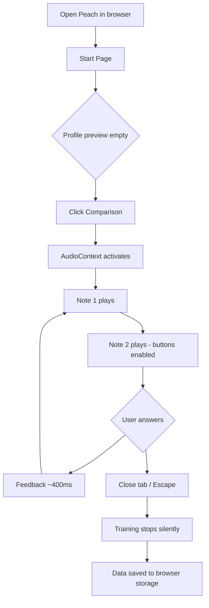
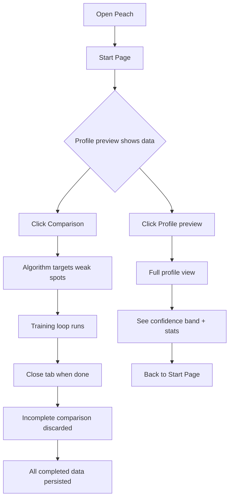
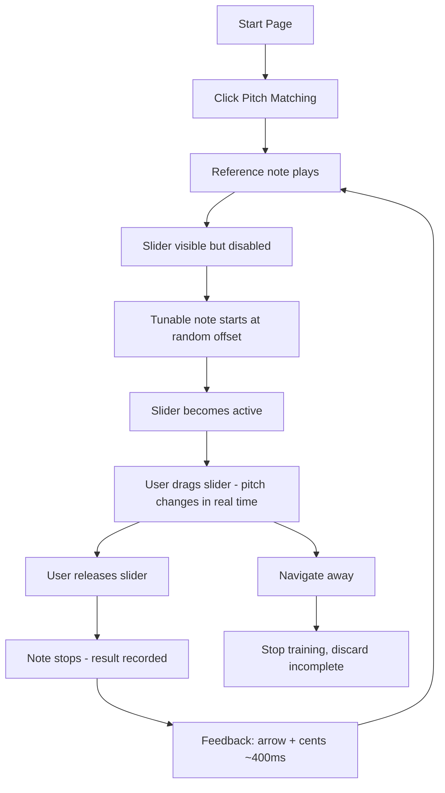
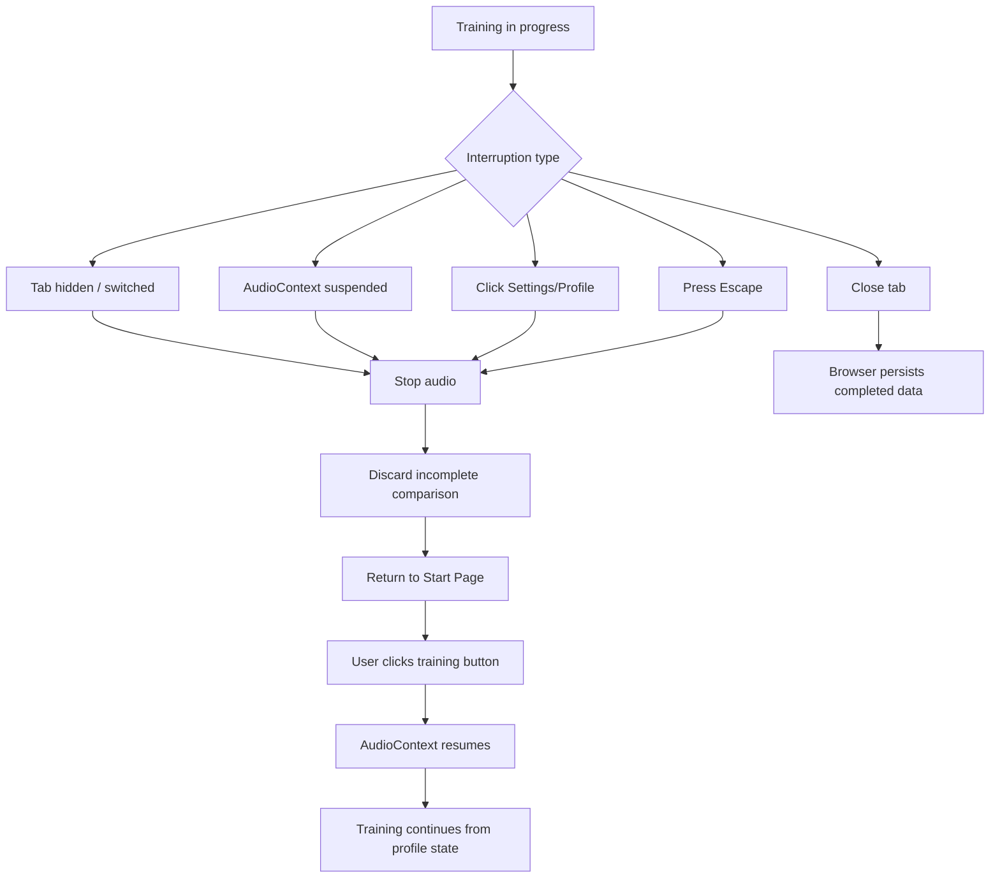
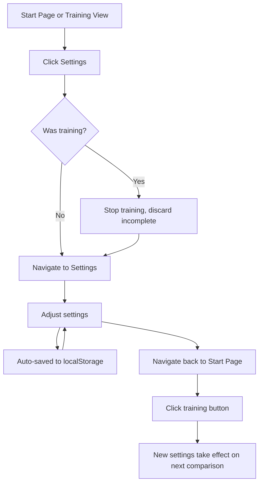

# UX Design Specification peach-web

**Author:** Michael
**Date:** 2026-03-03

---

## Executive Summary

### Project Vision

Peach is a browser-based ear training application that builds a perceptual profile of the user's pitch discrimination ability through adaptive comparison training. Built as a web reimplementation of the existing Peach iOS app, it brings the same "training, not testing" philosophy to any modern browser — desktop or mobile, any operating system.

The interaction is radically simple: two notes play in sequence, the user indicates higher or lower. The intelligence lives entirely in the adaptive algorithm, invisible to the user. No scores, no gamification, no session framing. Every answer is data that improves the model. Wrong answers are information, not failure.

The web version's primary differentiator is accessibility — same philosophy, same algorithms, new platform. Remove the iOS gate.

### Target Users

Musicians (singers, string, woodwind, brass players) for whom intonation is a practical challenge. Musically sophisticated but not necessarily tech-savvy. They want a tool that fits into the cracks of their day and makes them measurably better without demanding attention or emotional investment. 30 seconds of training is as valid as 30 minutes.

### Key Design Challenges

1. **Invisible intelligence** — The adaptive algorithm is the core value, but users cannot see it working. The UX must make adaptive behavior feel purposeful, not random.
2. **Sparse-data visualization** — On first use, the perceptual profile has almost no data. The profile must look meaningful and inviting even when mostly empty.
3. **No-session training model** — Start and stop must feel natural without conventional session framing. No guilt mechanics, no summaries, no confirmation dialogs.
4. **Multi-input interaction** — The browser must support mouse, keyboard, and touch equally for the core training loop. Keyboard shortcuts are the power-user path.
5. **Web audio constraints** — AudioContext activation requires a user gesture; tab suspension kills audio. The UX must handle these transitions gracefully without breaking the training flow.

### Design Opportunities

1. **Disappearing UI** — The sparse, meditative design philosophy is a genuine differentiator in a space dominated by visually noisy, gamified apps. Peach can own the calm, tool-like experience.
2. **Instant start, instant stop** — Respecting incidental time is rare. One click from the start page to hearing the first note is a powerful UX statement.
3. **Proven iOS foundation** — A comprehensive, distilled UX specification from the iOS app provides a strong starting point. The web version adapts where the platform differs (no haptic feedback, keyboard shortcuts, browser audio policies) rather than redesigning from scratch.

## Core User Experience

### Defining Experience

The core experience is the **comparison loop**: two notes play in sequence, the user indicates higher or lower, feedback flashes, the next pair begins. This loop is the entire product. Everything else exists to support or reflect it.

The loop must feel **reflexive, not deliberative**. The user should be reacting to sounds, not thinking about an app. If the user is ever thinking about the UI during training, the design has failed.

The secondary mode — **pitch matching** — follows the same philosophy but with a slower, more deliberate rhythm: hear a reference, tune a note by ear using a vertical slider, release to commit. No visual proximity feedback — the ear is the only guide.

### Platform Strategy

- **Web SPA** (Rust/WASM + Leptos), statically deployed, no backend, fully offline after initial load
- **Multi-input:** Mouse click, keyboard shortcuts (Arrow Up/H for higher, Arrow Down/L for lower, Escape to stop), and touch — all equally supported for the core training loop
- **Desktop primary, mobile supported** — keyboard shortcuts are the power-user path; touch targets meet 44x44px minimum
- **Sensory hierarchy (web-adapted):** Ears > eyes (feedback) > keyboard/mouse. Haptic feedback is unavailable on web. Visual feedback compensates by being clear but emotionally neutral — same visual weight for correct and incorrect

### Effortless Interactions

1. **Start training** — One click/keypress from the start page to hearing the first note. No onboarding, no account, no "welcome back." The training button doubles as the Web Audio API activation gesture.
2. **Stop training** — One click/keypress, close the tab, or switch tabs. No confirmation dialog, no session summary. Incomplete comparison silently discarded.
3. **Answer a comparison** — Click a button or press a key. Buttons are enabled the moment the second note begins playing, allowing early answers.
4. **Resume where you left off** — There is no resume. There are no sessions. The user opens the page and starts training; the algorithm already knows their profile.
5. **See progress** — The profile preview on the start page provides a glanceable snapshot. Clicking it opens the full profile.

### Critical Success Moments

1. **First comparison** — User clicks "Comparison," hears two notes, indicates higher or lower, sees brief feedback, next pair begins. Within seconds they are in the loop. One click to first sound is non-negotiable.
2. **First wrong answer** — Brief thumbs-down, same visual weight as thumbs-up, next pair begins. No shame, no special treatment. This is where trust in the "training, not testing" philosophy is built.
3. **Profile discovery** — After training, the confidence band starts filling in. The user sees their pitch perception visualized. Quiet curiosity, not celebration.
4. **Audio interruption** — Tab hidden or AudioContext suspended: training stops cleanly. User returns to start page, one click to resume. No error dialogs, no lost data.

### Experience Principles

1. **Disappearing UI** — Every design decision should reduce the distance between the user and the sounds. Controls, transitions, and feedback should be felt, not studied.
2. **Every answer improves you** — No answer is wasted, no answer is punished. Wrong answers are information, not failure. No scores, no streaks, no "try again" language.
3. **Respect incidental time** — Instant start, instant stop. 30 seconds of training is as valid as 30 minutes.
4. **Show, don't score** — Progress is a perceptual profile that evolves, not a number going up.
5. **Sound first, pixels second** — Audio quality, timing, and accuracy take absolute priority over visual polish.

## Emotional Design

### Primary Emotional Goals

1. **Calm focus** — Training should feel meditative, not competitive. The rhythmic cadence of the comparison loop creates a flow state.
2. **Quiet confidence** — Over time, a growing inner certainty that hearing is sharpening, confirmed by the data.
3. **Freedom from judgment** — No answer carries weight. The app never evaluates the user — it trains them.

### Emotional Journey

| Moment | Desired Feeling | Anti-Pattern to Avoid |
|---|---|---|
| **First launch** | Curiosity, ease — "that's it?" | Overwhelm, setup fatigue |
| **First comparisons** | Playful alertness — like a reflex game | Scoring overhead, distraction |
| **First wrong answer** | Nothing — indicator and the next pair | Shame, "try again" pressure |
| **Stopping mid-training** | Neutral — like closing a book | Guilt, loss aversion, "are you sure?" |
| **Checking the profile** | Honest curiosity — "what does my hearing look like?" | Score-driven framing |
| **Seeing improvement** | Quiet satisfaction — the data speaks for itself | Artificial celebration, badges |
| **Returning after a break** | Seamless continuity | Guilt trips, streak resets |

### Design Implications

| Emotional Goal | UX Approach |
|---|---|
| Calm focus | Minimal training view — no stats, counters, or progress bars during training |
| Freedom from judgment | Feedback indicator is brief (~400ms) and non-emphatic. Same visual weight for correct and incorrect |
| Quiet confidence | Profile visualization uses calm, factual presentation. No celebratory animations |
| Seamless continuity | No session boundaries, no timers, no "session complete" screens |

### Sensory Hierarchy (Web Adaptation)

The iOS app uses: ears > fingers (haptic) > eyes. On the web, haptic feedback is unavailable. The adapted hierarchy is:

**Ears > eyes (feedback) > keyboard/mouse**

- Audio provides the training content (primary)
- Visual feedback provides the result (secondary) — must be brief and non-emphatic
- Input provides the response (tertiary)

The absence of haptic feedback means the web version relies more on visual feedback than iOS. The feedback indicator compensates by being visually clear but emotionally neutral.

## Anti-Patterns and UX Pattern Strategy

### Transferable UX Patterns

**Navigation: Hub-and-Spoke**

- Start page is always the hub. All secondary views return to it. Maximum navigation depth is 1 level. No tabs, no nested views.
- Why it works: Eliminates navigation confusion. The user always knows where they are and how to get back. Matches the "respect incidental time" principle — no navigation overhead.

**Interaction: Reflexive Loop**

- The comparison loop runs continuously with no pause between iterations. Feedback is brief (~400ms) and automatic. Next pair begins without user action.
- Why it works: Creates a rhythmic cadence that induces flow state. The user stops thinking about the app and starts reacting to sounds.

**Interaction: Early Answer**

- Answer buttons are enabled the moment the second note begins playing, not after it finishes. The user can respond as soon as they've heard enough.
- Why it works: Respects expert users who can judge pitch quickly. Prevents the UI from feeling sluggish or patronizing.

**Visual: System Defaults as Design System**

- System font stack, system color scheme (light/dark via `prefers-color-scheme`), no brand colors, no custom fonts, minimal custom styling.
- Why it works: The app's identity comes from its behavior, not its visual branding. Platform-native feel reduces cognitive load and respects the "disappearing UI" principle.

**Feedback: Equal Weight**

- Correct and incorrect feedback use the same duration, position, and visual weight. Only color and icon differ (green thumbs-up / red thumbs-down).
- Why it works: Reinforces "every answer improves you." Neither outcome is emphasized over the other. No celebration, no punishment.

### Anti-Patterns to Avoid

These patterns are explicitly rejected:

1. **Score-driven design** — Any element that frames outcomes as a score, percentage, or pass/fail.
2. **Transition theater** — Animated transitions, "preparing next challenge" delays between comparisons. Every second of non-training time is a design failure.
3. **Engagement guilt mechanics** — Streaks, daily goals, "you haven't trained in X days," declining statistics presented as warnings.
4. **Complexity creep** — Visible algorithm parameters, per-comparison statistics, or "advanced mode" during training.
5. **Onboarding tutorials** — The interaction is self-explanatory. A tutorial implies complexity that doesn't exist.
6. **Session framing** — No session summaries, no "X comparisons today" counters, no session-complete screens.
7. **Gamification** — No badges, no levels, no achievements, no leaderboards, no confetti.

### Design Strategy

**Adopt:**

- Hub-and-spoke navigation — proven simplicity for single-purpose tools
- Reflexive loop with early answer — the defining interaction that creates flow state
- System defaults for visual foundation — maximum "disappearing UI," minimum maintenance
- Equal-weight feedback — core to the "training, not testing" philosophy

**Adapt for web:**

- Keyboard shortcuts as the power-user fast path (no equivalent in the iOS touch model)
- Visual feedback carries more weight than on iOS due to absent haptics — must remain emotionally neutral despite increased visual reliance
- AudioContext lifecycle management replaces iOS AVAudioSession — same UX intent (graceful interruption), different mechanism

**Avoid:**

- Everything in the anti-patterns list above. These are not negotiable — they represent the philosophical core of what makes Peach different from every other ear training app.

## Visual Design Foundation

### Design System Approach

Tailwind CSS utility classes on top of browser defaults. No component library, no pre-built design system. The app's visual identity comes from its behavior, not from branded styling.

This is deliberately minimal: Tailwind provides the spacing scale, responsive utilities, dark mode support, and color utilities. Everything else is system defaults.

### Rationale

- **Solo developer** — no team to coordinate design tokens with. Utility classes are self-documenting.
- **"Disappearing UI" philosophy** — the less custom design, the more the interaction speaks for itself.
- **Rust/WASM + Leptos** — Tailwind integrates with Trunk's build pipeline. No JavaScript component library dependencies.
- **System defaults are the design** — system fonts, system colors, `prefers-color-scheme` dark mode. The app should feel like a well-built web tool, not an iOS port.

### Color System

- **Feedback green:** Standard green for correct/close match
- **Feedback yellow:** Standard yellow/amber for moderate match (pitch matching only)
- **Feedback red:** Standard red for incorrect/far match
- **Text:** System foreground colors with semantic hierarchy (primary, secondary, muted)
- **Background:** System background, respecting dark mode
- **No brand colors.** The app's identity comes from its behavior.

### Typography

- System font stack: `-apple-system, BlinkMacSystemFont, "Segoe UI", Roboto, sans-serif`
- Standard size scale for hierarchy (headings, body, captions)
- No custom fonts

### Spacing and Layout

- Tailwind's default spacing scale (based on 4px increments: 1/2/4/6/8/12/16/24/32/48)
- Single-column layout for training views
- Responsive: works on desktop and mobile browsers
- Training view buttons should be large and easy to click/tap (minimum 44x44px touch targets)
- Content centered at a comfortable maximum width on desktop

## Interaction Patterns

### Comparison Loop Mechanics

The defining interaction: "Hear two notes, indicate higher or lower."

1. **Initiation:** User clicks a training button on the start page. Training view appears. First comparison begins immediately — no countdown, no "get ready." The click also activates the Web Audio API AudioContext.
2. **Note 1 plays:** Answer buttons disabled.
3. **Note 2 plays:** Answer buttons enabled the moment the second note begins. User can answer during or after the note.
4. **Answer:** User clicks a button or presses a key (Arrow Up/H for higher, Arrow Down/L for lower). Both buttons disable immediately.
5. **Feedback:** Indicator appears instantly (thumbs up/down). Persists ~400ms. No other information shown.
6. **Loop:** Indicator clears, next comparison begins. Loop continues indefinitely until the user navigates away.
7. **Leaving:** User clicks Settings/Profile link, presses Escape, or closes/hides the tab. Incomplete comparison silently discarded. No session summary, no confirmation.

**Timing diagram:**

```
[Note 1 ~~~] [Note 2 ~~~] [Answer] [Feedback ··] [Note 1 ~~~] [Note 2 ~~~] ...
 buttons off   buttons on   click/   brief show    buttons off   buttons on
                             key!     400ms
```

### Pitch Matching Loop Mechanics

The secondary interaction: "Tune a note to match a reference by ear."

1. **Initiation:** User clicks Pitch Matching on start page. Training view appears. First reference note plays immediately.
2. **Reference plays:** Configured duration. Slider visible but disabled (dimmed).
3. **Reference stops, tunable auto-starts:** Tunable note begins at random offset. Slider becomes active.
4. **User tunes:** Dragging the slider changes pitch in real time. No visual proximity feedback — the ear is the only guide.
5. **User releases:** Note stops immediately. Result recorded. Feedback appears (directional arrow + signed cent offset, ~400ms).
6. **Loop:** Feedback clears, next reference note plays. Loop continues until user navigates away.

**Timing diagram:**

```
[Reference ~~~] [Tunable ~~~~~~~~~~~~~~~~~~~~...release] [Feedback ··] [Reference ~~~] ...
 slider visible   auto-starts, slider active              arrow+cents   slider visible
 but disabled     user tunes by ear, no visual aid        ~400ms        but disabled
```

### Keyboard Shortcuts

| Action | Keys | Context |
|---|---|---|
| Answer "Higher" | Arrow Up or H | Comparison training |
| Answer "Lower" | Arrow Down or L | Comparison training |
| Fine pitch adjust | Arrow Up / Arrow Down | Pitch matching (slider focused) |
| Commit pitch | Enter or Space | Pitch matching |
| Stop / leave training | Escape | Any training view |

### Interruption Handling

| Interruption | Behavior |
|---|---|
| Navigate to Settings/Profile | Stop training, discard incomplete |
| Press Escape | Stop training, return to start page |
| Close or hide tab | Stop training, discard incomplete |
| AudioContext suspended by browser | Stop training, require user gesture to resume |
| Return after interruption | Start page — user starts fresh |

All interruptions follow the same rule: stop audio, discard incomplete exercise, return to start page. No error dialogs, no "resume" prompts.

### Web Audio Context Activation

The Web Audio API requires a user gesture to create or resume an AudioContext. The training start button serves as this gesture — clicking "Comparison" or "Pitch Matching" both activates the AudioContext and begins training in one action.

If the AudioContext becomes suspended (e.g. tab hidden, browser policy), training stops. The user must return to the start page and click a training button again to resume.

## Responsive Design

### Strategy

The app works on both desktop and mobile browsers. No breakpoints for training functionality — the core interaction works at any reasonable viewport size.

### Desktop (Primary)

- Training buttons are large, centered
- Keyboard shortcuts are the primary input method for power users
- Profile visualization uses full available width
- Content centered at a comfortable maximum width

### Mobile (Supported)

- Touch-friendly button sizes (minimum 44x44px tap targets)
- Vertical slider works with touch drag
- Single-column layout, no horizontal scrolling
- Viewport meta tag for proper mobile rendering

### Orientation

- **Portrait (phone):** Natural layout, vertical slider fills height
- **Landscape (phone):** Reduced slider height, still functional
- **Desktop:** Width varies; training views center content at a comfortable maximum width

## Accessibility

### Strategy

Follow WCAG 2.1 AA guidelines. Use semantic HTML, ARIA attributes where needed, and keyboard navigation throughout.

### Requirements

| Area | Approach |
|---|---|
| Keyboard navigation | All interactive elements reachable and operable via keyboard |
| Screen reader | Semantic HTML + ARIA labels for custom components |
| Color contrast | Minimum 4.5:1 for text, 3:1 for large text and UI components |
| Focus indicators | Visible focus rings on all interactive elements |
| Motion | Respect `prefers-reduced-motion` — minimize or eliminate animations |
| Dark mode | Respect `prefers-color-scheme` — all colors work in both modes |
| Text scaling | Layout doesn't break at 200% browser zoom |

### Screen Reader Announcements

| Event | Announcement |
|---|---|
| Comparison feedback | "Correct" or "Incorrect" |
| Pitch matching feedback | "4 cents sharp" / "27 cents flat" / "Dead center" |
| Training started | "Training started" |
| Training stopped | "Training stopped" |
| Interval change | "Target interval: Perfect Fifth Up" |

### Audio Dependency

Peach requires audio output to function. This is a fundamental constraint of the domain. Users who cannot hear audio cannot use the core training functionality. This is acknowledged as a limitation, not a design oversight.

## Navigation and Screen Structure

### Hub-and-Spoke Model

```
                    ┌──────────────────────────┐
                    │      Start Page          │
                    │                          │
                    │ [Comparison]             │
                    │ [Pitch Matching]         │
                    │ ── ── ── ── ── ── ──    │
                    │ [Interval Comparison]    │
                    │ [Interval Pitch Matching]│
                    │                          │
                    │ [Settings] [Profile]     │
                    │ [Info]                   │
                    └┬──┬──┬──┬──┬──┬──┬──┬──┘
                     │  │  │  │  │  │  │  │
        Comparison───┘  │  │  │  │  │  │  └───Interval PM
        Pitch Match─────┘  │  │  │  │  └──────Interval Comp
                           │  │  │  │
                    Settings  Profile  Info
```

### Navigation Rules

| Rule | Implementation |
|---|---|
| Start page is always the hub | Client-side routing root (`/`) |
| All secondary views return to start page | Back navigation or explicit link |
| Training views are entered only from start page | Direct links from start page buttons |
| Training views are exited by navigating away | Settings/Profile links, Escape key, or closing the tab |
| Maximum navigation depth is always 1 level | No nested views |
| No tabs | Single navigation flow |

### Route Paths

| Route | View |
|---|---|
| `/` | Start Page |
| `/training/comparison` | Comparison Training (unison) |
| `/training/comparison?intervals=M3u,M3d,...` | Comparison Training (interval) |
| `/training/pitch-matching` | Pitch Matching Training (unison) |
| `/training/pitch-matching?intervals=M3u,M3d,...` | Pitch Matching Training (interval) |
| `/profile` | Profile View |
| `/settings` | Settings View |
| `/info` | Info View |

## Screen Specifications

### Start Page

**Purpose:** Hub for all app actions. Profile preview, training mode selection, navigation.

**Elements:**

- **Profile Preview** — compact visualization of the perceptual profile. Clickable, navigates to full profile view. Shows cold-start empty state when no data exists.
- **Comparison button** — primary action, most prominent. Begins comparison training.
- **Pitch Matching button** — secondary action, less prominent. Begins pitch matching training.
- **Visual separator** — subtle divider between unison and interval modes.
- **Interval Comparison button** — secondary action. Begins interval comparison training.
- **Interval Pitch Matching button** — secondary action. Begins interval pitch matching training.
- **Settings link** — navigates to settings view.
- **Profile link** — navigates to full profile view.
- **Info link** — navigates to info view.

**Button hierarchy:**

| Button | Prominence | Description |
|---|---|---|
| Comparison | Primary (most prominent) | Hero action for new and returning users |
| Pitch Matching | Secondary | Below comparison |
| Interval Comparison | Secondary | Below separator |
| Interval Pitch Matching | Secondary | Below separator |
| Settings, Profile, Info | Tertiary (icon or text link) | Utility navigation |

**Behavior:**

- No onboarding, tutorial, or welcome message.
- Identical on every visit regardless of time elapsed since last use.
- No "welcome back," streak, or activity summary.

### Comparison Training View

**Purpose:** The core comparison training loop.

**Elements:**

- **Target interval label** — shown only in interval mode. Displays the current interval name (e.g. "Perfect Fifth Up"). Hidden in unison mode.
- **Higher button** — user's judgment that the second note was higher.
- **Lower button** — user's judgment that the second note was lower.
- **Feedback indicator** — thumbs up (correct) or thumbs down (incorrect), shown briefly after each answer.
- **Settings link** — navigates to settings (stops training).
- **Profile link** — navigates to profile (stops training).

**States:**

| State | Higher/Lower Buttons | Feedback | Description |
|---|---|---|---|
| `playingReferenceNote` | Disabled | Hidden | Reference note playing |
| `playingTargetNote` | **Enabled** | Hidden | Target note playing — early answer allowed |
| `awaitingAnswer` | Enabled | Hidden | Both notes finished, waiting for input |
| `showingFeedback` | Disabled | Visible (400ms) | Brief result display |

**Feedback indicator:**

- Correct: thumbs-up icon, green color
- Incorrect: thumbs-down icon, red color
- Same visual weight, same duration, same position for both
- No haptic equivalent on web — the visual indicator is the sole feedback channel

### Pitch Matching Training View

**Purpose:** Pitch matching training — tune a note to match a reference.

**Elements:**

- **Target interval label** — shown only in interval mode. Hidden in unison mode.
- **Vertical pitch slider** — the primary interaction control. Up = sharper, down = flatter. Custom component.
- **Feedback indicator** — directional arrow + signed cent offset, shown after each attempt.
- **Settings link** — navigates to settings (stops training).
- **Profile link** — navigates to profile (stops training).

**States:**

| State | Slider | Feedback | Description |
|---|---|---|---|
| `playingReference` | Visible, disabled (dimmed) | Hidden | Reference note playing |
| `awaitingSliderTouch` | Enabled, waiting | Hidden | Reference ended, tunable note playing, waiting for first interaction |
| `playingTunable` | Active, user dragging | Hidden | Pitch changes in real time as user drags |
| `showingFeedback` | Disabled | Visible (400ms) | Result display: arrow + cent offset |

**Pitch matching feedback:**

| User's Error | Symbol | Color | Example |
|---|---|---|---|
| Dead center (~0 cents) | Dot | Green | "0 cents" |
| Slightly off (<10 cents) | Short arrow up/down | Green | "+4 cents" |
| Moderately off (10-30 cents) | Medium arrow up/down | Yellow | "-22 cents" |
| Far off (>30 cents) | Long arrow up/down | Red | "+55 cents" |

Arrow direction indicates sharp (up) or flat (down). Arrow length is categorical (short/medium/long), not proportional. The signed cent offset provides exact detail.

### Profile View

**Purpose:** Full perceptual profile visualization and statistics.

**Elements:**

- **Perceptual profile visualization** — piano keyboard with confidence band overlay (Canvas or SVG).
- **Summary statistics** — overall mean detection threshold, standard deviation, trend indicator (improving/stable/declining).
- **Pitch matching statistics** — mean absolute error, standard deviation, sample count. Shown when matching data exists.
- **Back navigation** — returns to start page.

**Empty states:**

- **Cold start (no data):** Keyboard renders fully. Band absent or shown as a faint uniform placeholder at 100 cents. Text: "Start training to build your profile." No call-to-action button.
- **Statistics cold start:** Show dashes ("—") instead of numbers. Trend indicator hidden.
- **Partial data:** Band renders where data exists and fades where it doesn't. No interpolation across large gaps.

### Settings View

**Purpose:** Configuration of all training parameters.

| Setting | Control Type | Notes |
|---|---|---|
| Note range (lower bound) | Dropdown or stepper | MIDI note range |
| Note range (upper bound) | Dropdown or stepper | MIDI note range |
| Note duration | Slider or stepper | 0.3 to 3.0 seconds |
| Reference pitch | Dropdown or stepper | 440Hz, 442Hz, 432Hz, 415Hz, or custom |
| Sound source | Dropdown | Available instrument sounds |
| Vary loudness | Slider | 0% to 100% |
| Interval selection | Multi-select | Which directed intervals to train |
| Tuning system | Dropdown | Equal Temperament / Just Intonation |
| Reset all training data | Button with confirmation | Destructive action — requires confirmation dialog |

**Behavior:**

- All changes auto-save to browser storage — no save/cancel buttons.
- No form validation needed — all controls are bounded.
- Changes take effect on the next comparison after returning to training.
- Settings persist across page refreshes and browser restarts via localStorage.

### Info View

**Purpose:** Basic app information.

**Contents:** App name (Peach), developer name, copyright notice, version number.

Minimal content. Can be a modal/overlay or a separate page.

## Custom Components

### Perceptual Profile Visualization

**Purpose:** Display pitch discrimination ability across the training range.

**Implementation:** HTML Canvas or SVG.

- Piano keyboard strip (horizontal, stylized rectangles with standard proportions)
- Confidence band area chart overlaid above the keyboard
- Inverted Y-axis (lower = better)
- System colors for band fill, with opacity for confidence range
- Note names at octave boundaries (C2, C3, C4, etc.)

**States:** Empty (keyboard only), sparse (partial band with gaps), populated (continuous band).

**Accessibility:** ARIA role and label on the container. Text alternative: "Perceptual profile: average detection threshold X cents across Y trained notes."

### Profile Preview

**Purpose:** Compact, clickable miniature of the profile on the start page.

- Same band shape as full visualization, no axis labels, no numerical values
- Clickable, navigates to full profile view
- Empty state: subtle placeholder shape

**Accessibility:** "Your pitch profile. Click to view details." If data exists: "Your pitch profile. Average threshold: X cents. Click to view details."

### Comparison Feedback Indicator

- Thumbs up / thumbs down icon (Unicode or SVG)
- Green (correct) / red (incorrect)
- Centered overlay, large enough for peripheral vision
- Appears for ~400ms, then disappears
- No animation required (simple show/hide; subtle fade acceptable)

### Pitch Matching Feedback Indicator

- Directional arrow (up/down) or dot, colored by proximity band
- Signed cent offset text alongside
- Same position, timing, and transition as comparison feedback

### Vertical Pitch Slider

- Vertical orientation, occupying most of the training view height
- Large thumb/handle for comfortable dragging
- No markings, no tick marks, no center indicator — a blank instrument
- Always starts at the same physical position regardless of pitch offset
- Works with: mouse drag, touch drag, and keyboard (Arrow Up/Down for fine adjustment)
- No visual proximity feedback during tuning — the ear is the only guide
- Release = commit

**States:** Inactive (dimmed, during reference), active (enabled), dragging (following input), released (disabled, result recorded).

**Accessibility:** ARIA role: slider. ARIA label: "Pitch adjustment." Keyboard operable. Announce result after commit.

## User Journey Flows

### First Encounter

A musician opens Peach for the first time. No account, no onboarding. They see training buttons and a profile preview. One click to first sound.



**Key UX requirement:** Zero steps between "open browser" and "hear first note" beyond one button click. No signup, no tutorial, no welcome screen.

### Daily Practice

Returning user, two weeks later. Profile preview shows progress. Trains for a few minutes during a break.



**Key UX requirement:** Start page is identical every visit. No "welcome back," no time-since-last-visit messaging. The profile preview is the only indicator of accumulated progress.

### Pitch Matching

A singer explores pitch matching mode. Slower, more deliberate rhythm.



**Key UX requirement:** No visual proximity feedback during tuning. The ear is the only guide. Release = commit.

### Interruption and Recovery

Mid-training, something interrupts. Every interruption follows the same rule.



**Key UX requirement:** All interruptions are equivalent. No error dialogs, no "resume session" prompts. One click to start again. The algorithm already knows the user's profile.

### Settings Change

User adjusts training parameters. Changes take effect seamlessly.



**Key UX requirement:** No save/cancel buttons. All changes auto-save. Changes apply on the next comparison, not retroactively.

## Component Strategy

### Standard Components (HTML + Tailwind)

These need no custom implementation — standard HTML elements styled with Tailwind utilities:

| Component | Usage | Notes |
|---|---|---|
| Button (primary) | Comparison start button | Large, prominent, touch-friendly |
| Button (secondary) | Pitch Matching, Interval modes | Less prominent than primary |
| Button (action) | Higher / Lower answer buttons | Large, disabled/enabled states |
| Link (tertiary) | Settings, Profile, Info navigation | Icon or text link |
| Dropdown / Select | Settings: sound source, tuning system, reference pitch | Native HTML select |
| Range slider | Settings: note duration, vary loudness | Native HTML input[range] |
| Multi-select | Settings: interval selection | Checkbox group |
| Confirmation dialog | Reset all training data | Native HTML dialog or simple modal |
| Text display | Statistics, interval labels, info content | Semantic HTML elements |

### Custom Components (Leptos)

These require custom implementation — no standard HTML equivalent:

| Component | Complexity | Phase | Rationale |
|---|---|---|---|
| Comparison Feedback Indicator | Low | 1 | Show/hide with icon + color. Simple timer-based visibility toggle |
| Vertical Pitch Slider | High | 3 | Custom drag interaction, vertical orientation, no markings, mouse/touch/keyboard support |
| Pitch Matching Feedback Indicator | Low | 3 | Arrow direction + color + cent offset text. Same pattern as comparison feedback |
| Perceptual Profile Visualization | High | 4 | Canvas or SVG rendering of piano keyboard + confidence band. Three states (empty/sparse/populated) |
| Profile Preview | Medium | 4 | Miniature of full visualization. Clickable. Empty state handling |

### View Components (Leptos Routing)

One component per route, composing the above:

| Component | Route | Composes |
|---|---|---|
| `StartPage` | `/` | Profile Preview, training buttons, nav links |
| `ComparisonView` | `/training/comparison` | Answer buttons, Comparison Feedback Indicator, interval label, nav links |
| `PitchMatchingView` | `/training/pitch-matching` | Vertical Pitch Slider, PM Feedback Indicator, interval label, nav links |
| `ProfileView` | `/profile` | Profile Visualization, statistics display, back link |
| `SettingsView` | `/settings` | Standard form controls, reset button with confirmation |
| `InfoView` | `/info` | Static text content |

### Implementation Roadmap

Aligned with PRD phases:

**Phase 1 — Foundation:**
- `StartPage` (Comparison button only)
- `ComparisonView` (Higher/Lower buttons, feedback indicator)
- Comparison Feedback Indicator

**Phase 2 — Core Training:**
- `SettingsView` (all form controls)
- `StartPage` updated (all training buttons)

**Phase 3 — Pitch Matching:**
- Vertical Pitch Slider
- Pitch Matching Feedback Indicator
- `PitchMatchingView`

**Phase 4 — Visualization and Polish:**
- Perceptual Profile Visualization
- Profile Preview
- `ProfileView`
- `StartPage` updated (profile preview added)
- `InfoView`

## UX Consistency Patterns

### Loading States

| Situation | Behavior |
|---|---|
| App startup (profile hydration) | Show start page immediately. Profile preview shows loading placeholder until hydration completes (<1s for 10k records). Training buttons enabled after hydration. |
| SoundFont loading | Non-blocking. Start page is interactive immediately with oscillator fallback. SoundFont swap happens silently when download completes. No loading indicator. |
| Training start | Instant. No "loading" or "preparing" state. First note plays immediately after button click. |

**Rule:** Never block the user from starting training. Oscillator fallback ensures audio is always available. Profile hydration is fast enough to be imperceptible in most cases.

### Empty States

| Context | Display | Text |
|---|---|---|
| Profile preview (no data) | Subtle placeholder shape | None |
| Profile view (no data) | Piano keyboard renders fully. Band absent or faint placeholder. | "Start training to build your profile." |
| Statistics (no data) | Dashes ("—") instead of numbers | Trend indicator hidden |
| Partial profile data | Band renders where data exists, fades where it doesn't | No interpolation across gaps |

**Rule:** Empty states are calm and inviting, never urgent. No call-to-action buttons in empty states — the start page buttons serve that purpose.

### Error States

| Error | User-Facing Behavior |
|---|---|
| Storage write failure | Inform user that data may not have been saved. Non-blocking — training continues. |
| AudioContext creation failure | Training button click has no effect. Display brief message: "Audio unavailable. Please check your browser settings." |
| AudioContext suspension (tab hidden) | Stop training silently. Return to start page on next visit. |
| SoundFont load failure | Fall back to oscillators silently. No error message — oscillators are a valid sound source. |

**Rule:** Errors are quiet and non-blocking where possible. No modal error dialogs during training. Storage errors are the only case where the user must be informed (NFR8: no silent data loss).

### Button Behavior

| Pattern | Rule |
|---|---|
| Disabled state | Visually dimmed. Not clickable. Used during `playingReferenceNote` and `showingFeedback` states. |
| Enabled state | Full visual weight. Clickable and keyboard-accessible. |
| Click feedback | Immediate state change — no delay, no animation. Button disables instantly on click. |
| Touch targets | Minimum 44x44px on all interactive elements. |
| Keyboard focus | Visible focus ring on all buttons. Tab order follows visual order. |

### Form Behavior (Settings)

| Pattern | Rule |
|---|---|
| Auto-save | All changes persist immediately to localStorage. No save/cancel buttons. |
| Bounded controls | All inputs are constrained to valid ranges. No validation errors possible. |
| Feedback on change | No confirmation toast or save indicator. The control state itself is the feedback. |
| Reset action | "Reset all training data" is the only destructive action. Requires explicit confirmation dialog before executing. |
| Default values | All settings have sensible defaults. First-time users never need to visit settings. |

### Transition Patterns

| Pattern | Rule |
|---|---|
| Page navigation | Instant. No page transition animations. |
| Training start | Instant. First note plays with no delay after button click. |
| Training stop | Instant. Audio stops immediately. No "session ending" transition. |
| Feedback appearance | Instant show (no fade-in). Optional subtle fade-out after 400ms. |
| Respect `prefers-reduced-motion` | If set, eliminate any fade transitions. Pure show/hide only. |

## Implementation Guidelines

### Responsive Implementation

- **No breakpoints for training views.** The core interaction (buttons, slider, feedback) works at any reasonable viewport size. Single-column, centered layout scales naturally.
- **Tailwind responsive utilities** for start page and profile view where layout may benefit from wider screens (e.g. profile visualization using full width).
- **Relative units:** `rem` for typography and spacing, `%` and `vw`/`vh` for layout, `px` only for borders and minimum touch targets.
- **Mobile-first media queries** via Tailwind: base styles are mobile, `md:` and `lg:` prefixes add desktop enhancements.
- **Viewport meta tag:** `<meta name="viewport" content="width=device-width, initial-scale=1">` in `index.html`.

### Accessibility Implementation

- **Semantic HTML first.** Use `<button>`, `<a>`, `<input>`, `<select>`, `<dialog>` — not `<div>` with click handlers.
- **ARIA only where semantic HTML is insufficient:** profile visualization (Canvas/SVG), pitch slider (custom component), live region for feedback announcements.
- **Focus management:** When navigating to a training view, focus the first interactive element. When training stops, focus returns to the start page.
- **`aria-live="polite"`** region for feedback announcements ("Correct", "Incorrect", "4 cents sharp"). Updates announced without interrupting the user.
- **Skip link** at top of page: "Skip to main content" — standard pattern, low effort, high value.
- **Dark mode:** All Tailwind color utilities use `dark:` variants. Test both modes for contrast compliance.

### Testing Approach

**Responsive:**
- Test with browser DevTools device emulation (Chrome, Firefox)
- Verify training views at 320px (small phone) through 2560px (large desktop)
- Test vertical pitch slider with both touch and mouse at various heights
- Verify 200% browser zoom doesn't break layout

**Accessibility:**
- Manual keyboard-only navigation test for all views
- VoiceOver (macOS) testing for screen reader announcements
- Browser DevTools accessibility audit (Lighthouse)
- Color contrast verification for all feedback colors in both light and dark mode
